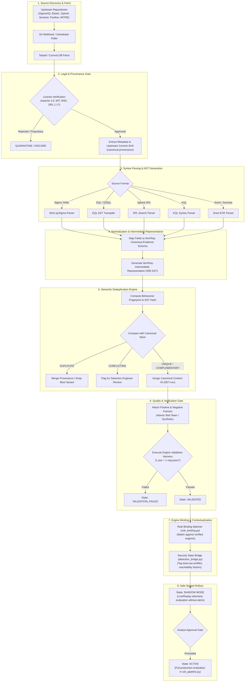
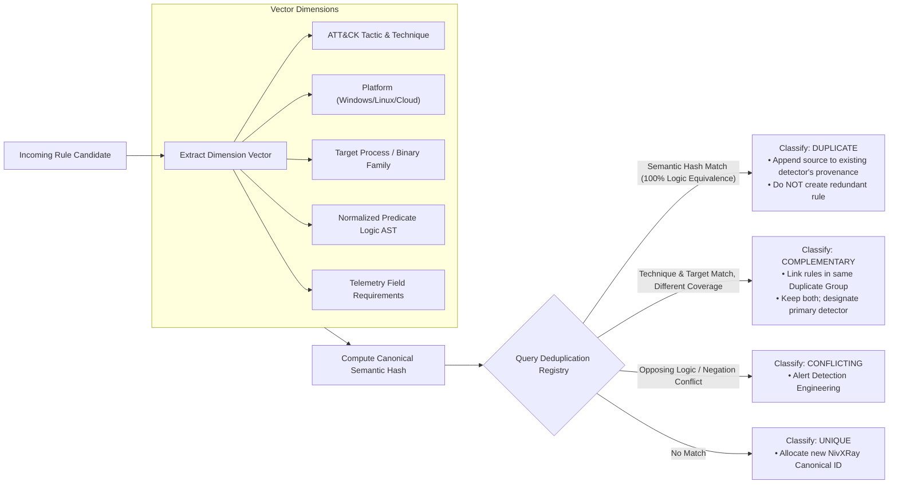
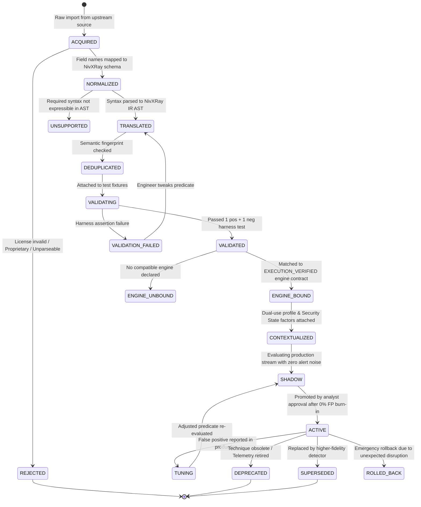
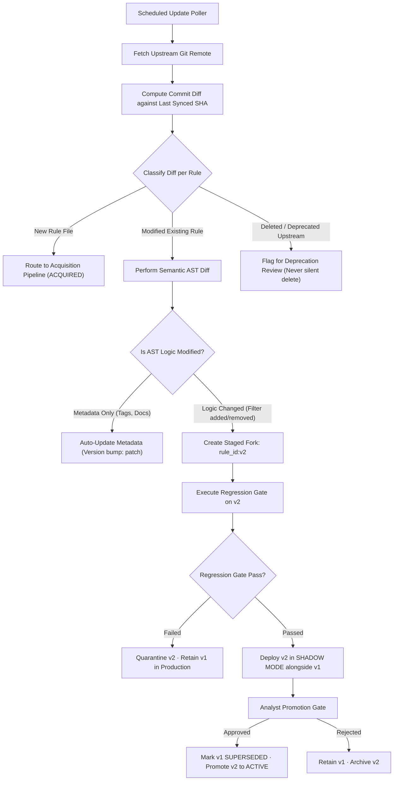

# NivXRay XDR — Enterprise Content Acquisition & Lifecycle Architecture
**Document Version:** 1.0.0  
**Audit Date:** 2026-09-04  
**Classification:** Detection Content Engineering Architecture  
**Governing Principle:** `NO EVIDENCE → NO CLAIM` · `ZERO DUMP ARCHITECTURE`  
**Phase Status:** Phase 1 Read-Only Architecture & Truth Discovery  

---

## 1. Executive Summary & Architectural Philosophy

NivXRay XDR rejects the anti-pattern of operating as a raw, uncurated repository of thousands of blindly copied detection strings. The goal of this architecture is **not** to "download 3,000 rules and dump them into NivXRay."

Instead, NivXRay XDR establishes an industrial-grade, deterministic pipeline:
$$\mathbf{Industry\ Source} \longrightarrow \mathbf{Acquisition} \longrightarrow \mathbf{License/Provenance} \longrightarrow \mathbf{Normalize} \longrightarrow \mathbf{Translate} \longrightarrow \mathbf{Deduplicate} \longrightarrow \mathbf{Validate} \longrightarrow \mathbf{Engine\ Bind} \longrightarrow \mathbf{Correlate} \longrightarrow \mathbf{Security\ State} \longrightarrow \mathbf{Shadow} \longrightarrow \mathbf{Active}$$

This architecture ensures:
1. **Zero Piracy**: Only legally verified, permissively licensed public defensive content is ingested.
2. **Deterministic Semantic Deduplication**: Content is deduplicated by behavioral AST fingerprint, not superficial rule titles.
3. **Continuous Provenance**: Full lineage back to upstream authors, commits, and licenses is retained indefinitely.
4. **Governed Lifecycle & Auditability**: Rules move through formal quality gates; every state transition is recorded in an append-only audit trail.
5. **No Silent Production Drift**: Upstream version bumps trigger regression gates and shadow observation prior to activation.

---

## 2. End-to-End Content Acquisition Pipeline

The diagram below details the end-to-end data flow from upstream open-source repositories to active runtime evaluation:

---

## 3. Semantic Deduplication Architecture

When acquiring hundreds of rules across Sigma, Splunk, and Elastic, multiple rules inevitably detect the identical underlying technique (e.g. `whoami /all`, `vssadmin delete shadows`, `mimikatz sekurlsa::logonpasswords`). Superficial string matching or name comparison fails because vendors name identical behavior differently.

### 3.1 Multi-Dimensional Deduplication Vector
The deduplication engine computes a 7-dimensional behavioral signature:
$$\mathbf{S}_{rule} = \langle \text{Platform},\ \text{Tactic},\ \text{Technique\_ID},\ \text{Primary\_Image},\ \text{Normalized\_Arg\_Pattern},\ \text{Required\_Field\_Set},\ \text{AST\_Structure\_Hash} \rangle$$

### 3.2 Canonical Detector Selection Policy
When multiple public rules exist for the exact same semantic fingerprint:
1. **Attribution Preservation**: All originating sources (e.g. `sigma:rule-uuid-1`, `elastic:rule-uuid-2`) are appended to `metadata.cross_references` and `metadata.provenance`.
2. **Canonical Selection Hierarchy**:
   - Priority 1: The variant with the strictest (lowest false-positive) argument filtering.
   - Priority 2: The variant with certified automated test fixtures (`fixtures.count >= 2`).
   - Priority 3: The variant requiring the most universal canonical evidence fields.
3. **Zero Loss of Specificity**: If Rule A covers Windows 10 and Rule B covers Windows Server 2022 specific command flags, they are marked `COMPLEMENTARY` rather than collapsed into a single diluted rule.

---

## 4. Formal Content Lifecycle State Machine

Every piece of detection and correlation content in NivXRay XDR is governed by a deterministic finite state machine. Transitions occur only when programmatic verification criteria are satisfied.

### State Definitions & Transition Criteria:
1. **`ACQUIRED`**: Upstream YAML/TOML/JSON stored in staging database. Provenance hash recorded.
2. **`NORMALIZED`**: Telemetry fields translated to NivXRay canonical evidence fields (`process.name`, `network.src.ip`).
3. **`TRANSLATED`**: Query logic compiled into deterministic Python predicate or engine AST.
4. **`DEDUPLICATED`**: Fingerprinted against existing library. Duplicates merged; unique rules indexed.
5. **`VALIDATING`**: Executed against local positive and negative test fixtures in `detection_harness.py`.
6. **`VALIDATED`**: Fixtures verified with 100% accuracy.
7. **`ENGINE_BOUND`**: Attached to an active engine contract where `execution.detection = True`.
8. **`CONTEXTUALIZED`**: Enriched with Security State dual-use rules (`detection_bridge.py`).
9. **`SHADOW`**: Active in stream, emitting shadow telemetry to `xdr_shadow_matches` for burn-in.
10. **`ACTIVE`**: Full production evaluation in `xdr_pipeline.py`. Emits live observations to IUE/ICE.

---

## 5. Source Update, Diff & Versioning Model

Public detection repositories release continuous updates, bug fixes, and deprecations. NivXRay XDR must absorb updates safely without overwriting tuned production rules.

### Versioning Contract:
- **`source_version`**: The exact Git tag or commit hash of the originating upstream repository (e.g., `SigmaHQ:r2026-08-15:abc1234`).
- **`translation_version`**: The version of the NivXRay AST transpiler used (e.g., `nx-transpiler-v1.2`).
- **`canonical_version`**: SemVer format (`major.minor.patch`) assigned by NivXRay Rule Studio:
  - `patch`: Metadata, documentation, or ATT&CK tag updates.
  - `minor`: Non-breaking filter refinement or additional positive test fixtures.
  - `major`: Structural logic changes, field requirement changes, or engine re-binding.
- **Rollback Guarantee**: Every active rule stores its immediate previous version. If a newly promoted rule produces unexpected volume in production, an analyst can trigger an instantaneous rollback (`POST /api/xdr/rule-studio/rollback/{rule_id}`), transitioning the active detector back to the previous validated SHA.

---
*End of Enterprise Content Acquisition & Lifecycle Architecture.*
