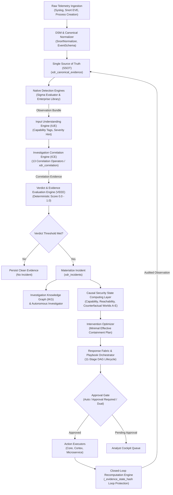

# NivXRay XDR — Existing Engine Capability & Compatibility Matrix
**Document Version:** 1.0.0  
**Audit Date:** 2026-09-04  
**Classification:** Architecture & Engine Execution Contracts  
**Governing Principle:** `NO EVIDENCE → NO CLAIM` · `ZERO SYNTHETIC EXECUTION`  
**Phase Status:** Phase 1 Read-Only Architecture & Truth Discovery  

---

## 1. Executive Summary & Engine Execution Hierarchy

In NivXRay XDR, engine registration in a database or capability contract is **NOT** proof of execution readiness. An engine is only recognized as operationally active when it passes the strict execution lifecycle:

```
ENGINE
  ↓
CAPABILITIES
  ↓
SUPPORTED CONTENT
  ↓
EXECUTION PATH
  ↓
VALIDATION (Harness Fixtures)
  ↓
READY / ACTIVE
```

This matrix provides a forensic, component-by-component audit of all 15 native detection, correlation, response, understanding, and evaluation engines currently implemented in NivXRay XDR.

---

## 2. Engine Capability & Compatibility Matrix

| # | Engine Identifier | Capability Role | Supported Content | Input Schema | Execution Path | Binding Mechanism | Validation Mechanism | Runtime Status | Tenant Boundary | Persistence Store | Limitations & Boundaries |
| :-: | :--- | :--- | :--- | :--- | :--- | :--- | :--- | :---: | :--- | :--- | :--- |
| **1** | `nivxray::detection_content::nivxray_native_sigma` | `DETECTION_ENGINE` | Strict Sigma AST rules (process creation, network, registry, file) | Flattened canonical evidence dict (`process_event`, `command_line`, etc.) | In-process AST matching via `evaluate(rule, evidence)` | Promoted via `contract_registry.py` with `execution.detection = True` | Detection Execution Harness (`detection_harness.py`) with certified positive/negative fixtures | **ACTIVE** / **EXECUTION_VERIFIED** | Enforced at event ingestion level | `xdr_capability_contracts` | Evaluates deterministic Sigma selections and boolean conditions. Does NOT evaluate aggregations or multi-event correlations (handled by Correlation Engine). |
| **2** | `snort-eve-parser` / `snort-eve` | `DETECTION_ENGINE` (Network IDS) | Snort / Suricata EVE JSON alerts | Raw Suricata/Snort EVE JSON records | DSM resolve $\to$ SnortEveParser $\to$ SnortNormalizer $\to$ Golden rule match | Wired directly into `xdr_pipeline.py` DSM registry | Pytest suite in `test_telemetry_adapters.py` | **ACTIVE** / **RUNTIME_VERIFIED** | Scoped via integration and collector ID | `xdr_canonical_evidence` | Restricted to Network IDS format with signature ID and IP header information. |
| **3** | `nivxray::detection::library_registry` | `DETECTION_ENGINE` | Enterprise Detection Content Library (22 rules across 12 tactics) | Canonical event dictionary (`canonical_evidence`) | Evaluated in `xdr_pipeline.py` via `REGISTRY.evaluate_event(canonical)` | Static multi-index registry loaded on import | 44 certified positive and negative unit fixtures (100% pass) | **ACTIVE** / **TESTED** | Inherits tenant context from pipeline event | In-memory index; rule definitions in `rules_enterprise.py` | Currently contains 22 high-fidelity rules; scalable to thousands without architectural redesign. |
| **4** | `nivxray::xdr::ice` | `CORRELATION_ENGINE` (Single-Event) | Single-event correlation rules in `xdr_correlation_rules` | Canonical event + IUE understanding object | Evaluated asynchronously in `xdr_pipeline.py` via `ice_correlate()` | Direct function call in pipeline | Verified in `test_ice_correlate.py` | **ACTIVE** / **TESTED** | Filtered by `tenant_id` in database query | `xdr_correlation_matches` | Single-event correlation only. Defers temporal and multi-event tracking to the stateful correlation engine. |
| **5** | `nivxray::xdr::correlation` | `CORRELATION_ENGINE` (Stateful Stream) | 13 stateful correlation operators (TEMPORAL, SEQUENCE, THRESHOLD, etc.) | Event stream / Signals with sliding entity window state | REST endpoint and async stream worker in `routers/xdr_correlation.py` | MongoDB collections + state cache | Verified in `test_xdr_correlation.py` and `test_correlation_engine.py` | **ACTIVE** / **TESTED** | Multi-tenant isolation enforced on all collection queries | `xdr_correlation_rules`, `xdr_correlation_matches`, `xdr_correlation_state` | Sliding window bounded in memory/MongoDB. Requires continuous timestamp ordering. |
| **6** | `nivxray::xdr::iue` | `UNDERSTANDING_ENGINE` | Canonical evidence observations | Canonical evidence dict + Detection result | `iue_understand(canonical, detection)` in `xdr_iue.py` | Direct pipeline invocation | Tested in `test_xdr_round30_iue_v0.py` | **ACTIVE** / **TESTED** | Pipeline event scoped | Canonical evidence enrichment | Synthesizes capability tags and severity hints. Does NOT decide maliciousness. |
| **7** | `nivxray::xdr::veee` | `VERDICT_ENGINE` | Unified Evidence Evaluation | Canonical evidence, Detection match, IUE tags, ICE matches | `veee_compute()` in `xdr_veee.py` | Exclusive owner of verdict scoring in pipeline | Tested in `test_p1_02b_verdict_engine.py` | **ACTIVE** / **TESTED** | Scoped to incident context | Emitted into `xdr_canonical_evidence` | Single authority on verdict score (0.0 to 1.0). Rules never emit verdicts. |
| **8** | `nivxray::xdr::response_fabric` | `ORCHESTRATION_FABRIC` | Response policies, threat strategies, candidate actions | Materialized Incident ID + evidence bundle | `response_orchestrate()` in `xdr_response_fabric.py` | Pipeline trigger upon incident creation | Tested in `test_xdr_round13_response.py` | **ACTIVE** / **TESTED** | Scoped by incident tenant ID | `xdr_response_actions` | Pure orchestration composer. Does not execute actions directly without Approval Engine. |
| **9** | `nivxray::xdr::response_executor` | `ACTION_EXECUTOR` | 13 canonical actions (isolation, kill, block, quarantine, etc.) | Target entity ID, action ID, execution parameters, RBAC context | `execute_action()` in `xdr_response_executor.py` | Bound via `xdr_action_registry.py` | Tested in `test_xdr_round13_response.py` | **ACTIVE (SIMULATION)** / `NOT_CONFIGURED` | Multi-tenant audit logging enforced | `xdr_response_actions` | Enforces `NOT_CONFIGURED` when live external vendor EDR/firewall API keys are missing. Honest reporting. |
| **10**| `nivxray::xdr::cortex_executor` | `ACTION_EXECUTOR` (Vendor Adapter) | Palo Alto Cortex XDR API actions (isolate, quarantine) | Cortex device ID, file hash, API token | `execute_cortex_action()` in `routers/xdr_cortex_actions.py` | Bound to Cortex integration configuration | Integration test suite in `test_xdr_round26_cortex_ingest.py` | **ACTIVE (STUB/LIVE)** | Scoped to customer integration tenant | `xdr_response_actions` | Requires active Palo Alto API credentials for live dispatch; otherwise logs error cleanly. |
| **11**| `nivxray::security_state::orchestrator` | `PLAYBOOK_ENGINE` (DAG Walker) | 22 response playbooks with 11-stage lifecycles | Incident ID + Security State Vector + Playbook Definition | `execute_playbook_lifecycle()` in `orchestration/engine.py` | Invoked by Security State Intervention layer | Tested in `test_rule_detection_playbook_expansion.py` | **ACTIVE (SIMULATION)** | Scoped to incident and host entity | Playbook execution trace persisted to database | Dry-run and simulation mode enforced when `execution_lock_engaged = True`. Zero unauthorized production damage. |
| **12**| `nivxray::security_state::intervention` | `OPTIMIZATION_ENGINE` | Causal structural model, Reachability graph, Counterfactual worlds A–E | Active Security State + Crown Jewel asset registry | `InterventionOptimizer.optimize()` in `intervention/optimizer.py` | Bridge to Response Fabric and Playbook Library | 92/92 Master Security State Tests PASS | **ACTIVE** / **PRODUCTION_READY** | Scoped to tenant network topology | Security State Cryptographic Ledger | Evaluates minimal effective containment plans across counterfactual worlds to eliminate lateral reachability. |
| **13**| `nivxray::xdr::closed_loop` | `VERIFICATION_ENGINE` | Completed action results + post-response evidence | Action execution record + incident trace ID | `closed_loop_recompute()` in `xdr_closed_loop.py` | Executed after action completion in pipeline | Tested in `test_xdr_round20_closed_loop_determinism.py` | **ACTIVE** / **TESTED** | Incident tenant scoped | Recomputed observations in `xdr_canonical_evidence` | Enforces `_evidence_state_hash` loop protection to prevent infinite remediation re-triggering. |
| **14**| `nivxray::universal_decoder` | `CONTENT_ANALYSIS_FRAMEWORK` | Base64, Hex, URL, GZIP, XOR, PowerShell EncodedCommand, shellcode | Raw obfuscated strings or file payload buffers | Multi-stage recursive pipeline in `universal_decoder/` | Integrated via `decoder_bridge.py` | 24/24 backend tests PASS; 10/10 runtime E2E cases verified | **FROZEN 🔒** / **RUNTIME_VERIFIED** | Processed in isolated request context | Decoded timeline metadata in evidence store | **Static and bounded analysis only.** No decoded-content execution, subprocess spawning, dynamic evaluation, or outbound network access. |
| **15**| `nivxray::investigator::v0` | `AUTONOMOUS_INVESTIGATOR` | Graph pivots, entity hops, observable clustering | Materialized Incident ID + IKG graph | `InvestigatorService.tick()` in `services/investigator.py` | Automatic post-incident creation pipeline trigger | Tested in `test_xdr_round31_investigator.py` | **ACTIVE** / **TESTED** | Incident tenant scoped | Investigation state and findings collections | Bounded pivot depth; executes deterministic query traversals across the graph. |

---

## 3. Engine Interoperability & Hand-Off Pipeline

The diagram below illustrates the exact hand-off between detection, correlation, understanding, verdict, causal modeling, and response execution:



---
*End of Existing Engine Capability & Compatibility Matrix.*
