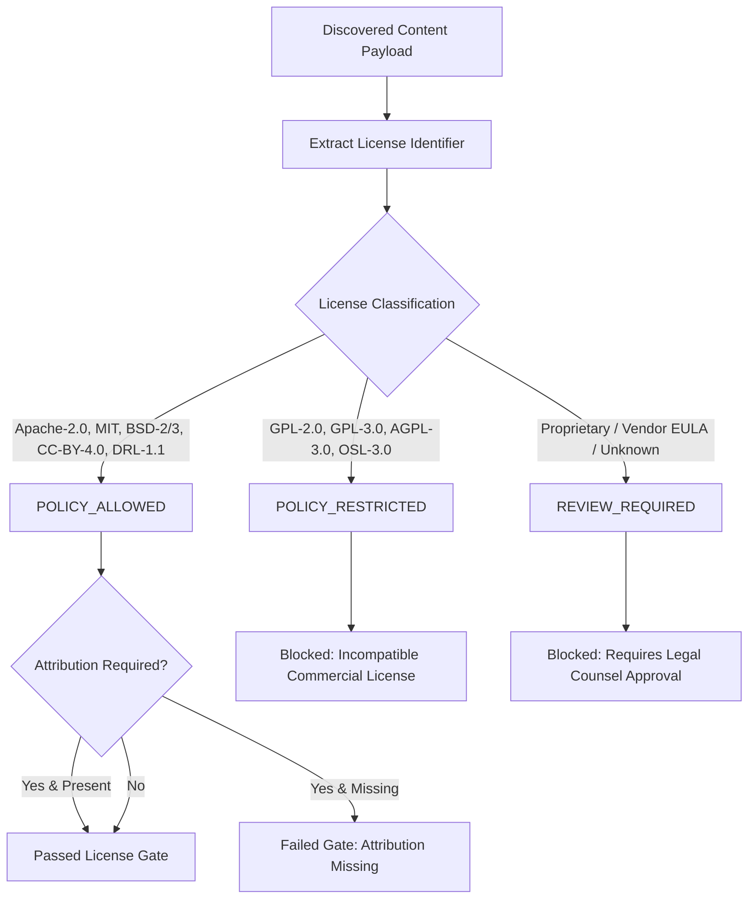

# NivXRay XDR — Content Provenance & License Governance Model

## 1. Provenance Integrity & Auditability

In enterprise security operations, content provenance is as vital as the detection logic itself. Knowing exactly who authored a rule, where it originated, when it was acquired, and what legal restrictions apply is required for legal compliance and threat intelligence attribution.

Every `CanonicalContentObject` in NivXRay enforces an immutable provenance ledger:

```json
{
  "provenance": {
    "source": "SIGMAHQ",
    "source_id": "848214f4-5f80-4ec9-8d77-6ef184d0b002",
    "source_url": "https://github.com/SigmaHQ/sigma/blob/master/rules/windows/process_creation/proc_creation_win_mimikatz.yml",
    "organization": "SigmaHQ",
    "license": "DRL-1.1",
    "license_verified": true,
    "attribution": "Detection rule authored by Florian Roth / SigmaHQ Community",
    "source_version": "1.0.4",
    "source_date": "2026-02-15",
    "acquisition_timestamp": "2026-09-04T16:07:53Z",
    "trace_id": "9f6580f0-8c9f-4bc2-8178-369f8c6eb891",
    "transitions": [
      {
        "from": "discovered",
        "to": "parsed",
        "reason": "Automated AST syntax parsing successful",
        "actor": "acquisition_daemon",
        "timestamp": "2026-09-04T16:07:53.102Z"
      },
      {
        "from": "parsed",
        "to": "active",
        "reason": "Passed all 15 quality gates and canary replay",
        "actor": "content_orchestrator",
        "timestamp": "2026-09-04T16:07:53.118Z"
      }
    ]
  }
}
```

---

## 2. License Governance Policy

NivXRay implements programmatic license enforcement via `LicensePolicy`:



### Supported License Categories

| License Category | Examples | Status in NivXRay | Operational Policy |
|:---|:---|:---|:---|
| **Permissive Open Source** | `Apache-2.0`, `MIT`, `BSD-2-Clause`, `BSD-3-Clause` | **ALLOWED** | Immediate compilation and active deployment permitted; maintain author notice. |
| **Detection Rights License** | `DRL-1.1`, `CC-BY-4.0` | **ALLOWED** | Permitted for threat detection; attribution string must be preserved in alert output. |
| **Copyleft / Viral** | `GPL-2.0`, `GPL-3.0`, `AGPL-3.0` | **RESTRICTED** | Prohibited in production binaries to avoid license contamination of proprietary core. |
| **Commercial / Closed EULA** | Proprietary vendor feeds | **REVIEW REQUIRED** | Bound to tenant-specific license keys with mutual indemnity contracts. |
| **Unidentified / No License** | Raw forum pastes, unindexed GitHub gists | **BLOCKED** | Stored in quarantine; cannot transition to `ACTIVE` without manual legal sign-off. |

---

## 3. Provenance Retention Invariants

1. **Non-Repudiation**: The `trace_id` generated at discovery must follow the rule across all intermediate transformations and be included in any downstream alerts or incidents.
2. **Attribution Preservation**: When an alert fires from an attribution-requiring rule, the alert payload automatically includes the rule's original author and upstream URL.
3. **No Unlicensed Elevation**: A rule cannot be elevated from `SHADOW` to `ACTIVE` if `license_verified` is `false`.
