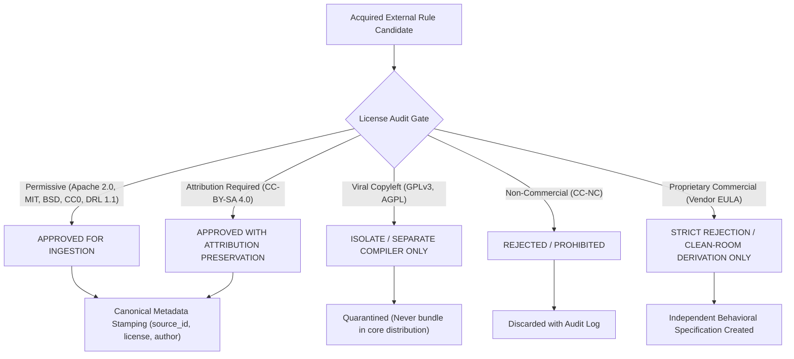

# NivXRay XDR — Content Source & Legal License Matrix
**Document Version:** 1.0.0  
**Audit Date:** 2026-09-04  
**Classification:** Legal, Licensing & Content Acquisition Provenance  
**Governing Principle:** `NO EVIDENCE → NO CLAIM` · `ZERO PROPRIETARY PIRACY`  
**Phase Status:** Phase 1 Read-Only Architecture & Truth Discovery  

---

## 1. Executive Summary & Legal Invariants

NivXRay XDR's detection acquisition strategy strictly relies on **publicly accessible, permissively licensed open-source detection engineering repositories and defensive security research**.

### Non-Negotiable Legal Principles:
1. **Zero Proprietary Logic Theft**:
   - Under no circumstances shall proprietary commercial detection logic (e.g. closed-source CrowdStrike, SentinelOne, Microsoft Defender proprietary signatures, or commercial threat feeds) be scraped, copied, decompiled, or ingested.
   - Where proprietary vendor detection concepts are discussed publicly in threat reports or blogs, NivXRay XDR independently derives clean-room behavioral predicates from empirical telemetry specifications rather than copying proprietary vendor strings.
2. **Strict Attribution & Provenance Retention**:
   - Every piece of acquired content must permanently store source provenance: originating repository, author, original rule ID, commit hash, original license, and modification notes in canonical metadata.
3. **License Compatibility Enforcement**:
   - Only permissive open-source licenses (Apache 2.0, MIT, BSD, CC-BY-SA 4.0, Creative Commons Zero) are ingested directly into the canonical library.
   - Non-commercial, viral copyleft, or restrictive licenses (GPLv3, CC-NC, proprietary commercial EULAs) are strictly quarantined or rejected.

---

## 2. Industry Source Acquisition Matrix

The table below catalogs every target source class evaluated for NivXRay XDR:

| Source | Organization / Curator | Repository / Web Location | Content Type | License | Attribution Requirement | Versioning Scheme | Machine-Readable Format | Translation Difficulty | Legal / Provenance Requirements | Recommended Ingestion Method |
| :--- | :--- | :--- | :--- | :--- | :--- | :--- | :--- | :---: | :--- | :--- |
| **SigmaHQ** | SigmaHQ Community | `github.com/SigmaHQ/sigma` | Generic behavioral detection rules | Detection Rule License (DRL 1.1) / CC-BY-SA 4.0 | Maintain author and rule ID in metadata | Git commit hash + SemVer releases | YAML (Sigma v1/v2 schema) | **EXACT** / **STRONG** | Retain YAML header, license notice, and original UUID | Git submodule or release tag sync; strict `pySigma` AST parser |
| **Elastic Security Rules** | Elastic N.V. | `github.com/elastic/detection-rules` | EQL, KQL, Lucene, Threshold rules | Elastic License 2.0 / Apache 2.0 | Explicit attribution to Elastic Security | Git tags (e.g. `v8.x.x`) | TOML + YAML metadata | **STRONG** (EQL) / **PARTIAL** (ES\|QL) | Validate license header per file; record rule ID | Release tarball download; TOML parser $\to$ EQL AST compiler |
| **Splunk Security Content** | Splunk Threat Research Team (STRT) | `github.com/splunk/security_content` | SPL queries, correlation searches, analytic stories | Apache 2.0 | Apache 2.0 license notice & original author | Git tags / monthly releases | YAML (Analytic Story schema) | **STRONG** (Search syntax) / **PARTIAL** (SPL macros) | Apache 2.0 notice in metadata | Git clone / release tarball; YAML parser $\to$ SPL AST translator |
| **Microsoft Sentinel Public Detections** | Microsoft Security Community | `github.com/Azure/Azure-Sentinel` | KQL analytic queries, hunting queries, workbooks | MIT License | MIT license notice | Rolling Git commits | YAML + ARM/Bicep templates | **STRONG** (KQL tabular operators) | Standard MIT attribution block | Git clone; YAML parser $\to$ KQL AST translator |
| **Panther Public Analysis** | Panther Labs | `github.com/panther-labs/panther-analysis` | Python-based streaming detection rules | Apache 2.0 | Apache 2.0 copyright notice | Git release tags | Python + YAML metadata | **EXACT** (Python native predicates) | Retain author and Apache 2.0 header | Git submodule; Python AST extractor $\to$ NivXRay predicate mapper |
| **MITRE CAR (Cyber Analytics Repository)** | MITRE Corporation | `car.mitre.org` / `github.com/mitre-attack/car` | Pseudocode, EQL, Splunk, CAR analytics | Apache 2.0 | MITRE CAR attribution & CAR-ID | Git commit history | YAML / Markdown | **STRONG** (Pseudocode / EQL) | Retain CAR ID (e.g. `CAR-2013-05-002`) | API / Git ingest; translate CAR logic to canonical AST |
| **Atomic Red Team** | Red Canary | `github.com/redcanaryco/atomic-red-team` | Adversary emulation commands (Test fixtures) | MIT License | Red Canary attribution | Git release tags | YAML (Atomic test definitions) | **EXACT** (Generates positive test fixtures) | Retain Atomic Test GUID and technique ID | Git release sync; parse into positive verification fixtures |
| **CISA Defensive Guidance & KEV** | Cybersecurity and Infrastructure Security Agency (CISA) | `cisa.gov` / `github.com/cisagov` | Threat advisories, Indicators of Compromise (IOCs), KEV catalog | Public Domain (US Gov / CC0) | US CISA citation | Rolling release / CVE timestamps | JSON (KEV catalog), STIX/TAXII | **EXACT** (CVE exposure & IOC lists) | Retain CISA Advisory ID (e.g. `AA24-xxxA`) | Automated HTTP JSON ingestion into CVE and IOC lanes |
| **Public YARA Rules** | Florian Roth, Neo23x0, YARA-Exchange | `github.com/Neo23x0/signature-base`, `yaraify.abuse.ch` | Binary string & regex pattern matching | GPLv3 / CC-BY-NC 4.0 / MIT (varies per repo) | Mandatory author attribution | Git commits / daily feeds | YARA text format (`.yar`) | **PARTIAL** (Static string scanning only) | Strict license triage: reject CC-NC; keep permissive only | Selective ingestion; compile strings for static content lane |
| **Public Snort / Suricata Rules** | Emerging Threats (ET Open), OISF | `rules.emergingthreats.net`, `suricata.io` | Network packet and signature inspection | BSD 2-Clause / Open Source | Emerging Threats attribution | Daily rule tarballs | Snort/Suricata text rule format | **EXACT** (Network IDS signature lane) | Retain SID and `msg` field provenance | Automated tarball download; parse via SnortEve parser |
| **Public DFIR Research & Blog Detections** | DFIR Report, SANS, TrustedSec, SpecterOps | Individual research blogs / GitHub repositories | Behavioral telemetry markers, process commands, registry keys | CC-BY 4.0 / Public Research | Full academic/source citation & link | Publication date + revision | Markdown, text snippets, raw logs | **DERIVED** (Clean-room engineering) | Document origin URL, author, and research methodology | Manual/semi-automated curation; author clean NivXRay rules |
| **Public RMM Abuse Research** | Huntress, Red Canary, CISA RMM Guide | Threat reports, public security blogs | Process names, command-line flags, network domains for 14 RMM tools | Public Knowledge / CC-BY | Citation of original research report | Document publication date | JSON / CSV / Markdown | **EXACT** (Behavioral signature extraction) | Provenance citation in `RMMContentModel` | Ingest into `DET-CC-001` dual-use RMM behavioral profile |
| **Cloud Security Guidance (AWS, Azure, GCP)** | Cloud Providers (AWS Security, Microsoft Learn, Google Cloud SEC) | Provider security architecture blogs and whitepapers | Cloud audit event patterns (CloudTrail, Activity, Auditd) | Open Documentation (CC-BY / Apache) | Provider doc attribution | Documentation release date | Markdown / Documentation | **STRONG** (Translate API event calls) | Cite official cloud documentation | Clean-room translation of API signatures to cloud lane rules |
| **Active Directory & Identity Research** | SpecterOps, Trimarc, Dirk-jan Mollema, Benjamin Delpy | GitHub research tools, whitepapers | Kerberos anomalies, AD CS template abuse, DCSync telemetry | MIT / Open Source research | Author citation | Tool commit / paper date | Markdown / BloodHound JSON | **STRONG** (Map to AD/Identity events) | Retain technique credit (e.g. Will Schroeder / Lee Christensen) | Behavioral modeling into Identity/Event lanes |
| **Ransomware Threat Research** | Trend Micro, Sophos, SentinelLabs public blogs | Public threat intelligence write-ups | Canary file modifications, shadow deletion commands, encryption rates | Public Research | Full citation of research report | Report timestamp | Markdown / Threat reports | **STRONG** (Map to behavior and endpoint lanes) | Citation of ransomware family telemetry profile | Clean-room synthesis into high-velocity behavior predicates |
| **Kubernetes / Container Research** | CNCF, Aqua Nautilus, Sysdig Research | Threat research whitepapers, Falco rules | Container escape mechanisms, hostPath abuse, cgroup manipulation | Apache 2.0 (Falco rules) | Falco / CNCF attribution | Git tags | YAML (Falco rule format) | **STRONG** (Translate syscall filters) | Retain Falco rule ID and Apache 2.0 license notice | Syscall expression translator $\to$ Linux/Container lane |
| **Non-Human Identity & AI-Agent Research** | OWASP Top 10 GenAI, Wiz Research, Public Blogs | OWASP GitHub, research papers | Workload identity abuse, prompt injection tool escalation | Creative Commons / Apache 2.0 | OWASP citation | Release versions | Markdown / YAML | **STRONG** (Model into Emerging Identity lane) | Retain research reference | Clean-room predicate definition for AI/NHI lane |

---

## 3. License Compatibility & Quarantining Rules

### License Handling Rules:
1. **DRL 1.1 (Detection Rule License) / CC-BY-SA 4.0 (SigmaHQ)**:
   - Ingestion is fully compliant provided attribution to SigmaHQ and original authors is preserved in `canonical.provenance`.
2. **Apache 2.0 (Elastic, Splunk, Panther, MITRE CAR)**:
   - Fully compliant. Ingestion scripts must extract and store copyright headers and license text in the rule's `license_verified` record.
3. **MIT License (Atomic Red Team, Microsoft Sentinel)**:
   - Fully compliant. MIT attribution preserved.
4. **GPLv3 / Copyleft Restrictions**:
   - GPLv3 content must not be dynamically embedded into proprietary runtime artifacts. Where GPLv3 rules (such as certain community YARA collections) are examined, they are used solely as external references, or parsed in an isolated subprocess.
5. **Clean-Room Derivation Protocol**:
   - For threat techniques discovered through proprietary vendor reports (e.g. Unit 42, Mandiant, CrowdStrike blog posts), detection engineers write a clean-room behavioral specification based strictly on the underlying operating system mechanics, verified using local Atomic Red Team or synthetic lab fixtures.

---
*End of Content Source & Legal License Matrix.*
