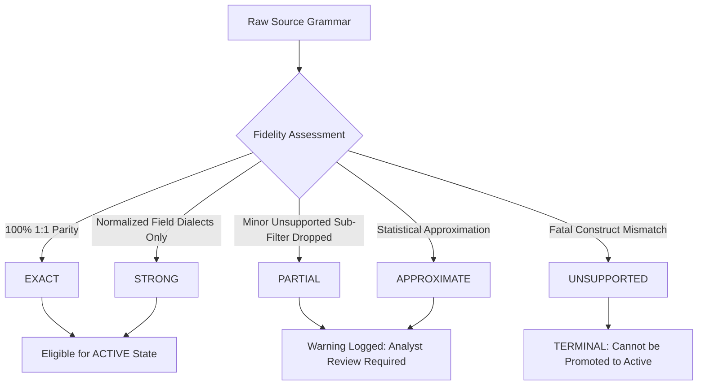

# NivXRay XDR — Content Translation Architecture

## 1. Architectural Philosophy: Native Semantics via Canonical IR

A primary flaw in traditional multi-SIEM translation systems is attempting to flatten distinct languages into a generic string query syntax. In NivXRay XDR:
```
YARA ≠ Sigma
Sigma ≠ EQL
EQL ≠ SPL
SPL ≠ KQL
```

Each detection language expresses security logic through fundamentally different paradigms:
- **Sigma**: Declarative YAML log filtering against structured event logs.
- **YARA**: Byte-level, hex-mask, regex, and header structural inspection of raw binaries and memory streams.
- **EQL**: Stateful event sequence joins (`sequence by host with maxspan=5m [process where ...] [file where ...]`).
- **SPL**: Streaming search processing pipeline with stats and evaluation commands.
- **KQL**: Relational schema projection with strongly typed tabular operators (`| where`, `| extend`, `| summarize`).

### Canonical IR (NIR) Role
Canonical Intermediate Representation (NIR) is **not** a lowest-common-denominator query flattener. Rather, NIR is a strongly-typed AST container that:
1. Retains native semantic intent and operators.
2. Normalizes entity fields across vendor dialects into NivXRay common taxonomy.
3. Attaches rich metadata (provenance, licensing, MITRE ATT&CK, confidence).
4. Routes rules to their native, optimized execution runtimes.
5. Bridges detection hits directly into the Security State causal graph.

```
       Source Language
  (Sigma / YARA / EQL / SPL / KQL)
              │
              ↓
  Language-Specific Parser
              │
              ↓
   AST Transformation Pass
              │
              ↓
 Canonical IR (NIR) Node Hierarchy
              │
    ┌─────────┴─────────┐
    ↓                   ↓
Translation      Runtime Engine
Fidelity Check     Binding
```

---

## 2. Supported Translation Engines & Translators

NivXRay implements specialized, dedicated translators registered in the central `TranslationManager`:

| Source Format | Dedicated Translator Class | Native Features Preserved | Execution Lane |
|:---|:---|:---|:---|
| **Sigma** | `SigmaTranslator` | Modifiers (`contains`, `endswith`, `all`), selection logic, conditional boolean trees | `SigmaEngine` |
| **YARA** | `YaraTranslator` | Hex bytes with wildcard masks, text/wide/ascii/nocase strings, PE magic header conditions | `YARARuntime` |
| **EQL** | `EqlTranslator` | Sequence progression, `by` keys, `until` clauses, `maxspan` temporal windows | `SigmaEngine` / `CorrelationEngine` |
| **SPL** | `SplTranslator` | Pipe processing, index/sourcetype isolation, search filters, wildcard terms | `SigmaEngine` |
| **KQL** | `KqlTranslator` | Table routing, verbatim `@""` string literals, `has`, `contains`, `in` operators | `SigmaEngine` |
| **IOC** | `IOCTranslator` | Defanged domains, IPCIDR ranges, URL sanitization, SHA-256 hash trees | `IOCIntelligence` |
| **Behavioral** | `BehavioralTranslator` | Parent-child lineage ancestry, token privilege checks, process trees | `SigmaEngine` |
| **Correlation** | `CorrelationTranslator` | 13 ICE operators, temporal sliding windows, causal event sequences | `CorrelationEngine` |
| **Threat Hunting**| `HuntingTranslator` | Hypothesis definitions, investigation pivot scopes, sweep schedules | `RuleStudioHunt` |
| **Baseline Anomaly**| `AnomalyTranslator` | Statistical thresholds, group-by entities, outlier detection definitions | `UEBAEngine` |
| **ATT&CK / Response**| `MappingTranslator` | Cross-domain tactic/technique mappings and remediation action triggers | `IKGMapping` / `ActionRegistry` |

---

## 3. Translation Fidelity Invariants & Anti-Weakening Guarantee

NivXRay classifies translation fidelity into five strict grades:



### The No-Silent-Weakening Rule
If a translation would silently drop a critical filter or wildcard that causes the rule to match broader activity (increasing false positives or diluting alert specificity), the translator **must fail** with `TranslationFidelity.UNSUPPORTED` and register an `UnsupportedConstruct` record explaining why the rule was rejected.
