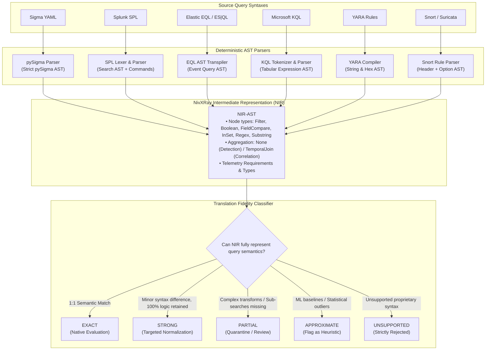
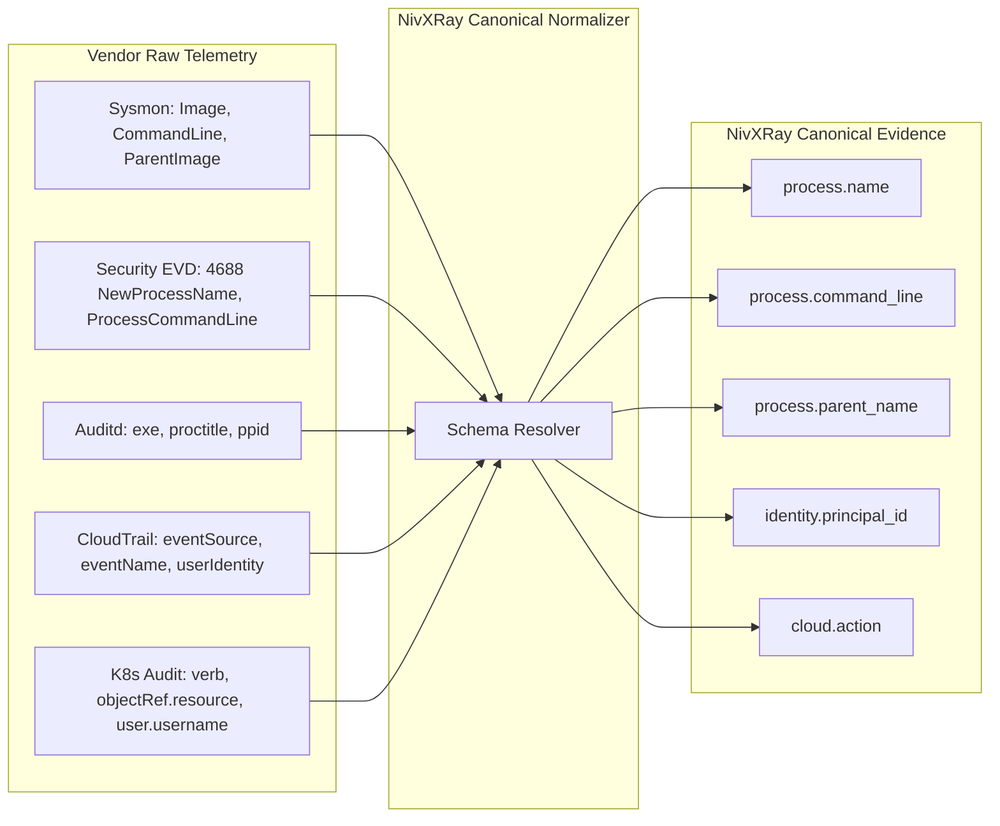
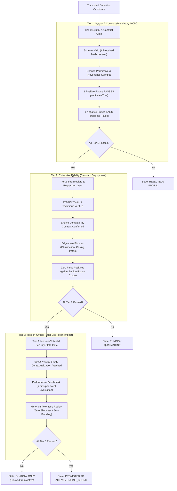

# NivXRay XDR — Content Translation Specification & Field Normalization
**Document Version:** 1.0.0  
**Audit Date:** 2026-09-04  
**Classification:** Detection Engineering & Grammar Specification  
**Governing Principle:** `NO EVIDENCE → NO CLAIM` · `NO SILENT WEAKENING`  
**Phase Status:** Phase 1 Read-Only Architecture & Truth Discovery  

---

## 1. Executive Summary & Strict Quality Contracts

This specification defines the deterministic translation pipelines, Intermediate Representation (IR), field normalization grammar, and multi-tier validation gates that govern the conversion of industry detection content (Sigma, SPL, KQL, EQL, YARA, Snort/Suricata) into the **NivXRay Canonical Content Model**.

### The Cardinal Rule: NO SILENT WEAKENING
> **If a query construct, aggregation window, or join operator cannot be represented faithfully by NivXRay's canonical evidence schema and native engines, it MUST be marked `UNSUPPORTED` or `PARTIAL`.**
> Under no circumstances shall an unsupported or complex condition (e.g. a sequence condition or entropy threshold) be silently stripped or weakened to an overbroad substring match.

---

## 2. Canonical NivXRay Content Model (Specification)

The table below specifies the complete schema contract for all content managed in NivXRay XDR, distinguishing fields that **currently exist** in the repository from **new proposed fields** required for Phase 2+:

| Schema Field | Type | Description | Current Repo State | Existing Citation / Target Component |
| :--- | :--- | :--- | :---: | :--- |
| `content_id` | `str` | Unique canonical content ID (e.g. `DET-EX-001`, `CORR-ENT-001`) | **EXISTS** | [`rules_enterprise.py:L331`](file:///d:/Projects/backend/detection_content/library/rules_enterprise.py#L331) |
| `content_type` | `enum` | Type: `DETECTION_RULE`, `CORRELATION_SCENARIO`, `PLAYBOOK` | **EXISTS** | [`models.py:L15`](file:///d:/Projects/backend/detection_content/library/models.py#L15) |
| `name` | `str` | Human-readable title of the detection | **EXISTS** | [`models.py:L35`](file:///d:/Projects/backend/detection_content/library/models.py#L35) |
| `description` | `str` | Detailed technical explanation of behavior | **EXISTS** | [`models.py:L36`](file:///d:/Projects/backend/detection_content/library/models.py#L36) |
| `source` | `str` | Source name (e.g. `SigmaHQ`, `Elastic`, `Splunk`, `NivXRay`) | **EXISTS** | [`xdr_rule_studio.py:L218`](file:///d:/Projects/backend/routers/xdr_rule_studio.py#L218) |
| `source_id` | `str` | Upstream rule identifier / UUID (e.g. `d3a436e2-...`) | **EXISTS** | [`sigma_strict.py:L55`](file:///d:/Projects/backend/detection_content/sigma_strict.py#L55) |
| `source_url` | `str` | Direct web link to upstream Git repository or research paper | **NEW** | Added to `canonical.provenance` |
| `license` | `str` | Declared open-source license (e.g. `Apache-2.0`, `DRL-1.1`, `MIT`) | **EXISTS** | [`xdr_rule_studio.py:L80`](file:///d:/Projects/backend/routers/xdr_rule_studio.py#L80) |
| `license_verified`| `bool` | Cryptographically audited license compliance flag | **EXISTS** | Regression Gate `license` check |
| `attribution` | `str` | Original author attribution string | **EXISTS** | Rule Studio schema metadata |
| `source_version` | `str` | Upstream Git tag or commit hash | **NEW** | Required for source diff engine |
| `source_date` | `str` | ISO 8601 creation/update timestamp of upstream rule | **NEW** | Required for freshness metrics |
| `platform` | `enum` | Target OS/Environment (`windows`, `linux`, `cloud`, etc.) | **EXISTS** | [`models.py:L22`](file:///d:/Projects/backend/detection_content/library/models.py#L22) |
| `product` | `str` | Target log source product (e.g. `m365`, `sysmon`, `auditd`) | **EXISTS** | [`rule_binding.py:L73`](file:///d:/Projects/backend/detection_content/rule_binding.py#L73) |
| `environment` | `str` | Enterprise domain classification (Domains A through AB) | **NEW** | Proposed for taxonomy alignment |
| `data_source` | `str` | Telemetry channel (`process_creation`, `dns_query`, etc.) | **EXISTS** | [`xdr_rule_studio.py:L77`](file:///d:/Projects/backend/routers/xdr_rule_studio.py#L77) |
| `event_types` | `list[str]`| List of matching event kinds (`process`, `network`, `auth`) | **EXISTS** | [`canonical_evidence.py`](file:///d:/Projects/backend/models/canonical_evidence.py) |
| `required_fields` | `list[str]`| Mandatory telemetry attributes needed for evaluation | **EXISTS** | [`models.py:L43`](file:///d:/Projects/backend/detection_content/library/models.py#L43) |
| `normalized_fields`| `dict` | Mapping from upstream field names to NivXRay canonical keys | **NEW** | Proposed for translation layer |
| `logic` | `str` | Native Python expression or transpiled predicate | **EXISTS** | [`models.py:L42`](file:///d:/Projects/backend/detection_content/library/models.py#L42) |
| `AST` | `dict` | Serializable Abstract Syntax Tree of the detection condition | **EXISTS** | [`sigma_strict.py:L51`](file:///d:/Projects/backend/detection_content/sigma_strict.py#L51) |
| `correlation_logic`| `dict` | Multi-event temporal join and sequence conditions | **EXISTS** | [`correlation_library.py:L43`](file:///d:/Projects/backend/detection_content/correlation_library.py#L43) |
| `severity` | `enum` | `CRITICAL`, `HIGH`, `MEDIUM`, `LOW`, `INFORMATIONAL` | **EXISTS** | [`models.py:L18`](file:///d:/Projects/backend/detection_content/library/models.py#L18) |
| `confidence` | `str` | `confirmed`, `high`, `medium`, `low` | **EXISTS** | [`models.py:L40`](file:///d:/Projects/backend/detection_content/library/models.py#L40) |
| `ATT&CK` | `list[str]`| MITRE ATT&CK technique IDs (e.g. `["T1059.001"]`) | **EXISTS** | [`models.py:L44`](file:///d:/Projects/backend/detection_content/library/models.py#L44) |
| `tactics` | `list[enum]`| ATT&CK Tactics (`EXECUTION`, `INITIAL_ACCESS`, etc.) | **EXISTS** | [`models.py:L26`](file:///d:/Projects/backend/detection_content/library/models.py#L26) |
| `techniques` | `list[str]`| Human-readable technique names | **EXISTS** | [`models.py:L38`](file:///d:/Projects/backend/detection_content/library/models.py#L38) |
| `kill_chain` | `str` | Unified Kill Chain stage mapping | **NEW** | Proposed for Security State bridge |
| `behavior` | `str` | Behavioral summary tag (e.g. `script_host_abuse`) | **EXISTS** | [`xdr_iue.py:L45`](file:///d:/Projects/backend/detection_content/xdr_iue.py#L45) |
| `fixtures` | `list` | Certified positive and negative test cases with expected booleans | **EXISTS** | [`models.py:L46`](file:///d:/Projects/backend/detection_content/library/models.py#L46) |
| `false_positive_profile`| `str`| Documented benign software interactions | **EXISTS** | [`models.py:L45`](file:///d:/Projects/backend/detection_content/library/models.py#L45) |
| `required_telemetry`| `list` | Sensor capabilities required (e.g. `powershell_scriptblock`) | **EXISTS** | [`rule_binding.py:L65`](file:///d:/Projects/backend/detection_content/rule_binding.py#L65) |
| `engine_binding` | `dict` | Compatible engine IDs, classification, and compatibility state | **EXISTS** | [`rule_binding.py:L16`](file:///d:/Projects/backend/detection_content/rule_binding.py#L16) |
| `semantic_equivalence`| `str` | SHA-256 hash of normalized AST structure | **NEW** | Proposed for deduplication engine |
| `provenance` | `dict` | Immutably stamped trace, author, timestamp, commit SHA | **EXISTS** | [`canonical_evidence.py`](file:///d:/Projects/backend/models/canonical_evidence.py) |
| `supersedes` | `str` | Rule ID of legacy rule replaced by this content | **NEW** | Proposed for versioning engine |
| `related_content` | `list[str]`| IDs of related correlation scenarios or playbooks | **EXISTS** | [`correlation_library.py`](file:///d:/Projects/backend/detection_content/correlation_library.py) |
| `duplicate_group` | `str` | Cluster identifier for functionally equivalent detectors | **NEW** | Proposed for deduplication store |
| `validation_status`| `enum` | `NOT_VERIFIED`, `TIER_1_PASS`, `TIER_2_PASS`, `TIER_3_PASS` | **EXISTS** | Regression gate checks |
| `lifecycle_status` | `enum` | `DRAFT`, `TESTING`, `VALIDATED`, `SHADOW`, `ACTIVE`, etc. | **EXISTS** | [`xdr_rule_studio.py:L58`](file:///d:/Projects/backend/routers/xdr_rule_studio.py#L58) |
| `security_state_mapping`| `dict` | Dual-use flag, reachability factors, abuse classification | **EXISTS** | [`detection_bridge.py:L31`](file:///d:/Projects/backend/security_state/detection_bridge.py#L31) |

---

## 3. Translation Pipeline & Language Grammars

The diagram below details how each upstream source format is converted into the canonical NivXRay model without silent weakening:

### Deterministic Translation Rules by Language:

#### A. Sigma Translation Path
- **Grammar**: Sigma YAML detection block (`selection`, `filter`, `condition`).
- **Parser**: `pySigma` official parser (`sigma_strict.py`).
- **Translation Fidelity**: **EXACT** for atomic field comparisons (`|contains`, `|startswith`, `|endswith`, `|re`, list OR semantics).
- **Unsupported Primitives**:
  - Aggregations (`count() by host > 5`) $\longrightarrow$ Transpiled into **Correlation Engine** rules (`routers/xdr_correlation.py`), NOT detection rules.
  - Near conditions (`near condition_a and condition_b`) $\longrightarrow$ Transpiled to `TEMPORAL` correlation operator.

#### B. Splunk SPL Translation Path
- **Grammar**: Pipe-delimited search commands: `search index=... | where ... | stats ...`.
- **Translation Fidelity**:
  - `search` / `where` boolean predicates $\longrightarrow$ **EXACT** (mapped to canonical NIR filter nodes).
  - Wildcard searches (`CommandLine="* -enc *"`) $\longrightarrow$ **EXACT** (`|contains`).
  - `stats count by host | where count > 5` $\longrightarrow$ **STRONG** (transpiled to Correlation Engine `COUNT` + `THRESHOLD`).
  - Macros (`eval`, `lookup`, `transaction`, `join`, `rex`) $\longrightarrow$ **PARTIAL** or **UNSUPPORTED**. Never silently strip `rex` extractions!

#### C. Elastic EQL / ES|QL Translation Path
- **Grammar**: Event Query Language sequence and event matching syntax: `process where process.name == "cmd.exe"`.
- **Translation Fidelity**:
  - Single event queries $\longrightarrow$ **EXACT** (direct 1:1 mapping to canonical NIR fields).
  - `sequence by host.id with maxspan=15m` $\longrightarrow$ **EXACT** (transpiled to ICE `TEMPORAL_ORDERED` operator).
  - ES|QL pipe queries $\longrightarrow$ **STRONG** for boolean filters; **UNSUPPORTED** for dynamic aggregation transforms.

#### D. Microsoft KQL Translation Path
- **Grammar**: Tabular data queries: `DeviceProcessEvents | where FileName =~ "powershell.exe" | where ProcessCommandLine has "-enc"`.
- **Translation Fidelity**:
  - `where` filters with string operators (`has`, `contains`, `startswith`, `==~`) $\longrightarrow$ **EXACT** (case-insensitive string matching in NIR).
  - `project`, `extend` $\longrightarrow$ **STRONG** (mapped to canonical evidence field references).
  - `summarize count() by DeviceId` $\longrightarrow$ Transpiled to Correlation Engine `COUNT` operator.
  - Cross-table `join kind=inner` $\longrightarrow$ Transpiled to `CROSS_SOURCE` correlation operator.

#### E. Network IDS (Snort / Suricata) Translation Path
- **Grammar**: Rule options: `content:"|00 01 02|"; pcre:"/regex/i"; sid:12345;`.
- **Translation Fidelity**: **EXACT** for signature ID, protocol, ports, and content byte sequences via `SnortEveParser` and `SnortNormalizer`.

---

## 4. Canonical Field Normalization Layer

To ensure external detections evaluate accurately across diverse environments, telemetry fields must be deterministically mapped to the **NivXRay Canonical Evidence Schema**:

### Comprehensive Field Normalization Matrix:

| Enterprise Domain | Upstream Source Field | NivXRay Canonical Field | Normalization Status | Transformation / Fallback Rule |
| :--- | :--- | :--- | :---: | :--- |
| **Windows / Sysmon** | `Image` | `process.name` | **EXACT** | Extract basename if full path present (`powershell.exe`) |
| **Windows / Sysmon** | `CommandLine` | `process.command_line` | **EXACT** | Strip enclosing quotes; preserve raw arguments |
| **Windows / Sysmon** | `ParentImage` | `process.parent_name` | **EXACT** | Extract basename |
| **Windows / Sysmon** | `User` | `identity.principal_id` | **EXACT** | Normalize `DOMAIN\User` format |
| **Windows / Sysmon** | `TargetObject` | `registry.path` | **EXACT** | Normalize registry hive aliases (`HKLM\` $\to$ `\REGISTRY\MACHINE\`) |
| **Windows Security** | `4688: NewProcessName` | `process.name` | **MAPPED** | Path normalized to lower-case basename |
| **Windows Security** | `4688: ProcessCommandLine` | `process.command_line`| **MAPPED** | Used directly |
| **Windows Security** | `4769: ServiceName` | `identity.service` | **MAPPED** | Kerberos SPN target extraction |
| **Windows Security** | `4768: TargetUserName` | `identity.target_user` | **MAPPED** | Account name without domain |
| **Linux Auditd** | `exe` | `process.name` | **EXACT** | Executable file path |
| **Linux Auditd** | `proctitle` | `process.command_line` | **DERIVED** | Unhex hex-encoded argv null-delimited arguments |
| **Linux eBPF** | `filename` | `process.name` | **EXACT** | Syscall `execve` target path |
| **macOS ESF** | `process.executable.path` | `process.name` | **EXACT** | Mach-O executable path |
| **Active Directory**| `5136: AttributeLDAPDisplayName`| `identity.attribute` | **MAPPED** | Directory schema attribute name |
| **AD CS** | `4886: CertificateTemplate` | `certificate.template` | **MAPPED** | OID or display template name |
| **Entra ID** | `UserPrincipalName` | `identity.principal_id` | **EXACT** | Normalized email identity |
| **Entra ID** | `appId` | `identity.service_principal_id`| **EXACT** | Client GUID of service principal |
| **M365 Exchange** | `Operations: New-InboxRule` | `cloud.action` | **MAPPED** | Canonical cloud audit operation |
| **DNS** | `QueryName` / `query` | `network.dns_query` | **EXACT** | Lowercase FQDN with trailing dot stripped |
| **Network IDS** | `src_ip` / `source.ip` | `network.src.ip` | **EXACT** | Validated IPv4 / IPv6 format |
| **Network IDS** | `dest_port` / `destination.port`| `network.dst.port` | **EXACT** | Integer 1 - 65535 |
| **AWS CloudTrail** | `eventName` | `cloud.action` | **EXACT** | API action name (`PutRolePolicy`) |
| **AWS CloudTrail** | `recipientAccountId` | `cloud.account_id` | **EXACT** | 12-digit AWS account number |
| **Azure Activity** | `operationName.value` | `cloud.action` | **MAPPED** | Azure Resource Manager operation |
| **GCP Cloud Audit** | `methodName` | `cloud.action` | **EXACT** | GCP RPC method string |
| **Kubernetes** | `verb` + `resource` | `cloud.action` | **DERIVED** | Formatted as `verb:resource` (e.g. `create:pods`) |
| **VMware ESXi** | `shell.log: command` | `process.command_line` | **EXACT** | CLI command string entered in ESXi tech support mode |
| **RMM Software** | Discovered Process Name | `process.name` | **EXACT** | Checked against RMM Known Binaries catalogue |
| **Non-Human ID** | Token Claims: `oid` / `sub` | `identity.principal_id` | **MAPPED** | Workload identity object ID |
| **AI Agent Trace** | LLM Tool Call: `tool_name` | `process.name` | **DERIVED** | Mapped from tool invocation name |

### Normalization Status Rules:
- **`EXACT`**: Field semantics and data types match directly without transformation.
- **`MAPPED`**: Field names differ, but standard 1:1 lookup resolves value with zero loss.
- **`DERIVED`**: Field requires deterministic string extraction (e.g. unhexing proctitle, combining verb + resource).
- **`UNAVAILABLE`**: Target telemetry is not provided by the originating log source. Must NOT be invented.
- **`AMBIGUOUS`**: Multiple conflicting fields exist (e.g. NAT IP vs Internal IP); must be explicitly disambiguated.

---

## 5. Multi-Tier Quality Validation Gate

Every converted detection must pass through the **NivXRay Quality Validation Gate** before it can be engine-bound or scheduled for shadow evaluation:

### Validation Tier Definitions:
1. **Tier 1 (Base Contract Gate)**:
   - **Prerequisites**: Valid schema, licensed, author provenance, compatible data source declared.
   - **Fixture Requirement**: Exactly **1 positive fixture** (asserts `True`) + **1 negative fixture** (asserts `False`).
   - **Outcome**: Promoted to `VALIDATED`.
2. **Tier 2 (Enterprise Fidelity Gate)**:
   - **Prerequisites**: Passed Tier 1.
   - **Fixture Requirement**: Minimum **3 positive variations** (case variations, argument reordering, path variations) + **3 negative benign administration fixtures**.
   - **Regression Requirement**: Zero regression failures across the master test corpus.
   - **Outcome**: Promoted to `ENGINE_BOUND`.
3. **Tier 3 (Mission-Critical & Dual-Use Gate)**:
   - **Prerequisites**: Required for all Critical-severity rules, RMM detections, and system-modifying detections (VSS deletion, Defender disablement).
   - **Enrichment**: Must attach a `SecurityStateDetectionBridge` contextualization mapping (identifying Crown Jewel reachability and privileged identity prerequisites).
   - **Performance**: Evaluation latency verified under 5.0 milliseconds on single-pass event loop.
   - **Outcome**: Promoted to `SHADOW MODE` for minimum 7-day observation before `ACTIVE` promotion.

---
*End of Content Translation Specification & Field Normalization.*
