# NivXRay XDR — Correlation Content Architecture & Coverage Matrix
**Document Version:** 1.0.0  
**Status:** IMPLEMENTED & INTEGRATED  
**Engine Base:** Stateful Multi-Operator Correlation Engine (`backend/routers/xdr_correlation.py`, 13 operators)  

---

## 1. Executive Summary & Architectural Invariant

A central mandate of this program was:
> **"Reuse the existing Correlation Engine. Do NOT create another correlation engine."**

NivXRay XDR's stateful correlation engine already possesses:
- **13 Stateful Operators**: `EVENT_MATCH`, `TEMPORAL`, `TEMPORAL_ORDERED`, `SEQUENCE`, `COUNT`, `THRESHOLD`, `VALUE_COUNT`, `GROUP_BY`, `ENTITY_CORRELATION`, `CROSS_SOURCE`, `CROSS_HOST`, `CROSS_USER`, `NEGATIVE_EVIDENCE`.
- **Sliding-Window Entity Memory**: MongoDB collections `xdr_correlation_rules`, `xdr_correlation_state`, `xdr_correlation_matches`.
- **Evidence-Only Invariant**: Emits correlation evidence (`CORRELATION_OBSERVED`, `CORRELATION_CANDIDATE`, `CORRELATION_SUPPORTED`), **never** verdicts. Verdicts remain exclusively owned by the downstream Verdict Engine (`VEEE` / `VerdictStage2`).

Rather than rebuilding this engine, this program authored and integrated the **Enterprise Correlation Content Pack** (`backend/detection_content/correlation_library.py`), expanding correlation from basic unit demonstrations to comprehensive multi-stage enterprise attack chains.

---

## 2. Multi-Stage Enterprise Correlation Scenarios

```mermaid
flowchart TD
    classDef step fill:#0f172a,stroke:#3b82f6,stroke-width:2px,color:#93c5fd;
    classDef corr fill:#1e1b4b,stroke:#8b5cf6,stroke-width:2px,color:#ddd6fe;

    subgraph RANSOMWARE ["CORR-ENT-001: Ransomware Pre-Encryption Kill Chain (TEMPORAL_ORDERED, 1800s)"]
        R1["1. LSASS Dump<br/>(DET-CR-001)"]:::step --> R2["2. Lateral Pivot<br/>(DET-LM-001)"]:::step
        R2 --> R3["3. VSS Shadow Deletion<br/>(DET-IM-001)"]:::step
        R3 --> R4["4. Mass File Encryption<br/>(DET-IM-004)"]:::step
        R4 --> R_OUT["Emits: CORRELATION_SUPPORTED<br/>Severity: CRITICAL"]:::corr
    end

    subgraph PHISH ["CORR-ENT-002: Phishing-to-C2 Infection Sequence (TEMPORAL_ORDERED, 600s)"]
        P1["1. Office Spawns Shell<br/>(DET-IA-002)"]:::step --> P2["2. Encoded PowerShell<br/>(DET-EX-001)"]:::step
        P2 --> P3["3. Certutil Ingress<br/>(DET-EX-002)"]:::step
        P3 --> P_OUT["Emits: CORRELATION_OBSERVED<br/>Severity: HIGH"]:::corr
    end

    subgraph RMM_PIVOT ["CORR-ENT-003: Valid Account RMM Lateral Movement (SEQUENCE, 1200s)"]
        M1["1. Privileged Auth<br/>(auth.privileged)"]:::step --> M2["2. Unauthorized RMM<br/>(DET-CC-001)"]:::step
        M2 --> M3["3. WinRM Remote Exec<br/>(DET-LM-002)"]:::step
        M3 --> M_OUT["Emits: CORRELATION_SUPPORTED<br/>Severity: HIGH"]:::corr
    end
```

---

## 3. Correlation Coverage Matrix

| Scenario ID | Name | Operator Type | Group By | Window | Sequence Stages | ATT&CK Mapping | Severity |
| :--- | :--- | :--- | :--- | :---: | :--- | :--- | :---: |
| **`CORR-ENT-001`** | Multi-Stage Ransomware Kill Chain | `TEMPORAL_ORDERED` | `host_id` | 1800s | 1. LSASS Memory Dump (`DET-CR-001`) 2. PsExec Lateral Pivot (`DET-LM-001`) 3. VSS Shadow Deletion (`DET-IM-001`) 4. Mass File Encryption (`DET-IM-004`) | `T1003.001`, `T1021.002`, `T1490`, `T1486` | **CRITICAL** |
| **`CORR-ENT-002`** | Phishing to C2 Ingress Sequence | `TEMPORAL_ORDERED` | `host_id` | 600s | 1. Office Spawning Shell (`DET-IA-002`) 2. Encoded PowerShell (`DET-EX-001`) 3. Certutil Ingress (`DET-EX-002`) | `T1566.001`, `T1059.001`, `T1105` | **HIGH** |
| **`CORR-ENT-003`** | Valid Account to RMM Lateral Pivot | `SEQUENCE` | `user_id` | 1200s | 1. Privileged Auth (`auth.privileged`) 2. Unauthorized RMM Tool (`DET-CC-001`) 3. WinRM Remote Execution (`DET-LM-002`) | `T1078.002`, `T1219`, `T1021.006` | **HIGH** |
| **`CORR-ENT-004`** | Cloud IMDS Theft to IAM Escalation | `TEMPORAL_ORDERED` | `user_id` | 900s | 1. Cloud IMDS Token Theft (`DET-CR-006`) 2. Cloud PutUserPolicy Escalation (`DET-PE-003`) | `T1552.005`, `T1098` | **CRITICAL** |
| **`CORR-ENT-005`** | AD Recon to AD CS Template Exploitation | `TEMPORAL_ORDERED` | `host_id` | 1800s | 1. AD Recon SharpHound (`DET-DS-001`) 2. AD CS ESC1 Abuse (`DET-PE-002`) 3. PsExec Lateral Movement (`DET-LM-001`) | `T1087.002`, `T1649`, `T1021.002` | **CRITICAL** |

---

## 4. Integration with Security State & Causal Intelligence

When a correlation scenario matches, it emits an enriched correlation evidence document that enters the **Security State Vector**:
1. **Attack Progression Update**: Transitions the Security State attack stage from `PRE_ATTACK` $\longrightarrow$ `ACTIVE_ATTACK` or `CONFIRMED_ATTACK`.
2. **Attacker Capabilities**: Activates capabilities in the capability profiler (`RANSOMWARE_STAGING`, `CREDENTIAL_ACCESS`, `LATERAL_MOVEMENT`).
3. **Causal DAG Generation**: Injects causal edges directly between the ordered stages in `causal/engine.py`, guaranteeing that counterfactual simulations know precisely which intervention cuts the critical path.

---
*End of Correlation Content Architecture & Matrix.*
