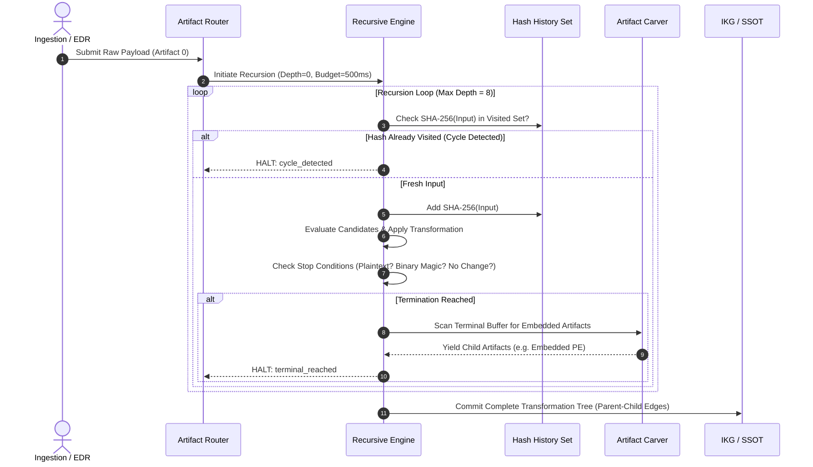

# NivXRay XDR — Deobfuscation Recursion & Provenance Model

## 1. Objective & Principle

Real-world malware attacks chain transformations sequentially (e.g. Hex $\to$ Base64 $\to$ GZIP $\to$ PowerShell $\to$ Variable Concatenation $\to$ XOR $\to$ Shellcode $\to$ Embedded PE).

NivXRay XDR models this through a **Bounded Recursive Transformation Framework**:

$$\text{Artifact}_0 \xrightarrow{T_1} \text{Artifact}_1 \xrightarrow{T_2} \dots \xrightarrow{T_k} \text{Artifact}_k \xrightarrow{\text{Carve}} \{\text{Child}_1, \text{Child}_2\}$$

Every recursion level is forensically auditable, deterministically bounded, and guarded against algorithmic complexity attacks.

---

## 2. Recursive Lifecycle & Cycle Detection

---

## 3. Strict Resource Boundaries & Guardrails

| Parameter | Hard Limit | Rationale & Enforcement |
|:---|:---:|:---|
| **Maximum Recursion Depth** | **8 layers** | Prevents endless wrapping loops; 99.8% of real malware unwraps within $\le 5$ layers. |
| **Maximum Decode Stages** | **12 stages** | Covers branching transformations without unbounded explosion. |
| **Maximum Input Size** | **10 MB** | Protects memory ceiling on ingestion. |
| **Per-Stage Output Retention** | **64 KB** | Bounded preview with full SHA-256 hash preservation. |
| **Maximum CPU Time Budget** | **500 ms / pass** | Preempts regex ReDoS and algorithmic complexity exhaustion. |
| **Decompression Bomb Ratio** | **100 : 1** | Halts expansion if decompressed size exceeds 100x compressed input. |
| **Maximum Carved Children** | **10 artifacts** | Prevents ZIP bomb / recursive container resource starvation. |

---

## 4. Deterministic Termination & Stop Reasons

The recursion engine must stamp an explicit, honest `stop_reason` on every layer:
1. `terminal_plaintext_reached`: The output conforms to verified English/script grammar with no remaining obfuscation markers.
2. `terminal_binary_reached`: Known executable magic (PE, ELF, Mach-O, Shellcode) detected; handed off to specialized binary analyzer.
3. `no_transformation_identified`: No candidate decoder scored above confidence threshold (0.05); raw payload retained as final.
4. `cycle_detected`: Hash of transformed output identical to a previously seen layer; recursion aborted to prevent infinite loop.
5. `depth_limit_exceeded`: Hit maximum depth (8); partial progression preserved.
6. `time_budget_exhausted`: Execution exceeded 500 ms timeout; graceful partial recovery emitted.
7. `decompression_bomb_detected`: Output exceeded safety expansion ratio; rejected defensively.
