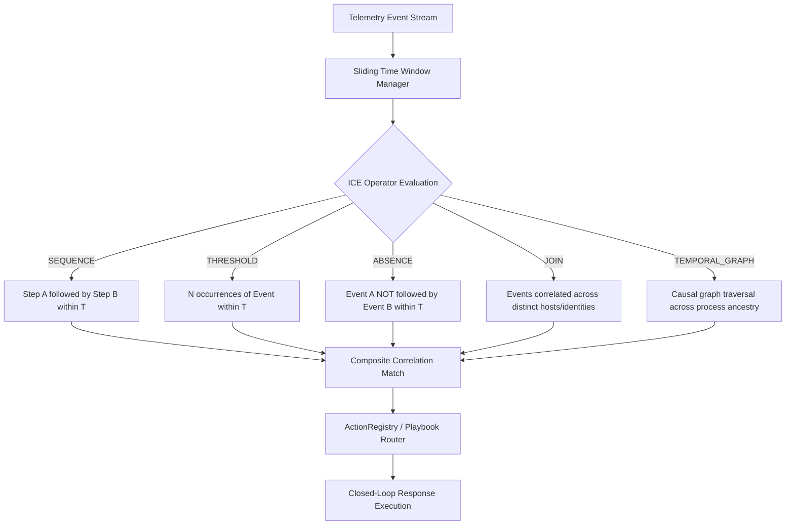

# NivXRay XDR — Detection Correlation & Response Flow

## 1. Multi-Event Correlation Architecture

Adversaries do not execute intrusions in a single atomic command. Complex attacks occur in multi-stage sequences across distributed endpoints, network perimeters, and cloud identities over minutes, hours, or days.

NivXRay implements the **Industrial Correlation Engine (ICE)** supporting **13 stateful correlation operators** across sliding temporal windows:



---

## 2. The 13 Authoritative Correlation Operators

| # | Operator Name | Native Semantics | Example Attack Scenario Detected |
|:---|:---|:---|:---|
| 1 | `SEQUENCE` | Event A followed by Event B within `max_span` | Phishing attachment opened -> PowerShell spawns -> C2 beacon initiates |
| 2 | `STRICT_SEQUENCE` | Event A followed immediately by Event B with no intervening events | Command execution -> immediate defense evasion unhooking |
| 3 | `THRESHOLD` | Event count exceeds $N$ within time window $W$ | Password spraying (>10 failed logons in 60s across different users) |
| 4 | `UNIQUE_COUNT` | Distinct values of field exceeds $K$ within $W$ | Port scan (>50 unique destination ports from single source IP) |
| 5 | `ABSENCE` | Event A occurs, but expected Event B does NOT occur | Staged file creation without subsequent automated backup upload |
| 6 | `CONCURRENT` | Events A and B occur within small window $\pm \Delta t$ | Simultaneous logon to same user account from two distant IP addresses |
| 7 | `JOIN_BY_ENTITY` | Correlates events sharing a common entity key | Process hash matched on host A followed by lateral movement to host B |
| 8 | `CAUSAL_ANCESTRY` | Multi-hop process tree relationship traversal | Office app -> WMI -> PowerShell -> Certutil -> Injected LSASS |
| 9 | `NETWORK_BEACON` | Periodic network requests with low jitter | HTTP C2 callback with interval $60s \pm 10\%$ over 4 hours |
| 10 | `CROSS_SOURCE_JOIN` | Joins endpoint EDR event with cloud/firewall log | Endpoint process creation matching outbound blocked firewall stream |
| 11 | `TEMPORAL_WINDOW` | Sliding time aggregation window | Accumulation of low-severity suspicious events into high-severity incident |
| 12 | `SET_DIFFERENCE` | Set comparison between baseline and active set | New process launched on server that never ran in 30-day baseline |
| 13 | `STATEFUL_FSM` | Full multi-state automaton progression | Initial Access -> Discovery -> Lateral Movement -> Exfiltration |

---

## 3. Closed-Loop Response Execution Flow

When a correlation or high-confidence detection hits, NivXRay triggers automated closed-loop response playbooks registered in `ActionRegistry`:

```mermaid
sequenceDiagram
    autonumber
    participant Engine as Correlation Engine
    participant Registry as Action Registry
    participant Safety as Safety Gate
    participant Executor as Response Executor
    participant Audit as Response Audit Log

    Engine->>Registry: Trigger Playbook (e.g., ACT-RESP-001: Host Containment)
    Registry->>Safety: Check Blast Radius & Target Exclusion List
    alt Target is Critical Infrastructure (Domain Controller / Hospital ICU)
        Safety-->>Registry: Block Automated Action; Request SOC Approval
    else Target is Standard Workstation
        Safety->>Executor: Authorize Execution Token
        Executor->>Executor: Execute Network Isolation / Process Kill
        Executor->>Audit: Record Immutable Execution Proof
        Executor->>Engine: Return Execution Status (SUCCESS)
    end
```

### Response Playbooks Supported
1. `ACT-RESP-001` (**Host Network Isolation**): Severs all non-management traffic to contain active lateral movement.
2. `ACT-RESP-002` (**Process Tree Termination**): Kills offending malicious processes and child processes.
3. `ACT-RESP-003` (**Account Credential Invalidation**): Forces password reset and revokes active Kerberos/OAuth tokens.
4. `ACT-RESP-004` (**Automated File Quarantine**): Moves malicious payload to encrypted sandbox repository.
