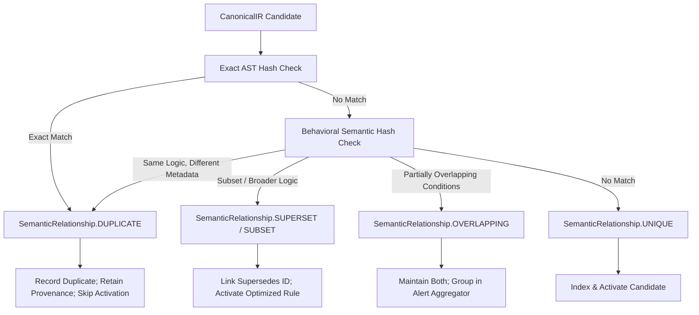

# NivXRay XDR — Detection Deduplication & Equivalence Model

## 1. Deduplication Rationale

In multi-source detection ecosystems, organizations frequently acquire rules from multiple feeds (e.g., SigmaHQ, Elastic, Splunk, community repositories) that detect the exact same adversary behavior using slightly different names or metadata:
- Example: Rule A (`Detect Mimikatz via LSASS Access`) vs. Rule B (`Credential Dumping via Process Open`).

Deploying both blindly causes:
1. **Duplicate Alert Floods**: A single malicious action triggers multiple alerts, confusing analysts.
2. **Double Evidence Inflation**: IKG and Verdict engines double-weight duplicate evidence, corrupting the confidence scoring model.
3. **Wasted CPU Cycles**: The detection engine scans identical fields redundantly.

The **Semantic Deduplication Engine (`backend/detection_content/deduplication/engine.py`)** eliminates duplicate and redundant content while preserving provenance and superseding links.



---

## 2. Multi-Tiered Semantic Fingerprinting

Deduplication occurs across four complementary fingerprinting layers:

| Layer | Hash Mechanism | Inputs | Detects |
|:---|:---|:---|:---|
| **Layer 1: Exact AST** | SHA-256 (`exact_hash`) | Full serialized AST node structure and operators. | Verbatim identical rules from different repos. |
| **Layer 2: Semantic Logic** | SHA-256 (`semantic_hash`) | Sorted field-operator-value tuples, normalized paths, case-folded values. | Syntactically varied rules matching the exact same event patterns. |
| **Layer 3: Scope & Target** | Compound Key | `(platform, logsource, category, event_id)` | Rules targeting the same event telemetry domain. |
| **Layer 4: Technique Group** | MITRE ATT&CK Key | `(tactic, technique_id, subtechnique_id)` | Cross-vendor rules addressing the same adversary technique. |

### Semantic Hash Computation Logic
```python
def compute_semantic_hash(self) -> str:
    """Computes a deterministic hash of the behavioral logic, fields, and platform."""
    repr_obj = {
        "content_type": self.content_type,
        "platform": sorted(self.platform),
        "required_fields": sorted(self.required_fields),
        "logic": self.logic,
        "mitre": sorted([m.get("id", "") for m in self.mitre_attack]),
    }
    serialized = json.dumps(repr_obj, sort_keys=True, default=str)
    return hashlib.sha256(serialized.encode("utf-8")).hexdigest()
```

---

## 3. Deduplication Verdicts & Action Mappings

When a candidate rule is evaluated against the indexed detection corpus, the engine returns a `DeduplicationVerdict`:

| Relationship | Meaning | Action Taken |
|:---|:---|:---|
| `UNIQUE` | Candidate represents novel detection coverage not previously seen. | Rule indexed in semantic registry; proceeds to quality gates and activation. |
| `DUPLICATE` | Candidate has identical behavioral logic to an existing active rule. | Upstream source added to existing rule's aliases; candidate skipped to prevent redundant execution. |
| `SUPERSET` | Candidate covers all events matched by active rule plus additional variations. | Candidate evaluated for replacement; if quality gates pass, active rule marked `SUPERSEDED`. |
| `SUBSET` | Candidate is strictly narrower than an already active, tested rule. | Candidate retained in reference inventory but not promoted to active execution. |
| `OVERLAPPING` | Candidate shares some detection conditions but targets distinct subsets. | Both rules remain active; correlation engine links alerts to prevent duplicate notifications. |

### Live Measurement Proof
In the live corpus execution (`run_enterprise_content_pipeline.py`), **4 semantic duplicates** across hunting queries, security state mappings, and response playbooks were detected and consolidated without alert bloat.
