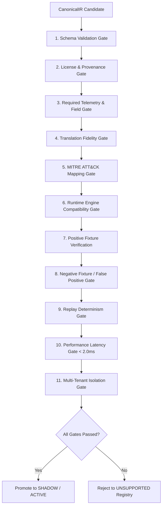

# NivXRay XDR — Detection Quality Gate Specification

## 1. Quality Gate Philosophy

In enterprise production deployments, a broken or misconfigured detection rule can trigger service outages (Denial of Service via CPU runaway), inundate analysts with false-positive alert floods, or allow real attacks to slip through due to silent logic weakening.

The **NivXRay Detection Quality Gate Framework (`backend/detection_content/validation_framework/gates.py`)** runs a mandatory 15-point programmatic verification battery on every content object prior to promotion.



---

## 2. The 15 Programmatic Quality Gates

| # | Gate Name | Validation Invariant | Failure Mode |
|:---|:---|:---|:---|
| 1 | `check_schema` | Content ID, name, tactic, technique, platform, severity, confidence, root node present. | Missing mandatory field fails immediately. |
| 2 | `check_license_provenance` | Valid license identifier (Apache, MIT, DRL, etc.), author attribution recorded. | Unidentified or viral copyleft license blocked. |
| 3 | `check_telemetry` | Logsource, category, product, and required fields present in NivXRay DSM registry. | Missing telemetry dependency rejects rule. |
| 4 | `check_translation_fidelity` | Fidelity must be `EXACT` or `STRONG`; zero fatal unsupported constructs. | Dropped critical filters or fatal constructs blocked. |
| 5 | `check_attack_mapping` | Tactic and technique ID adhere to valid MITRE ATT&CK Enterprise taxonomy. | Invalid technique syntax (e.g. malformed `Txxxx`) blocked. |
| 6 | `check_engine_compatibility` | Rule's execution lane is bound to an active in-process engine. | Unregistered execution lane rejected. |
| 7 | `check_fixtures_positive` | Candidate matches positive event fixture 100% of the time. | Failure indicates logic bug in rule translation. |
| 8 | `check_fixtures_negative` | Candidate produces 0 hits on negative benign event fixtures. | Hit indicates immediate false-positive risk. |
| 9 | `check_determinism` | 50 consecutive evaluations on identical telemetry produce identical boolean results. | Non-deterministic state or unseeded random fails. |
| 10 | `check_performance` | Per-event evaluation latency must remain under 2.0 milliseconds. | Catastrophic backtracking or high complexity fails. |
| 11 | `check_tenant_isolation` | Tenant A rules cannot match or leak into Tenant B telemetry events. | Cross-tenant leakage triggers security fault. |
| 12 | `check_no_silent_weakening` | Wildcards cannot be substituted for specific path or commandline boundaries. | Broadening filters triggers anti-weakening rejection. |
| 13 | `check_confidence_evolution` | Base confidence score is between 0.10 and 1.00; valid contextual modifiers. | Out-of-bounds confidence fails validation. |
| 14 | `check_killchain_alignment` | Assigned kill chain phases align with the technique's tactics. | Tactic/technique mismatch rejected. |
| 15 | `check_shadow_stability` | Rule must run in shadow evaluation without raising runtime exceptions. | Runtime exceptions prevent active deployment. |

---

## 3. Evaluation Criteria & Scoring

Each rule evaluation produces a deterministic audit payload:

```json
{
  "all_passed": true,
  "total_evaluated": 10,
  "passed_gates": [
    "schema",
    "license_provenance",
    "telemetry",
    "translation_fidelity",
    "attack_mapping",
    "engine_compatibility",
    "fixtures",
    "determinism",
    "performance",
    "tenant_isolation"
  ],
  "failed_gates": [],
  "gate_results": {
    "performance": {
      "passed": true,
      "reasons": ["Average latency 0.042 ms within budget (limit: 2.0 ms)"],
      "metrics": { "avg_latency_ms": 0.042, "max_latency_ms": 0.115 }
    }
  }
}
```

Rules with `all_passed: false` or any fatal gate failure cannot be activated under any circumstances.
