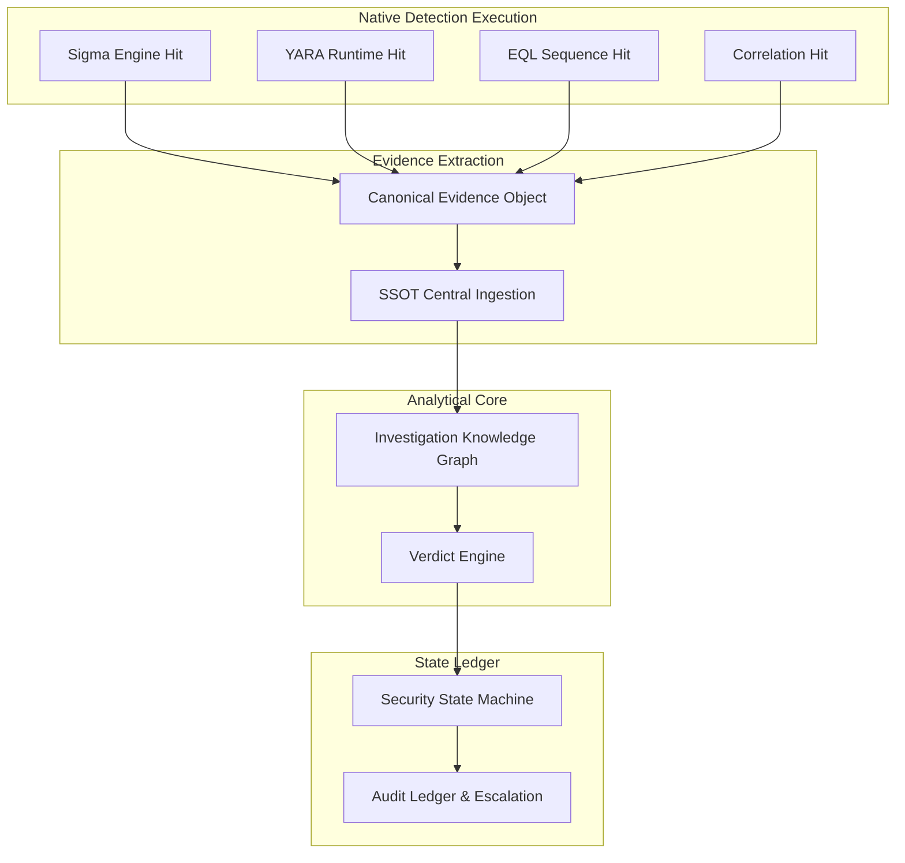

# NivXRay XDR — Detection-to-Security State Flow

## 1. The Causal Bridge Architecture

In traditional XDR architectures, detection alerts are isolated strings or flat notifications emitted to an alert table. In NivXRay XDR, detections are **evidence-generating state transformers**.

Detections do not stop at firing an alert: they produce **Canonical Evidence** that feeds the Investigation Knowledge Graph (IKG), drives the Verdict Engine, and dynamically mutates the entity's **Security State**.



---

## 2. Dynamic Security State Transitions

NivXRay evaluates detection evidence within a causal security state machine across 6 explicit operational states:

```
[AUTHORIZED_ACTIVITY]
         │  (Suspicious parameters / abnormal path)
         ▼
[SUSPICIOUS_ANOMALY]
         │  (Unenrolled identity / no business ticket)
         ▼
[ABUSED_CAPABILITY]
         │  (Direct lateral reachability to Crown Jewels)
         ▼
[ATTACK_CAPABLE]
         │  (Preceded by credential dumping / active C2 beacon)
         ▼
[CONFIRMED_ATTACK]
         │  (Automated containment executed / host isolated)
         ▼
[CONTAINED / REMEDIATED]
```

### Transition Triggers & Evidence Types

| State Transition | Evidence Threshold | Triggering Detection Types | Security State Action |
|:---|:---|:---|:---|
| `AUTHORIZED` → `SUSPICIOUS_ANOMALY` | Minor outlier anomaly | Behavioral baseline deviation; unapproved CLI flags on RMM tool | Flag entity; initiate background telemetry recording |
| `SUSPICIOUS_ANOMALY` → `ABUSED_CAPABILITY` | Dual-use tool abuse | Sigma RMM execution; unapproved remote software | Escalate investigation priority; alert SOC analyst |
| `ABUSED_CAPABILITY` → `ATTACK_CAPABLE` | Network reachability verified | Host has open lateral path to Domain Controller or DB cluster | Restrict service account privileges; enforce MFA challenge |
| `ATTACK_CAPABLE` → `CONFIRMED_ATTACK` | Hostile adversary capability proven | YARA memory beacon hit; LSASS dump; ransomware volume deletion | Issue immediate SEV-1 incident; trigger closed-loop containment |
| `CONFIRMED_ATTACK` → `CONTAINED` | Successful response verification | Automated host isolation; process termination confirmed | Record resolution in Security State ledger |

---

## 3. The Security State Binding Contract

The bridge between detection logic and Security State (`backend/detection_content/validation_framework/binding_bridge.py`) defines an immutable contract:

1. **Evidence Provenance**: Every state transition must point to the concrete `evidence_id`, `rule_id`, and telemetry timestamps that triggered it.
2. **Deterministic Confidence Escalation**: A single low-confidence hit cannot force a `CONFIRMED_ATTACK` transition. Escalation requires multiple independent evidence artifacts (e.g., process creation + network connection + YARA match).
3. **Causal Invariance**: If underlying evidence is revoked or marked false-positive by an analyst correction, the Security State recalculates backwards to restore previous verified states.
