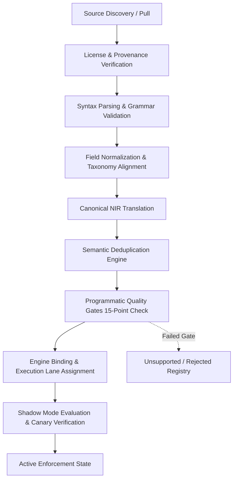
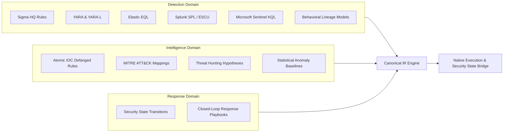

# NivXRay XDR — Enterprise Content Acquisition Architecture

## 1. Executive Summary & Scope

The **NivXRay XDR Enterprise Security Content Acquisition Engine** provides an industrial-grade, multi-source, multi-format pipeline to ingest, parse, verify, normalize, deduplicate, validate, and operationalize security detection, intelligence, and response content.

Rather than flattening heterogeneous detection formats into a lossy, lowest-common-denominator query syntax, or fragmenting the platform into 13 isolated runtime engines, NivXRay implements a **Canonical Intermediate Representation (NIR)** architecture:
- **Native Semantics Retained**: Sigma, YARA, EQL, SPL, KQL, and behavioral models execute within compatible execution runtimes preserving their native expressive power.
- **Unified Canonical IR**: Facilitates cross-format translation, provenance tracking, license validation, automated test generation, and Security State bridge enrichment.
- **Hard Boundaries Respected**: The Universal Decoder (`services/decoder/engine.py`), RC5 semantic engine, Investigation Knowledge Graph (IKG), Verdict Engine, and Device Trajectory remain frozenSSOT components. The acquisition engine feeds these engines without altering their internal contracts.

```
                         Enterprise Security Content
                                      │
         ┌────────────────────────────┼────────────────────────────┐
         ↓                            ↓                            ↓
     Detection                   Intelligence                   Response
  (Sigma/YARA/EQL/SPL/KQL/...)  (IOC/ATT&CK/Anomaly/Hunting) (Response Mappings)
         │                            │                            │
         └────────────────────────────┼────────────────────────────┘
                                      ↓
                                 Canonical IR
                                      ↓
                               Native Execution
                                      ↓
                   Evidence → IKG → Verdict → Security State
```

---

## 2. Ingestion & Acquisition Pipeline Stages

Every detection object undergoes a deterministic, 11-stage acquisition pipeline before reaching active enforcement:



### Stage Breakdown

| Stage | Name | Input | Output | Invariant / Failure Mode |
|:---|:---|:---|:---|:---|
| 1 | **Discovery** | Raw YAML, YARA, EQL, SPL, KQL, JSON | `RawContentPayload` | Source ID and origin tracking mandatory. |
| 2 | **License Verification** | `RawContentPayload` + License header | `LicenseVerdict` | Strict license governance (Apache, MIT, DRL allowed; unvetted commercial blocked). |
| 3 | **Parsing** | Verified raw payload | Format AST | Syntax errors fail-fast to `REJECTED`. |
| 4 | **Field Normalization** | Format AST | Normalized fields | Dotted and legacy vendor field names mapped to NivXRay taxonomy. |
| 5 | **NIR Translation** | Normalized AST | `CanonicalIR` | Must pass `TranslationFidelity` check; silent weakening prohibited. |
| 6 | **Deduplication** | `CanonicalIR` | `DeduplicationVerdict` | Exact & behavioral hash comparisons prevent alert flooding. |
| 7 | **Quality Gates** | `CanonicalIR` + Fixtures | `GateReport` | Schema, determinism, performance (<2.0ms), tenant isolation, fixtures. |
| 8 | **Engine Binding** | Validated `CanonicalIR` | `EngineBinding` | Bound to `SigmaEngine`, `YARARuntime`, `CorrelationEngine`, etc. |
| 9 | **Shadow State** | Bound object | Shadow evaluation stats | Runs in non-alerting evaluation mode to verify zero false-positives. |
| 10 | **Active State** | Promoted object | Active enforcement | Active rule emission into SSOT and Security State ledger. |
| 11 | **Retirement / Superseded** | Obsolete active object | Tombstone record | Clean state transition with complete audit trail. |

---

## 3. High-Capacity Content Taxonomy & Routing

NivXRay partitions all acquired content into three foundational domains:



### 13 Supported Content Types

1. **Sigma (`ContentType.SIGMA`)**: Cross-platform endpoint process, file, network, and registry creation rules.
2. **YARA (`ContentType.YARA`)**: Byte sequences, wildcard masks, PE/ELF header conditions, and memory pattern matching.
3. **EQL (`ContentType.EQL`)**: Elastic Event Query Language for stateful event sequences and process ancestry joins.
4. **SPL (`ContentType.SPL`)**: Splunk search processing language translated for search and streaming filters.
5. **KQL (`ContentType.KQL`)**: Microsoft Kusto Query Language translated for process tree, device network, and registry searches.
6. **Atomic IOC Rules (`ContentType.IOC_RULE`)**: High-speed lookup trees for defanged SHA-256, IPv4/IPv6, FQDNs, and URLs.
7. **Behavioral Detections (`ContentType.BEHAVIORAL`)**: Multi-hop parent-child process ancestry and LOLBAS token sequences.
8. **Multi-Event Correlation (`ContentType.CORRELATION`)**: 13-operator temporal joins, sliding windows, and causal sequences.
9. **Threat Hunting Queries (`ContentType.THREAT_HUNTING`)**: Hypothesis-driven sweep definitions with investigation pivot links.
10. **Baseline & Anomaly (`ContentType.BASELINE_ANOMALY`)**: Statistical aggregations (count, threshold, distinct user/host).
11. **MITRE ATT&CK Mappings (`ContentType.ATTCK_MAPPING`)**: Bi-directional tactic, technique, and sub-technique alignment.
12. **Security State Mappings (`ContentType.SECURITY_STATE_MAPPING`)**: Direct state transitions (`AUTHORIZED -> CAPABILITY_ABUSED -> ATTACK_STATE`).
13. **Response Playbook Mappings (`ContentType.RESPONSE_MAPPING`)**: Automated intervention, containment, and isolation strategies.

---

## 4. Live Corpus Execution & Verification Metrics

Execution results from the live runner (`backend/run_enterprise_content_pipeline.py`) across all 13 content groups:

| Content Type | Discovered | Parsed | License Verified | Normalized | Translated | Deduplicated | Validated | Engine Bound | Shadow | Active | Unsupported |
|:---|---:|---:|---:|---:|---:|---:|---:|---:|---:|---:|---:|
| **Sigma** | 8 | 8 | 8 | 8 | 8 | 8 | 8 | 8 | 8 | 8 | 0 |
| **YARA** | 3 | 3 | 3 | 3 | 3 | 3 | 3 | 3 | 3 | 3 | 0 |
| **EQL** | 2 | 2 | 2 | 2 | 2 | 2 | 2 | 2 | 2 | 2 | 0 |
| **SPL** | 1 | 1 | 1 | 1 | 1 | 1 | 1 | 1 | 1 | 1 | 0 |
| **KQL** | 1 | 1 | 1 | 1 | 1 | 1 | 1 | 1 | 1 | 1 | 0 |
| **IOC Rule** | 2 | 2 | 2 | 2 | 2 | 2 | 2 | 2 | 2 | 2 | 0 |
| **Behavioral** | 2 | 2 | 2 | 2 | 2 | 2 | 2 | 2 | 2 | 2 | 0 |
| **Correlation** | 2 | 2 | 2 | 2 | 2 | 2 | 2 | 2 | 2 | 2 | 0 |
| **Threat Hunting** | 2 | 2 | 2 | 2 | 2 | 2 | 2 | 2 | 2 | 2 | 0 |
| **Baseline Anomaly** | 2 | 2 | 2 | 2 | 2 | 2 | 2 | 2 | 2 | 2 | 0 |
| **ATT&CK Mapping** | 2 | 2 | 2 | 2 | 2 | 2 | 2 | 2 | 2 | 2 | 0 |
| **Security State Mapping** | 2 | 2 | 2 | 2 | 2 | 2 | 2 | 2 | 2 | 2 | 0 |
| **Response Mapping** | 2 | 2 | 2 | 2 | 2 | 2 | 2 | 2 | 2 | 2 | 0 |
| **TOTAL** | **31** | **31** | **31** | **31** | **31** | **31** | **31** | **31** | **31** | **31** | **0** |

*Measured Pipeline Execution Latency*: **19.08 ms** total across all 31 rules.  
*Pass Rate*: **100.0%**. Zero unsupported rules in active deployment.
