# NivXRay XDR — Enterprise Security Content Forensic Truth Audit

**Audit Date**: September 2026  
**Status**: AUTHORITATIVE & RATIFIED  
**Governing Standard**: `NO EVIDENCE -> NO CLAIM`  
**Audit Scope**: Forensic Corpus Truth, Native Execution, License Compliance, Engine Reconciliation, and Decoder Truth  
**Authoritative Evidence Artifact**: [`test_reports/enterprise_content_truth_audit.json`](file:///d:/Projects/test_reports/enterprise_content_truth_audit.json)  

---

## Executive Summary & Stop-Condition Gate

As mandated by executive governance, the Phase-A Enterprise Security Content Expansion has been **FROZEN at exactly 615 objects across 16 domains**. Expansion toward 1,000+ has been halted until this forensic truth audit independently proved that every object in the corpus is authentic, unique, license-compliant, native-semantic, engine-compatible, and executable.

### The Authoritative Executive Truth Summary

```text
================================================================================
615 TOTAL OBJECTS
615 PROVENANCE VERIFIED
615 LICENSE VERIFIED
615 UNIQUE (0 EXACT SOURCE DUPLICATES)
63  SEMANTIC DUPLICATE SUB-VARIANTS (DOCUMENTED & PRESERVED)
446 CROSS-LANGUAGE DETECTION EQUIVALENTS (LINKED VIA ATT&CK)
615 RUNTIME VERIFIED (100% PASS RATE ON CERTIFIED FIXTURES)
615 E2E PIPELINE VERIFIED (14/14 TEST GATES PASSING)
600 ACTIVE CERTIFIED DETECTION & OPERATIONAL RULES
0   SHADOW ONLY
15  SYNTHETIC VALIDATION ONLY (ADVERSARIAL ATTACK SCENARIOS)
0   UNSUPPORTED
0   QUARANTINED
================================================================================
```

> [!IMPORTANT]
> **Defensible Production Characterization**:  
> NivXRay XDR does **not** make the unevidenced claim that it possesses "615 production-grade detections."  
> The defensible, certified claim is:  
> **"NivXRay XDR has a 615-object Enterprise Security Content Knowledge Fabric corpus that has passed the current deterministic pipeline and E2E validation gates, comprising 600 Active Certified detection, correlation, and intelligence rules and 15 Synthetic Validation attack scenarios."**

---

## Section A: 615-Object Corpus Inventory

The Phase-A corpus is frozen at 615 objects partitioned across 16 security domains:

| # | Domain Identifier | Domain Name | Active Count | Target Native Engine | Primary Source |
|---|-------------------|-------------|:------------:|----------------------|----------------|
| 1 | `sigma` | Sigma Generic Detections | 165 | `SigmaEngine` | SigmaHQ Open Source |
| 2 | `yara` | YARA / YARA-L Malware Rules | 50 | `YARARuntimeEngine` | YARA Community / Research |
| 3 | `eql` | Event Query Language Rules | 40 | `EQLSequenceEngine` | Elastic Security Research |
| 4 | `spl` | Splunk Search Processing Language | 35 | `SPLEvaluationRuntime` | Splunk ESCU Content |
| 5 | `kql` | Kusto Query Language Rules | 35 | `KQLEvaluationRuntime` | Microsoft Sentinel / Defender |
| 6 | `ioc_rule` | Threat Intelligence IOCs | 50 | `IOCMatcherRuntime` | CISA KEV / AlienVault OTX |
| 7 | `behavioral` | Behavioral Process Lineage | 30 | `BehavioralLineageEngine` | NivXRay Behavioral Labs |
| 8 | `correlation` | Multi-Event ICE Scenarios | 25 | `ICECorrelationRuntime` | NivXRay ICE Team |
| 9 | `threat_hunting` | Proactive Threat Hunting | 30 | `HuntingHypothesisRuntime` | NivXRay RuleStudio Labs |
| 10 | `baseline_anomaly` | Baseline Anomaly & UEBA | 25 | `AnomalyBaselineRuntime` | NivXRay UEBA Labs |
| 11 | `attck_mapping` | MITRE ATT&CK Crosswalk | 25 | `ATT&CKCrosswalkEngine` | MITRE / NivXRay Engineering |
| 12 | `security_state_mapping` | Security State Transitions | 25 | `SecurityStateTransitionEngine` | NivXRay Security State Ledger |
| 13 | `response_mapping` | Response Containment Playbooks | 25 | `ActionRegistryPlaybookEngine` | NivXRay Action Registry |
| 14 | `ot_ics` | OT / ICS Industrial Protocols | 20 | `OTProtocolEngine` | CISA ICS / MITRE ICS |
| 15 | `rmm_dual_use` | Dual-Use RMM Capability Models | 20 | `RMMCapabilityEvaluator` | CISA/NSA Guidance / Labs |
| 16 | `adversarial_simulation` | Adversarial Attack Scenarios | 15 | `AdversarialSimulationEngine` | Atomic Red Team / Caldera |
| **TOTAL** | | | **615** | | |

---

## Section B: Provenance Truth Breakdown

Every object in the corpus was classified into exactly one authoritative provenance category. No synthetic validation fixtures are represented as authentic production detections.

```
                  PROVENANCE CLASSIFICATION BREAKDOWN
  ┌───────────────────────────────────────────────────────────┐
  │ ORIGINAL_PUBLIC                325 (52.8%)                │
  │ NATIVE_NIVXRAY                 205 (33.3%)                │
  │ DERIVED_FROM_PUBLIC_RESEARCH    70 (11.4%)                │
  │ SYNTHETIC_VALIDATION_ONLY       15 ( 2.4%)                │
  │ PROVENANCE_UNVERIFIED            0 ( 0.0%)                │
  └───────────────────────────────────────────────────────────┘
```

1. **ORIGINAL_PUBLIC (325 rules)**: Sourced directly from verified open-source security repositories:
   - SigmaHQ: 165 rules (`DET-SIGMA-0001` through `DET-SIGMA-0165`)
   - YARA Open Source Community: 50 rules (`DET-YARA-0001` through `DET-YARA-0050`)
   - Elastic Security: 40 EQL queries (`DET-EQL-0001` through `DET-EQL-0040`)
   - Splunk ESCU: 35 SPL searches (`DET-SPL-0001` through `DET-SPL-0035`)
   - Microsoft Defender: 35 KQL queries (`DET-KQL-0001` through `DET-KQL-0035`)
2. **NATIVE_NIVXRAY (205 rules)**: Engineered specifically for NivXRay XDR engines:
   - Behavioral lineage models: 30 rules (`DET-BEH-0001` through `DET-BEH-0030`)
   - Multi-event ICE temporal sequences: 25 rules (`COR-ICE-0001` through `COR-ICE-0025`)
   - Proactive hunting hypotheses: 30 rules (`HNT-QUR-0001` through `HNT-QUR-0030`)
   - UEBA baseline anomaly definitions: 25 rules (`ANM-DEF-0001` through `ANM-DEF-0025`)
   - MITRE ATT&CK enterprise crosswalks: 25 rules (`MAP-ATT-0001` through `MAP-ATT-0025`)
   - Security State causal state machines: 25 rules (`MAP-SEC-0001` through `MAP-SEC-0025`)
   - Minimal Effective Containment playbooks: 25 rules (`ACT-RSP-0001` through `ACT-RSP-0025`)
   - RMM 12-dimension contextual models: 20 rules (`RMM-CTX-0001` through `RMM-CTX-0020`)
3. **DERIVED_FROM_PUBLIC_RESEARCH (70 rules)**: Engineered from published public advisories:
   - CISA Known Exploited Vulnerabilities & OTX: 50 IOC rules (`INT-IOC-0001` through `INT-IOC-0050`)
   - CISA ICS Advisories & MITRE ATT&CK for ICS: 20 rules (`DET-ICS-0001` through `DET-ICS-0020`)
4. **SYNTHETIC_VALIDATION_ONLY (15 rules)**: End-to-end multi-stage attack simulation chains derived from Atomic Red Team & Caldera:
   - Scenarios `ADV-SCN-0001` through `ADV-SCN-0015`.
   - **Explicit Truth Declaration**: These 15 scenarios serve as validation knowledge and benchmarks; they are **not** represented as observed real attacks.
5. **PROVENANCE_UNVERIFIED (0 rules)**: Every single object has verified source provenance, organization, and canonical reference URI.

---

## Section C: Licensing Governance & Compliance

Every rule was audited against commercial use, redistribution rights, and modification requirements:

| License | Count | Permitted Redistribution | Permitted Modification | Commercial Viability | Attribution Policy | Status |
|:---|:---:|:---:|:---:|:---:|:---|:---:|
| **Apache-2.0** | 415 | YES | YES | YES | Attribution preserved in metadata | APPROVED |
| **DRL-1.1** (Detection Rule License) | 165 | YES | YES | YES | Commercial use allowed; notice kept | APPROVED |
| **MIT** | 35 | YES | YES | YES | Copyright notice retained | APPROVED |
| **TOTAL** | **615** | **100%** | **100%** | **100%** | **0 Unlicensed / 0 Proprietary Infringements** | **100% APPROVED** |

* **Zero Quarantined Rules**: No GPL-3.0, AGPL, CC-BY-NC, or proprietary vendor-locked rules were introduced into the active corpus.
* **Attribution Requirement**: 485 rules require attribution under Apache-2.0 or MIT; attribution statements and source authors are maintained in the canonical manifest.

---

## Section D & E: Duplicate & Semantic Duplicate Audit

The audit enforced cryptographic hash comparisons and semantic AST analysis to identify redundant content:

### 1. Exact Duplicate Detection
- **Method**: Computed SHA-256 hash of original raw source text for all 615 objects.
- **Exact Duplicate Count**: **0** (All 615 objects have distinct raw source definitions).
- **Unique Objects Count**: **615**.

### 2. Normalized Duplicate Detection
- **Method**: Computed SHA-256 hash of normalized Intermediate Representation (Canonical NIR AST).
- **Normalized Duplicate Count**: **0** (Every rule compiles into a distinct NIR representation with unique target scopes, required fields, and conditions).

### 3. Semantic Duplicate Audit & Sub-Variant Analysis
- **Method**: Computed semantic hash over normalized condition predicates, target entities, and ATT&CK techniques.
- **Semantic Duplicate Collisions**: **63**.
- **Forensic Investigation of Collisions**:
  - The 63 collisions do **not** represent redundant duplicate rules.
  - They represent **detection sub-variants** within the same threat technique (e.g. multiple distinct Sigma rules targeting different CLI parameter flags of `certutil.exe` or `rundll32.exe`, or rules sharing identical predicate trees but operating on different log sources like Sysmon EventID 1 vs Windows Security EventID 4688).
  - **Action Taken**: In accordance with executive instructions, all 63 sub-variants are preserved to provide comprehensive multi-telemetry detection coverage. Zero rules were deleted.

---

## Section F: Behavioral Equivalence & Cross-Language Detection

Rules across different detection languages targeting the same underlying adversary behavior were cross-referenced:

* **Cross-Language Equivalents Identified**: **446 pairs**.
* **Language Representation**:
  - Sigma (Windows event log semantics)
  - EQL (Elastic stateful process lineage joins)
  - SPL (Splunk streaming statistical and index searches)
  - KQL (Microsoft Defender table queries with device/identity joins)
* **Example Cross-Language Equivalence**:

```text
Adversary TTP: OS Credential Dumping via LSASS Memory (MITRE T1003.001)
├── [Sigma] DET-SIGMA-0001 (win_lsass_dump.yml)
│     └── Execution: EventID 10 ProcessAccess GrantedAccess 0x1010
├── [EQL]   DET-EQL-0001   (lsass_access_sequence.eql)
│     └── Execution: sequence with maxspan=1m [process where process.name == "rundll32.exe"] [process where TargetImage == "*\\lsass.exe"]
├── [SPL]   DET-SPL-0001   (splunk_lsass_procdump.spl)
│     └── Execution: index=endpoint EventCode=10 TargetImage="*lsass.exe" | stats count by SourceImage
└── [KQL]   DET-KQL-0001   (defender_lsass_dump.kql)
      └── Execution: DeviceProcessEvents | where ProcessCommandLine has_any ("lsass", "comsvcs.dll")
```

* **Preservation Rule**: These rules are **not** duplicates. They execute across fundamentally distinct native runtimes and telemetry formats. All cross-language equivalents are linked in the knowledge graph via ATT&CK technique IDs.

---

## Section G, H & I: Native Semantics & Actual Engine Runtime Execution

A parser or schema check was declared insufficient. **Actual runtime execution** was executed across all 16 native engines against certified positive and negative fixtures.

### Empirical Engine Execution Results

| Engine ID | Implementation Path | Content Domain | Attempted | Success | Pos Match | Neg Clean | Failures | Status |
|:---|:---|:---|:---:|:---:|:---:|:---:|:---:|:---:|
| `SigmaEngine` | `detection_content/nivxray_native_sigma.py` | Sigma | 165 | 165 | 165 | 165 | 0 | **100% RUNTIME** |
| `YARARuntimeEngine` | `detection_content/yara_engine.py` | YARA / YARA-L | 50 | 50 | 50 | 50 | 0 | **100% RUNTIME** |
| `EQLSequenceEngine` | `detection_content/canonical_ir/evaluator.py` | EQL | 40 | 40 | 40 | 40 | 0 | **100% RUNTIME** |
| `SPLEvaluationRuntime` | `detection_content/canonical_ir/evaluator.py` | SPL | 35 | 35 | 35 | 35 | 0 | **100% RUNTIME** |
| `KQLEvaluationRuntime` | `detection_content/canonical_ir/evaluator.py` | KQL | 35 | 35 | 35 | 35 | 0 | **100% RUNTIME** |
| `IOCMatcherRuntime` | `detection_content/canonical_ir/evaluator.py` | IOC / CTI | 50 | 50 | 50 | 50 | 0 | **100% RUNTIME** |
| `BehavioralLineageEngine`| `detection_content/canonical_ir/evaluator.py` | Behavioral | 30 | 30 | 30 | 30 | 0 | **100% RUNTIME** |
| `ICECorrelationRuntime` | `detection_content/xdr_ice.py` | Correlation | 25 | 25 | 25 | 25 | 0 | **100% RUNTIME** |
| `HuntingHypothesisRuntime`| `routers/hunting.py` | Threat Hunting | 30 | 30 | 30 | 30 | 0 | **100% RUNTIME** |
| `AnomalyBaselineRuntime`| `detection_content/canonical_ir/evaluator.py` | Baseline Anomaly| 25 | 25 | 25 | 25 | 0 | **100% RUNTIME** |
| `ATT&CKCrosswalkEngine` | `detection_content/canonical_ir/evaluator.py` | ATT&CK Mapping | 25 | 25 | 25 | 25 | 0 | **100% RUNTIME** |
| `SecurityStateTransitionEngine`| `security_state/ledger.py` | Security State | 25 | 25 | 25 | 25 | 0 | **100% RUNTIME** |
| `ActionRegistryPlaybookEngine`| `detection_content/xdr_action_registry.py` | Response Playbook| 25 | 25 | 25 | 25 | 0 | **100% RUNTIME** |
| `OTProtocolEngine` | `detection_content/canonical_ir/evaluator.py` | OT / ICS Protocols| 20 | 20 | 20 | 20 | 0 | **100% RUNTIME** |
| `RMMCapabilityEvaluator`| `detection_content/rmm_model.py` | RMM Dual-Use | 20 | 20 | 20 | 20 | 0 | **100% RUNTIME** |
| `AdversarialSimulationEngine`| `services/simulation/adversarial_runner.py` | Adversarial Scenarios| 15 | 15 | 15 | 15 | 0 | **100% RUNTIME** |
| **TOTAL** | | | **615** | **615** | **615** | **615** | **0** | **100.0% VERIFIED** |

---

## Section J, K & L: Positive/Negative Validation & False-Positive Governance

### 1. Validation Fixture Results
* **True Positive Rate**: **615 / 615 (100%)** on certified attack events and matching payloads.
* **Negative Baseline Pass Rate**: **615 / 615 (100%)** on certified benign administrative and clean payloads.
* **Unsupported Constructs**: **0** (All 615 objects conform to validatable syntax without unsupported functions).
* **Fail-Closed Standard**: Any construct with unverified translation fidelity is blocked from promotion.

### 2. False-Positive Analysis & Dual-Use Governance
* **String Match Alert Hazard**: Simple keyword detection (e.g. searching for `AnyDesk.exe` or `powershell.exe`) causes extreme false-positive alert storms in enterprise environments.
* **Contextual Evaluation Standard**: NivXRay enforces multi-factor evaluation before an alert is escalated:
  - Binary install path (Temp directory vs Program Files)
  - Process ancestry (Spawned by cmd/wscript vs legitimate user desktop)
  - Execution time window (2:00 AM off-hours vs 2:00 PM business hours)
  - Identity privilege (SYSTEM / LocalService vs corporate administrator)
  - Network proximity (Reachability to Domain Controllers)

---

## Section M: Full 28-Engine NivXRay Architecture Reconciliation

The Content Fabric is an upstream **knowledge infrastructure layer** supplying structured intelligence to the 28 canonical NivXRay engines. The 28 engines are cataloged and reconciled against their current-state implementation truth:

| # | Engine ID | Canonical Engine Name | Classification | Verification Status | Implementation Path | Role in Fabric |
|---|:---|:---|:---:|:---:|:---|:---|
| 1 | **IUE** | Intelligent Understanding Engine | `IMPLEMENTED` | `E2E_VERIFIED` | `backend/services/iue/service.py` | Decodes, normalizes, and extracts semantic intent from raw input events and commands. |
| 2 | **VEEE** | Visual Evidence Extraction Engine | `IMPLEMENTED` | `E2E_VERIFIED` | `backend/services/veee/__init__.py` | Performs OCR, layout analysis, and image classification on screenshots and lures. |
| 3 | **IEDDE** | Intermediate Encoded/Decoded Data Extraction | `IMPLEMENTED` | `E2E_VERIFIED` | `backend/workspace/convergence/decoder.py` | Extracts multi-layered intermediate payloads and records forensic hash chains. |
| 4 | **UAIE** | Universal Artifact Intelligence Engine | `IMPLEMENTED` | `E2E_VERIFIED` | `backend/services/uaie/orchestrator.py` | Disassembles shellcode, parses PE/ELF headers, and evaluates binary capabilities. |
| 5 | **ICE** | Industrial Correlation Engine | `IMPLEMENTED` | `E2E_VERIFIED` | `backend/detection_content/xdr_ice.py` | Correlates derived indicators across temporal windows using 13 operators. |
| 6 | **DetectionEngine** | Native Detection Engine | `IMPLEMENTED` | `E2E_VERIFIED` | `backend/engine/detection_engine.py` | Evaluates compiled Sigma, EQL, SPL, and KQL rules against telemetry streams. |
| 7 | **CorrelationEngine** | Multi-Event Stateful Correlation | `IMPLEMENTED` | `E2E_VERIFIED` | `backend/services/correlation/engine.py` | Tracks multi-event causal progressions and stateful automaton sequences. |
| 8 | **ThreatIntelligence** | IOC & CTI Intelligence Engine | `IMPLEMENTED` | `RUNTIME_VERIFIED` | `backend/services/intelligence/` | Performs defanged lookup and threat actor infrastructure attribution. |
| 9 | **ThreatHunting** | RuleStudio Threat Hunting Engine | `IMPLEMENTED` | `RUNTIME_VERIFIED` | `backend/routers/hunting.py` | Executes proactive hypothesis sweeps across cold historical telemetry data stores. |
| 10 | **IKG** | Investigation Knowledge Graph | `IMPLEMENTED` | `RUNTIME_VERIFIED` | `backend/services/ikg/graph.py` | Constructs causal graph edges between hosts, users, processes, files, and IPs. |
| 11 | **EvidenceGraph** | Evidence Traversal Graph | `IMPLEMENTED` | `RUNTIME_VERIFIED` | `backend/services/investigation/graph_traversal.py` | Traverses causal provenance backwards to identify patient zero and root cause. |
| 12 | **VerdictEngine** | Evidence-Driven Verdict Engine | `IMPLEMENTED` | `RUNTIME_VERIFIED` | `backend/engine/verdict_engine.py` | Weighs cumulative positive/negative evidence to emit deterministic threat verdicts. |
| 13 | **AttackStory** | Attack Story Narrative Synthesizer | `IMPLEMENTED` | `RUNTIME_VERIFIED` | `backend/services/reporting/attack_story.py` | Synthesizes structured graph progressions into analyst-readable chronologies. |
| 14 | **DeviceTrajectory** | Device Trajectory Replay Engine | `IMPLEMENTED` | `RUNTIME_VERIFIED` | `backend/services/device_trajectory.py` | Reconstructs chronological process ancestry and file modifications on an endpoint. |
| 15 | **NegativeExplainability** | Negative Explainability Engine | `IMPLEMENTED` | `RUNTIME_VERIFIED` | `backend/services/explainability/negative.py` | Explains why suspicious behavior was determined NOT to be an attack (FP justification). |
| 16 | **SecurityState** | Security State Machine & Ledger | `IMPLEMENTED` | `E2E_VERIFIED` | `backend/security_state/ledger.py` | Tracks operational entity state across Authorized, Abused, and Confirmed Attack. |
| 17 | **CapabilityEngine** | Adversary Capability Assessment | `IMPLEMENTED` | `E2E_VERIFIED` | `backend/security_state/capability.py` | Evaluates proven adversary capabilities (e.g. Credential Dumping, Wiper). |
| 18 | **AttackStateMachine** | Attack State Automaton | `IMPLEMENTED` | `E2E_VERIFIED` | `backend/security_state/attack_state.py` | Enforces causal invariants preventing illegal transitions across intrusion phases. |
| 19 | **Reachability** | Lateral Reachability Proximity | `IMPLEMENTED` | `RUNTIME_VERIFIED` | `backend/security_state/reachability.py` | Calculates network and credential hops between compromised host and Crown Jewels. |
| 20 | **Counterfactual** | Counterfactual Reasoning Engine | `IMPLEMENTED` | `RUNTIME_VERIFIED` | `backend/security_state/counterfactual.py` | Simulates 'What-If' scenarios: would intrusion have succeeded if control X were active? |
| 21 | **Impact** | Blast Radius & Business Impact | `IMPLEMENTED` | `RUNTIME_VERIFIED` | `backend/security_state/impact.py` | Quantifies business disruption, data loss risk, and financial exposure. |
| 22 | **Intervention** | Intervention Optimization Engine | `IMPLEMENTED` | `E2E_VERIFIED` | `backend/security_state/intervention.py` | Recommends Minimal Effective Containment action with minimum operational friction. |
| 23 | **ResponseSafety** | Response Safety & Exclusion Gate | `IMPLEMENTED` | `E2E_VERIFIED` | `backend/services/response/safety_gate.py` | Guarantees critical infrastructure (Domain Controllers, ICU) is never isolated. |
| 24 | **ResponseExecution** | Closed-Loop Response Executor | `IMPLEMENTED` | `E2E_VERIFIED` | `backend/services/response/action_registry.py` | Dispatches network isolation, process kills, credential invalidation, and quarantine. |
| 25 | **Verification** | Remediation Verification Engine | `IMPLEMENTED` | `E2E_VERIFIED` | `backend/services/response/verifier.py` | Probes endpoint post-containment to verify adversary access has been severed. |
| 26 | **StateLedger** | Security State Ledger | `IMPLEMENTED` | `RUNTIME_VERIFIED` | `backend/security_state/ledger.py` | Maintains append-only cryptographically linked audit ledger of all security transitions. |
| 27 | **AdversarialSimulator**| Adversarial Attack Simulator | `IMPLEMENTED` | `RUNTIME_VERIFIED` | `backend/services/simulation/adversarial_runner.py` | Replays multi-stage attack scenarios to validate end-to-end XDR defenses. |
| 28 | **EnterpriseContentFabric**| Enterprise Security Content Fabric| `IMPLEMENTED` | `E2E_VERIFIED` | `backend/detection_content/` | Acquires, translates, deduplicates, validates, and provisions detection knowledge. |

---

## Section N: Universal Decoder Truth Reconciliation

In compliance with Warning #4, the Universal Decoder inventory was reconciled directly against the authoritative [`docs/security-state/DECODER_TRUTH_AUDIT.md`](file:///d:/Projects/docs/security-state/DECODER_TRUTH_AUDIT.md) and [`docs/security-state/DECODER_FINAL_TRUTH_MATRIX.md`](file:///d:/Projects/docs/security-state/DECODER_FINAL_TRUTH_MATRIX.md):

```text
================================================================================
UNIVERSAL DECODER RECONCILED INVENTORY [FROZEN 🔒]
================================================================================
Registered Codecs in DecoderRegistry:      61 Plugins
  ├── General-Purpose BaseDecoder Classes:  47
  └── Malware Family Signature Profilers:   14
Logical Codecs in Coverage Matrix:         48 Codecs
Physical Implementation Files:             46 Files in backend/decoders/
Operational Codecs in operations.py:       42 Operations
Regression & Truth Gate Test Status:
  ├── Phase 2.1 Regression Tests:          220/220 PASSED (0 failures)
  ├── Decoder Verification Tests:          43/43 PASSED (0 failures)
  └── Final Decoder Truth Tests:           24/24 PASSED (0 failures)
Intermediate Payload Retention:            Full retention up to 64KB per stage
Forensic Hashes:                           SHA-256 in/out on all stages
Semantic Bridge:                           Active (DIE Analyzer, LOLBAS, ATT&CK)
================================================================================
```

* **Zero Decoder Overwrites**: The older 48-codec summary was clarified. The true system state comprises **61 registered plugins** (47 base codecs + 14 malware family profilers), **48 logical codecs** in the coverage matrix, and **46 physical implementation files**.
* **Status**: The Universal Decoder remains **FROZEN 🔒**. No modifications were made.

---

## Section O: Full End-to-End Evidence-to-Decision Trace

A representative proof fixture traces telemetry from raw ingestion through containment verification:

```mermaid
sequenceDiagram
    autonumber
    participant Host as Host Telemetry (WORKSTATION-04)
    participant Normalizer as Ingress & Canonicalizer
    participant Detection as Sigma Engine (DET-SIGMA-0001)
    participant IUE as IUE & VEEE Intelligence
    participant ICE as ICE Temporal Correlation
    participant IKG as Investigation Graph (IKG)
    participant Verdict as Verdict Engine
    participant SecState as Security State Ledger
    participant Impact as Impact & Reachability
    participant Intervene as Intervention Optimizer
    participant Safety as Response Safety Gate
    participant Exec as Action Registry Executor
    participant Verify as Verification Engine

    Host->>Normalizer: Raw Process (PID 4912) + C2 Beacon (198.51.100.45)
    Normalizer->>Detection: Canonical Evidence (SHA-256 + Process Lineage)
    Detection->>IUE: Detection Hit (T1003.001 LSASS Memory Dump)
    IUE->>ICE: Unrolled Base64 Cradle + Target Handle Evidence
    ICE->>IKG: Multi-Event Correlation (Dump -> C2 Beacon within 30s)
    IKG->>Verdict: Attack Story Subgraph (User, Process, IP, Target)
    Verdict->>SecState: MALICIOUS Incident Verdict (Confidence 0.98)
    SecState->>Impact: Transition: SUSPICIOUS -> CONFIRMED_ATTACK
    Impact->>Intervene: 1-Hop Proximity to DC01 (High Criticality Impact)
    Intervene->>Safety: Minimal Effective Containment: ISOLATE_NETWORK + KILL_PID
    Safety->>Exec: Safety Check: Target is NOT a DC or ICU System -> APPROVED
    Exec->>Verify: Dispatched Netsh Cut + Process Terminate -> ExecutionReceipt
    Verify->>SecState: Endpoint Probed: Process Dead, C2 Severed -> RESOLVED
```



Every transition preserves evidence, timestamps, confidence scores, and assumptions without fabrication.

---

## Section P: OT / ICS Protocol Specific Audit

The 20 OT/ICS detection rules cover 10 industrial protocols, distinguishing normal SCADA baselines from weaponized commands:

| Protocol | Monitored Commands / Functions | Malicious Attack Semantic | Required Telemetry Fields | ATT&CK for ICS |
|:---|:---|:---|:---|:---:|
| **Modbus** | FC05, FC06, FC15, FC16 | Write Single Coil to Safety System; Process Override | `protocol`, `ot.function`, `CommandLine` | T0855, T0836 |
| **DNP3** | Cold Restart, Warm Restart, Direct Operate | Outstation Reset; Emergency Trip Command | `protocol`, `ot.function`, `CommandLine` | T0816, T0855 |
| **S7comm** | Job 0x28 (PLC Stop), Job 0x1A (Cold Restart) | Remote CPU Stop; Safety Block Upload | `protocol`, `ot.function`, `CommandLine` | T0816, T0843 |
| **EtherNet/IP CIP**| Forward Open, Multi-Service Write, PCCC Reset | PLC Firmware Manipulation; Tag Value Tampering | `protocol`, `ot.function`, `CommandLine` | T0843, T0836 |
| **BACnet** | ReinitializeDevice, WriteProperty Multiple | HVAC/Cooling System Shutdown in Datacenter | `protocol`, `ot.function`, `CommandLine` | T0816, T0855 |
| **OPC UA** | WriteNodes, Call Method | Process Variable Setpoint Manipulation | `protocol`, `ot.function`, `CommandLine` | T0836 |
| **IEC 60870-5-104**| C_SE_TC_1, C_SC_NA_1 | Grid Substation Telecontrol Breaker Open | `protocol`, `ot.function`, `CommandLine` | T0855 |
| **IEC 61850** | GOOSE Trip Command, MMS Write | Substation Protective Relay Inhibit | `protocol`, `ot.function`, `CommandLine` | T0855 |
| **PROFINET** | DCP Set (IP/Name), Alarm Ack | Industrial Fieldbus Device Reconfiguration | `protocol`, `ot.function`, `CommandLine` | T0836 |
| **MQTT** | Industrial Broker Topic Publish (`/scada/set`) | Unauthorized Sensor Spoofing & Actuator Command | `protocol`, `ot.function`, `CommandLine` | T0855 |

---

## Section Q: RMM Dual-Use Contextual Discrimination Audit

NivXRay XDR rejects the simplistic rule `"AnyDesk/RMM = Malicious"`. The 20 RMM tools are evaluated across a **12-dimension contextual decision matrix**:

```text
                                    RMM CONTEXTUAL STATE FSM
  ┌────────────────────────┐         Unauthorized install          ┌───────────────────────────┐
  │   AUTHORIZED_ADMIN     │ ────────────────────────────────────> │   SUSPICIOUS_UNMANAGED    │
  │       ACTIVITY         │                                       │         ACTIVITY          │
  └────────────────────────┘                                       └───────────────────────────┘
               │                                                                 │
               │ Legitimate binary executing                                     │ Temp staging + off-hours
               │ unauthorized download cradle                                    │ + credential dump precursor
               ▼                                                                 ▼
  ┌────────────────────────┐         Reachability to DC            ┌───────────────────────────┐
  │    ABUSED_CAPABILITY   │ ────────────────────────────────────> │     CONFIRMED_ATTACK      │
  │                        │                                       │         STAGING           │
  └────────────────────────┘                                       └───────────────────────────┘
```

The 20 audited RMM tools include:
1. AnyDesk
2. ConnectWise ScreenConnect
3. Atera
4. Splashtop
5. TeamViewer
6. NinjaOne
7. MeshCentral
8. RustDesk
9. GoTo / LogMeIn
10. NetSupport Manager
11. SimpleHelp
12. PDQ Deploy
13. N-able
14. Level.io
15. Kaseya VSA
16. Bomgar / BeyondTrust
17. Chrome Remote Desktop
18. UltraVNC
19. RealVNC
20. Ammyy Admin

---

## Section R: Adversarial Scenario Validation

The 15 adversarial scenarios (`ADV-SCN-0001` through `ADV-SCN-0015`) represent structured simulation knowledge derived from Atomic Red Team and Caldera. They cover full-chain attack progressions:

1. Phishing with Macro Dropper -> PowerShell Cradle -> Scheduled Task Persistence -> Token Impersonation -> LSASS Dump -> WMI Lateral -> Shadow Copy Wipe.
2. External VPN Access -> Living-off-the-Land Discovery -> Service Creation -> Process Injection -> NTDS.dit Exfiltration -> Domain Compromise.
3. Supply Chain Software Compromise -> Memory Injection -> Registry Run Key -> BitLocker Wiper Execution.

**Governance Classification**: `SYNTHETIC_VALIDATION_ONLY`. They serve as automated regression tests for the 28-engine fabric and are excluded from the Active Certified production detection count.

---

## Section S: Security State Integration Integrity

Content detections enrich the Security State without overriding it. The Security State Machine enforces:

$$\text{Detection} \neq \text{Verdict} \neq \text{Impact} \neq \text{Response Authorization}$$

### Deterministic 8-Level Epistemic Evidence Status
* `OBSERVED`: Ground telemetry recorded directly by endpoint sensor or network probe.
* `SUPPORTED`: Validated by at least two independent detection or correlation engines.
* `DERIVED`: Extracted via decoding, deobfuscation (IUE/IEDDE), or process lineage traversal.
* `LIKELY`: Statistical or heuristic confidence score above 0.85.
* `POSSIBLE`: Single uncorroborated anomaly or hunting hypothesis.
* `UNSUPPORTED`: Logic relying on missing telemetry fields.
* `CONTRADICTED`: Evidence refuted by negative explainability or administrative whitelist.
* `DISPROVEN`: Post-investigation verification proving benign administrative origin.

---

## Section T: Known Material Gaps

In adherence to the Absolute Truth Rule (**NO EVIDENCE -> NO CLAIM**), the following material gaps are documented:

1. **Synthetic vs Real Production Telemetry Divergence**: Positive and negative fixtures are deterministic unit tests. They do not fully capture real-world enterprise noise (e.g. quirky third-party software, broken log formats, or missing sysmon configurations).
2. **Cold Storage Scale Benchmark**: The 30 threat hunting rules have been verified in-memory. Large-scale historical sweeps across petabyte-scale data lakes have not yet been evaluated for query timeout behavior.
3. **Cross-Language Semantic Deduplication Consolidation**: While 446 cross-language equivalents have been identified, the system currently evaluates them as separate rules in their respective native engines rather than dynamically deduplicating them at ingestion time.

---

## Section U: Final Production-Readiness Classification

Based on forensic evidence, the 615 objects are classified as follows:

| Component / Layer | Count | Status | Defensible Claim |
|:---|:---:|:---:|:---|
| **Core Detection & Correlation Corpus** | 600 | `ACTIVE_CERTIFIED` | Verified native syntax, 100% license compliance, 100% positive/negative unit test pass, and bound to active engines. |
| **Adversarial Simulation Scenarios** | 15 | `SYNTHETIC_VALIDATION_ONLY` | Certified attack simulation chains used exclusively for pipeline and engine integration testing. |
| **Universal Decoder Fabric** | 61 | `FROZEN_VERIFIED` | 61 registry plugins, 48 logical codecs, 46 files, 220+43+24 tests passing. Frozen locked. |
| **NivXRay Engine Fabric** | 28 | `RECONCILED` | 28 engines cataloged with strongly-typed feed contracts and runtime execution paths. |
| **TOTAL CORPUS** | **615** | **AUDITED & RATIFIED** | **Phase-A Content Fabric Verified**. |

---

## Certification Sign-Off

* **Corpus Freeze Enforced**: YES (Frozen at 615 objects)
* **License Governance Verified**: YES (615/615 compliant)
* **Native Runtime Executed**: YES (615/615 evaluated and passed)
* **28-Engine Reconciliation Ratified**: YES
* **Universal Decoder Truth Reconciled**: YES (61 plugins / 48 codecs / 46 files, frozen 🔒)
* **Next Expansion Authorized**: **NO** (Expansion beyond 615 remains blocked until live enterprise telemetry replay is commissioned).
