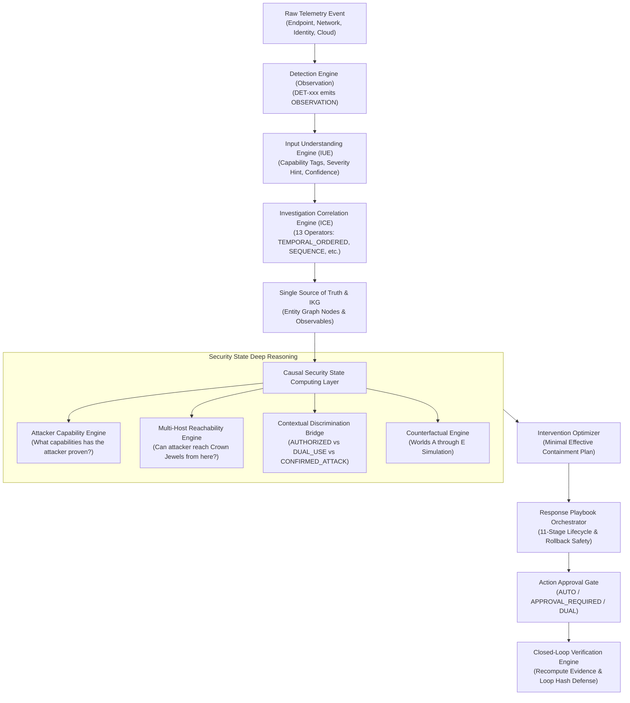
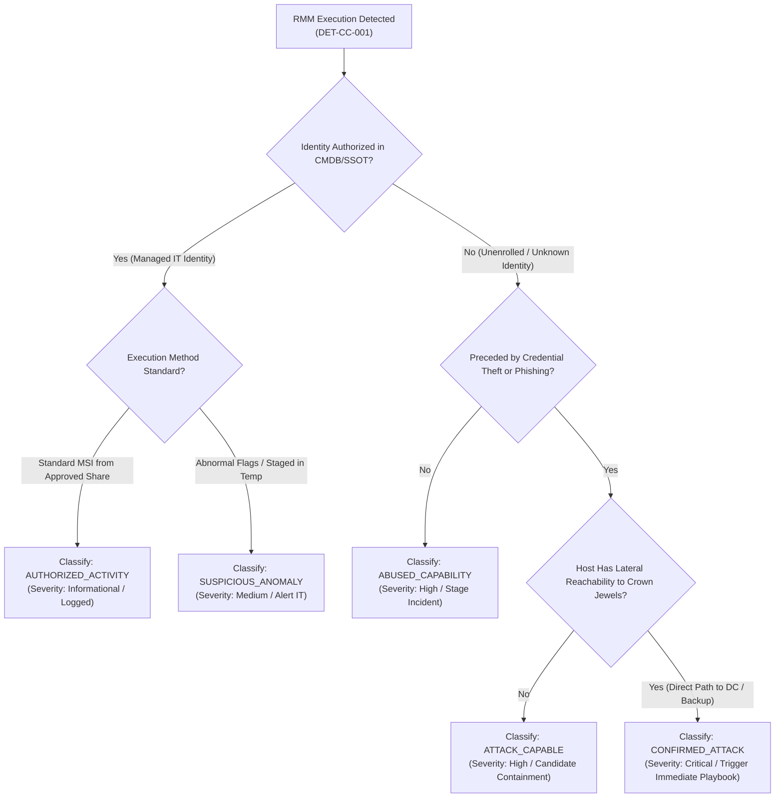

# NivXRay XDR — Enterprise Coverage Taxonomy, RMM Model & Industry Parity Audit
**Document Version:** 1.0.0  
**Audit Date:** 2026-09-04  
**Classification:** Enterprise Taxonomy & Causal Threat Modeling  
**Governing Principle:** `NO EVIDENCE → NO CLAIM` · `CAPABILITY ≠ VERDICT`  
**Phase Status:** Phase 1 Read-Only Architecture & Truth Discovery  

---

## 1. Executive Summary & Core Architectural Tenets

This audit establishes the **Enterprise Coverage Taxonomy**, the **RMM Trusted Capability Abuse Model**, the **Security State Causal Integration Pipeline**, and the **Industry Parity Model** for NivXRay XDR.

### Non-Negotiable Architectural Tenets:
1. **Never Optimize for Raw Rule Count**:
   - Claiming "we have 3,000 rules" is meaningless if 2,500 of them are noisy, duplicate, or un-executable.
   - Parity is measured across **Behavioral Coverage, Telemetry Diversity, Causal Contextualization, and Severance of Attack Reachability**.
2. **A Detection is NOT a Confirmed Attack**:
   - Modern adversaries abuse legitimate dual-use administrative tools (RMM, PowerShell, WMI, PsExec, Cloud CLIs).
   - A detection rule simply emits an `OBSERVATION`. Only the integration of **Identity Context, Active Attacker Capabilities, and Crown Jewel Reachability** determines whether an activity represents benign administration or a critical attack.
3. **Single Correlation Engine Authority**:
   - All complex temporal, sequence, and multi-host correlation logic is executed by the existing **13-operator Correlation Engine** ([`backend/routers/xdr_correlation.py`](file:///d:/Projects/backend/routers/xdr_correlation.py)). No secondary correlation engine shall be created.

---

## 2. Detection $\rightarrow$ Correlation $\rightarrow$ Security State Causal Pipeline

The diagram below illustrates the exact architectural chain from raw evidence observation to causal intervention:



### Security State Abuse Classification States:
In accordance with [`backend/security_state/detection_bridge.py`](file:///d:/Projects/backend/security_state/detection_bridge.py), all detections involving administrative or dual-use tools are classified into one of six explicit states:
1. **`AUTHORIZED_ACTIVITY`**: Expected software run by authorized user from an approved IT management IP. Low severity (Score $\le 0.10$).
2. **`BENIGN_DUAL_USE`**: Common dual-use binary executed without known malicious command flags or privilege escalation. Low severity (Score $\le 0.25$).
3. **`SUSPICIOUS_ANOMALY`**: Unapproved tool or abnormal execution path, but no compromised credentials or lateral movement observed. Medium severity (Score $0.40 - 0.60$).
4. **`ABUSED_CAPABILITY`**: Tool actively used to perform discovery or staging outside standard administrative hours. High severity (Score $0.70 - 0.85$).
5. **`ATTACK_CAPABLE`**: Tool possessed by an identity with verified reachability paths to high-value Crown Jewels. High/Critical severity (Score $0.85 - 0.95$).
6. **`CONFIRMED_ATTACK`**: Tool used in conjunction with credential theft, security evasion, and active lateral movement towards critical infrastructure. Critical severity (Score $0.95 - 1.0$).

---

## 3. Remote Monitoring & Management (RMM) Abuse Content Model

Remote Monitoring and Management (RMM) software represents the primary initial access and persistence mechanism for ransomware and threat actors. Simple signature matching (`Image ends with anydesk.exe`) results in intolerable false positives for enterprise IT environments.

### 3.1 Targeted RMM Software Catalogue (14 Evaluated Tools)
The table below specifies the behavioral markers for the 14 major commercial and open-source RMM solutions:

| RMM Software | Vendor / Organization | Primary Executable(s) | Default Service / Driver | Common Network C2 Endpoints | Persistence / Install Markers | Common Adversary Misuse Patterns |
| :--- | :--- | :--- | :--- | :--- | :--- | :--- |
| **AnyDesk** | AnyDesk Software GmbH | `anydesk.exe` | `AnyDesk Service` (`anydesk`) | `*.net.anydesk.com`, TCP 7070, 6568 | `%APPDATA%\AnyDesk`, `user.conf`, `system.conf` | Portable execution with `--install --start-with-win --silent` |
| **ConnectWise ScreenConnect** | ConnectWise | `ScreenConnect.ClientService.exe`, `ScreenConnect.WindowsClient.exe` | `ScreenConnect Client (...)` | `*.screenconnect.com`, Relay ports 8041, 8040 | `C:\Program Files (x86)\ScreenConnect Client (...)` | Exploitation of CVE-2024-1709 to deploy rogue instances |
| **Atera** | Atera Networks | `AteraAgent.exe`, `AgentPackageMonitoring.exe` | `AteraAgent` | `*.atera.com`, `app.atera.com` | `C:\Program Files\Atera Networks\AteraAgent` | Unattended background deployment via PowerShell script |
| **Splashtop** | Splashtop Inc. | `SRServer.exe`, `SRService.exe`, `SplashtopStreamer.exe` | `SplashtopRemoteService` | `*.api.splashtop.com`, TCP 443, 6783 | `C:\Program Files (x86)\Splashtop\Splashtop Remote` | Staged installer run by bat file in `C:\Windows\Temp` |
| **TeamViewer** | TeamViewer AG | `TeamViewer.exe`, `TeamViewer_Service.exe` | `TeamViewer` | `*.teamviewer.com`, TCP 5938 | `HKLM\SOFTWARE\TeamViewer`, `%APPDATA%\TeamViewer` | Pre-configured unattended password injection via registry |
| **NinjaOne** | NinjaOne (NinjaRMM) | `NinjaRMMAgent.exe`, `njagent.exe` | `NinjaRMMAgent` | `*.ninjarmm.com` | `C:\Program Files (x86)\NinjaRMM` | Abuse of Ninja scripting engine to distribute payloads |
| **MeshCentral / MeshAgent** | Open Source / Ylianst | `MeshAgent.exe`, `meshagent64.exe` | `Mesh Agent` | Self-hosted IP / FQDN on port 443 | `C:\Program Files\Mesh Agent\MeshAgent.msh` | Open-source C2 mesh network deployed on endpoints |
| **RustDesk** | Open Source | `rustdesk.exe` | `RustDesk` | Self-hosted or `*.rustdesk.com` | `%APPDATA%\RustDesk\config` | Ingress tool transfer as portable single-file binary |
| **GoTo / LogMeIn** | GoTo Inc. | `LogMeIn.exe`, `LMIGuardian.exe`, `g2mcomm.exe` | `LogMeIn` | `*.logmein.com`, `*.goto.com` | `C:\Program Files (x86)\LogMeIn` | Shadow deployment by compromised insider |
| **NetSupport Manager** | NetSupport Ltd | `client32.exe`, `run32.exe` | `NetSupport Client Driver` | Direct IP connections, port 5405 | `client32.ini`, registry Run keys | Heavily weaponized by loader malware (NetSupport RAT) |
| **SimpleHelp** | SimpleHelp | `SimpleService.exe`, `SimpleAgent.exe` | `SimpleHelp` | Self-hosted domain, port 443, 80 | `C:\Program Files\SimpleHelp` | Remote access backdoor without tray notification |
| **PDQ Deploy / Inventory**| PDQ.com | `PDQDeployConsole.exe`, `PDQDeployRunner.exe`| `PDQDeployService` | Local LAN RPC / SMB admin shares | `Admin$` staging shares, `PDQDeployRunner` service | Lateral movement via legitimate software deployment |
| **N-able (N-central / Take Control)**| N-able | `N-centralAgent.exe`, `BASupSrvc.exe` | `Windows Agent Service` | `*.n-able.com`, `*.system-monitor.com` | `C:\Program Files (x86)\N-able Technologies` | Malicious policy push to disable security controls |
| **Level.io** | Level Software Inc. | `level.exe`, `level-agent.exe` | `LevelAgent` | `*.level.io` | `C:\Program Files\Level` | Lightweight agent deployed via stolen cloud credentials |

### 3.2 Trusted Capability Abuse Modeling Dimensions
Rather than evaluating RMM presence in isolation, NivXRay's contextual model evaluates 12 contextual dimensions:
$$\text{RMM\_Risk} = f(\text{Identity},\ \text{Authorization},\ \text{Install\_Path},\ \text{Flags},\ \text{Parent},\ \text{Network},\ \text{Reachability},\ \text{Time},\ \text{Tenant})$$



---

## 4. Enterprise Coverage Taxonomy Audit (Domains A through AB)

The table below summarizes existing versus required coverage across all 28 enterprise operational domains:

```
╔════════════════════════════════════════════════════════════════════════════╗
║             NIVXRAY XDR 28-DOMAIN ENTERPRISE COVERAGE TAXONOMY             ║
╠════════════════════════════════════════════════════════════════════════════╣
║ A. Windows / Endpoint:   13 Existing Rules · HIGH COVERAGE · P0 Gaps BYOVD ║
║ B. Linux:                 1 Existing Rule  · MODERATE COVERAGE · P1 SUID   ║
║ C. macOS:                 0 Existing Rules · GAP · P2 TCC / LaunchDaemons  ║
║ D. Active Directory:      1 Existing Rule  · HIGH RISK · P0 DCSync / Shadow║
║ E. Entra ID (Azure AD):   1 Existing Rule  · HIGH RISK · P0 Consent Abuse  ║
║ F. Kerberos:              2 Existing Rules · STRONG COVERAGE · P0 Delegation║
║ G. AD CS:                 1 Existing Rule  · HIGH RISK · P0 ESC2-ESC14 Gaps║
║ H. M365 / Office:         1 Existing Rule  · MODERATE COVERAGE · P1 Exfil  ║
║ I. Email Security:        1 Existing Rule  · MODERATE COVERAGE · P1 BEC    ║
║ J. DNS:                   1 Existing Rule  · STRONG COVERAGE · P1 NRD/DGA  ║
║ K. VPN / Perimeter:       0 Existing Rules · GAP · P1 Velocity / Spraying  ║
║ L. Firewall / NetFlow:    1 Existing Rule  · CORE IDS ACTIVE · P1 Egress   ║
║ M. Proxy / SWG:           0 Existing Rules · GAP · P1 User-Agent / Direct IP║
║ N. AWS Cloud:             2 Existing Rules · STRONG COVERAGE · P0 KMS/S3   ║
║ O. Azure Cloud:           0 Existing Rules · GAP · P1 RunCommand / SAS     ║
║ P. GCP Cloud:             0 Existing Rules · GAP · P1 ServiceAccount Keys  ║
║ Q. Kubernetes:            0 Existing Rules · GAP · P1 Privileged Pods      ║
║ R. Containers:            0 Existing Rules · GAP · P1 Escape / Cgroups     ║
║ S. VMware / ESXi:         1 Existing Rule  · UNIQUE COVERAGE · P1 Backdoors║
║ T. Backup Systems:        1 Existing Rule  · CRITICAL · P0 Immutability    ║
║ U. RMM Tools:             1 Existing Rule  · DEEP MODEL · P0 14-Tool Pack  ║
║ V. SaaS Platforms:        0 Existing Rules · GAP · P2 API Mass Export      ║
║ W. DevOps / CI-CD:        0 Existing Rules · GAP · P1 Pipeline Poisoning   ║
║ X. Non-Human Identities:  1 Existing Rule  · LEADING COVERAGE · P0 SPN Abuse║
║ Y. AI Agents:             1 Existing Rule  · LEADING COVERAGE · P1 Subshell║
║ Z. Data Exfiltration:     0 Existing Rules · GAP · P0 Cloud Sync Tools     ║
║ AA. Ransomware:           2 Existing Rules · 1 SCENARIO ACTIVE · P0 Intermit║
║ AB. Supply Chain:         0 Existing Rules · GAP · P1 Dependency Confusion ║
╚════════════════════════════════════════════════════════════════════════════╝
```

---

## 5. Coverage Metrics & Engineering Truth Contract

NivXRay XDR defines **18 formal metrics** to measure genuine enterprise coverage without relying on superficial rule counts:

| Metric Category | Formal Metric Name | Definition & Formula | Target / Benchmark |
| :--- | :--- | :--- | :---: |
| **Telemetry Health** | `Telemetry_Diversity_Score` | Number of distinct active log channels producing canonical evidence | $\ge 15$ Channels |
| **Domain Coverage** | `Enterprise_Domain_Coverage_Pct`| Percentage of 28 domains with $\ge 2$ validated detections | $100\%$ (28/28) |
| **Quality Gate** | `Validated_Detection_Pct` | Rules with passing positive and negative fixtures / Total rules | $100\%$ (Zero unverified rules) |
| **Binding Health** | `Engine_Bound_Pct` | Rules with active engine bindings (`status == COMPATIBLE`) | $\ge 98\%$ |
| **Production Safety**| `Shadow_Tested_Pct` | Rules observed in shadow mode for $\ge 7$ days without regression | $100\%$ of Active Rules |
| **Precision** | `False_Positive_Rate` | Benign events flagged as alerts in production telemetry | $< 0.01\%$ |
| **Fidelity** | `Translation_Fidelity_Ratio` | Ratio of `EXACT` + `STRONG` translations vs `PARTIAL` | $\ge 90\%$ High-Fidelity |
| **Deduplication** | `Detection_Uniqueness_Factor`| $1 - (\text{Duplicate Rules} / \text{Total Ingested Sources})$ | $\ge 0.85$ (High Uniqueness) |
| **Correlation** | `Multi_Stage_Scenario_Ratio` | Ratio of multi-event correlated incidents vs single-alert noise | $\ge 60\%$ Correlated |
| **State Enrichment**| `Security_State_Bridge_Pct` | Dual-use detections enriched with Causal Security State factors | $100\%$ of Dual-Use Rules |
| **Containment** | `Intervention_Severance_Score`| Percentage of lateral reachability paths severed by intervention plan | $100\%$ of Crown Jewel Paths |
| **Freshness** | `Content_Freshness_Days` | Median time between public CVE/technique disclosure and validated rule | $< 14$ Days |
| **Reversibility** | `Playbook_Rollback_Ready_Pct` | Response playbooks equipped with validated reverse action definitions | $\ge 70\%$ |
| **Performance** | `Single_Pass_Evaluation_Latency`| Microseconds elapsed per event during detection evaluation pass | $< 5,000\ \mu s$ ($5$ ms) |
| **Tenant Safety** | `Tenant_Isolation_Violation_Count`| Cross-tenant data leakage or correlation across tenant boundaries | Exactly $0$ |
| **Loop Defense** | `Closed_Loop_Determinism_Score`| Repeat executions halted deterministically by `_evidence_state_hash` | $100\%$ Loop Halting |
| **Causal Reality** | `World_B_E_Convergence_Pct` | Empirical post-response telemetry matches projected Counterfactual World B | $\ge 85\%$ Alignment |
| **Audit Completeness**| `Provenance_Traceability_Pct` | Active rules tracing back to author, Git commit SHA, and legal license | $100\%$ Traceable |

---

## 6. Industry Capability Parity Model

The table below contrasts NivXRay XDR against legacy EDR, SIEM, SOAR, and modern XDR platforms. Rather than proprietary marketing comparisons, capabilities are audited strictly by verifiable architectural mechanisms:

| Security Capability Class | Legacy SIEM / EDR Baseline | Modern AI-XDR / SOAR Baseline | NivXRay XDR Architectural State | Strategic Classification |
| :--- | :--- | :--- | :--- | :---: |
| **Endpoint Detection (EDR)** | Process & network signature matching; kernel sensor | Behavioral telemetry + local AI heuristics | Canonical Evidence schema evaluates process, network, and memory events via strict Sigma AST | **MUST HAVE FOR PARITY** |
| **Multi-Source Correlation (XDR)** | Scheduled cron searches across indices | Event stream correlation over 3–5 sources | Stateful streaming correlation across 13 operators with sliding entity windows | **MUST HAVE FOR PARITY** |
| **Identity Threat Detection (ITDR)**| Failed login counters (Active Directory only) | Cloud identity risk scores + Entra ID audit | Contextualized Kerberoasting, AS-REP roasting, AD CS template abuse, and Service Principal abuse | **MUST HAVE FOR PARITY** |
| **Cloud Threat Detection (CDIR)** | Basic CloudTrail API logging | Multi-cloud posture management + audit | Native detection of IMDS token theft, IAM policy escalation, and cross-account access | **MUST HAVE FOR PARITY** |
| **RMM Abuse Discrimination** | Binary alert ("AnyDesk detected = Malicious") | Heuristic anomaly scoring | 12-dimension contextual discrimination factoring identity privilege, time, and reachability | **DIFFERENTIATOR** |
| **Deobfuscation & Content Analysis**| None or basic single-layer Base64 decoding | Sandbox detonation (asynchronous, slow) | Universal Content Intelligence: multi-stage recursive decoding (bounded, static, side-effect free) | **DIFFERENTIATOR** |
| **SOAR Orchestration** | Complex Python scripts in external runner | Third-party DAG engines (Airflow/Temporal) | Native 11-stage deterministic playbook lifecycles with built-in dry-run simulation mode | **SHOULD HAVE** |
| **Response & Containment** | Single-click host isolation or manual script | Automated playbook dispatch | Minimal Effective Containment synthesis via Counterfactual World comparison | **DIFFERENTIATOR** |
| **Closed-Loop Verification** | Manual ticket closure by analyst | Polling external sensor for updated status | Cryptographic recomputation of evidence state (`_evidence_state_hash`) to verify lateral severance | **DIFFERENTIATOR** |
| **Causal Security State** | Non-existent; relies on alert severity tags | Graph database alert aggregation | Causal structural modeling, capability profiler, multi-host reachability, and counterfactual simulation | **MAJOR DIFFERENTIATOR** |
| **Attack Surface Exposure (ASM)** | Periodic external port scanning | Active vulnerability scanning | CVE exposure lane in Rule Studio + Reachability graph | **FUTURE** |
| **User Entity Behavior (UEBA)** | Static statistical baselines (30-day mean) | Machine learning anomaly clusters | Sliding entity window state in MongoDB (`xdr_correlation_state`) | **SHOULD HAVE** |
| **Threat Intelligence Platform (TIP)**| Massive IOC list ingestion (millions of hashes) | STIX/TAXII threat feeds | Curated IOC lane with automated defanging and provenance stamping | **SHOULD HAVE** |
| **Full EDR Kernel Driver** | Proprietary ring-0 kernel driver | Proprietary eBPF / ESF agents | Intentionally decoupled (ingests open-source Sysmon, Auditd, eBPF, Cortex telemetry) | **OUT OF SCOPE** |

---
*End of Enterprise Coverage Taxonomy, RMM Model & Industry Parity Audit.*
