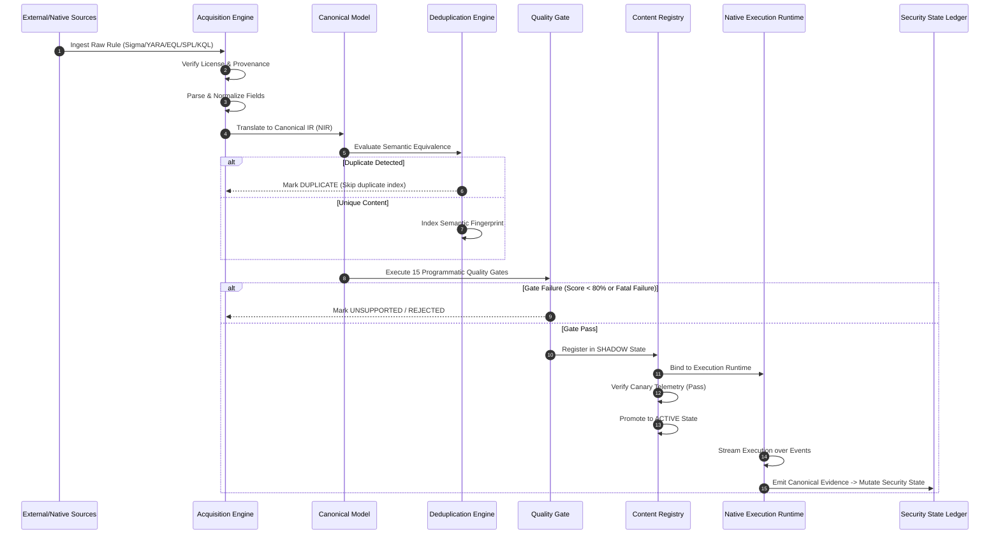
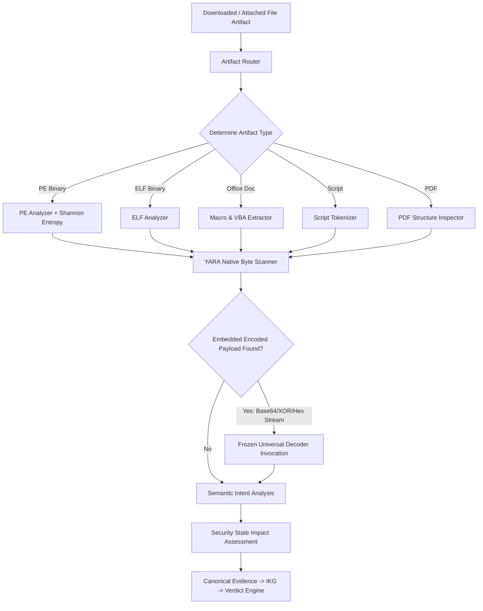

# NivXRay XDR — Enterprise Detection Content Flow

## 1. End-to-End Operational Lifecycle Flow

The lifecycle of detection content flows deterministically from discovery through canonical validation to live execution and Security State mutation:



---

## 2. Artifact-First Analysis Workflow

For file artifacts (executables, scripts, office files, PDFs, archives), detection follows an **Artifact-First Analysis Routing** model:



### Invariant: Universal Decoder Integration Boundary
- The **Universal Decoder** (`services/decoder/engine.py`) is **frozen**.
- The Artifact Router evaluates whether an encoded command or payload exists before invoking the decoder.
- The decoder is called **only when encoded payloads are discovered**, preventing CPU churn and preserving decoder determinism.

---

## 3. Strict Lifecycle State Transitions

NivXRay enforces a strict, directed state machine for all canonical content objects:

```
[DISCOVERED] ──> [PARSED] ──> [LICENSE_VERIFIED] ──> [NORMALIZED] ──> [TRANSLATED]
                                                                            │
[ACTIVE] <── [SHADOW] <── [ENGINE_BOUND] <── [VALIDATED] <── [DEDUPLICATED] ┘
   │
   ├──> [SUPERSEDED] ──> [RETIRED]
   ├──> [ROLLED_BACK] ──> [DEPRECATED] ──> [RETIRED]
   └──> [DEPRECATED] ──> [RETIRED]

Any Stage: [REJECTED] / [UNSUPPORTED] (Terminal)
```

### Transition Rule Constraints
1. **Zero Silent Skips**: Any transition must record the actor, timestamp, previous state, target state, and justification within `obj.provenance["transitions"]`.
2. **Deterministic Promotion**: An object cannot transition to `ACTIVE` without passing through `SHADOW` mode and validating that zero syntax, execution, or false-positive regressions occur.
3. **No Unbinding**: Once an object reaches `ENGINE_BOUND`, its runtime engine assignment cannot be modified without re-entering the `VALIDATING` gate.
