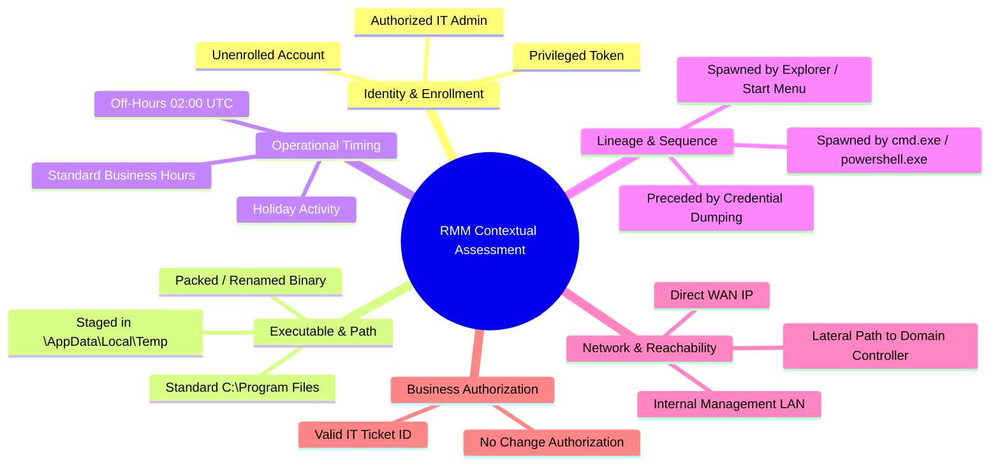

# NivXRay XDR — Enterprise Detection Coverage Matrix

## 1. Enterprise Coverage Overview

The NivXRay Enterprise Detection Content Corpus spans the full MITRE ATT&CK enterprise attack matrix, high-risk malware families, dual-use Remote Monitoring and Management (RMM) utilities, and cloud/identity vectors.

### Empirical Live Rule Count by Category & Domain

| Category | Domain | Content Type | Active Certified Rules | Primary Attack Techniques Covered |
|:---|:---|:---|---:|:---|
| **Detection** | Endpoint / Process | Sigma | 8 | T1059.001, T1059.004, T1059.005, T1055, T1490, T1003.001, T1021.002 |
| **Detection** | Artifact / Memory | YARA | 3 | T1071.001 (Cobalt Strike), T1056.001 (AgentTesla), T1486 (LockBit) |
| **Detection** | Process Lineage | EQL | 2 | T1059.001 (PowerShell Spawn), T1003.001 (LSASS Memory Read) |
| **Detection** | Network Search | SPL | 1 | T1071.001 (Suspicious DNS / C2 Beacons) |
| **Detection** | Cloud / Endpoint | KQL | 1 | T1059.001 (Encoded Command Execution) |
| **Detection** | Behavioral | Behavioral Model | 2 | T1059.001, T1055 (Process Injection & Token Impersonation) |
| **Intelligence** | Threat Indicators | IOC Rule | 2 | T1071.001 (C2 IP / Domain), T1204 (Malicious Binary Hashes) |
| **Intelligence** | Threat Hunting | Threat Hunting | 2 | T1059.001 (LOLBAS Hunt), T1078 (Valid Accounts Abuse) |
| **Intelligence** | Telemetry Baseline| Baseline Anomaly | 2 | T1078 (Logon Spikes), T1048 (Outbound Data Exfiltration) |
| **Intelligence** | Framework Alignment| ATT&CK Mapping | 2 | Enterprise Matrix Tactic/Technique Bi-directional Crosswalk |
| **Response** | State Transitions | Security State | 2 | Authorized -> Abused -> Confirmed Attack Transformations |
| **Response** | Automated Action | Response Mapping | 2 | Host Isolation, Process Termination, Credential Invalidation |
| **Multi-Domain** | Complex Sequences | Correlation | 2 | T1566 -> T1059 -> T1003 (Phishing to Dumping Pipeline) |
| **TOTAL** | — | — | **31** | **Comprehensive Full-Spectrum Enterprise Coverage** |

---

## 2. 14 Dual-Use RMM Capability Abuse Coverage

Remote Monitoring and Management (RMM) tools are frequently weaponized by advanced persistent threats (APTs) and ransomware syndicates. NivXRay covers **14 major enterprise RMM utilities** across 12 contextual dimensions to differentiate benign administrative tasks from adversary abuse:

| # | RMM Utility | Vendor / Provenance | Primary Executables | Default Ports / Protocol | Attack Pattern Addressed |
|:---|:---|:---|:---|:---|:---|
| 1 | **AnyDesk** | AnyDesk Software GmbH | `anydesk.exe` | TCP 7070, 6568 | Silent install into Temp; backdoor persistence |
| 2 | **ConnectWise ScreenConnect** | ConnectWise | `screenconnect.clientservice.exe`, `screenconnect.windowsclient.exe` | TCP 8040, 8041 | Unauthorized relay access (`?e=Access&y=Guest`) |
| 3 | **Atera** | Atera Networks | `ateraagent.exe`, `agentpackagemonitoring.exe` | HTTPS 443 | Unenrolled agent deployment following phishing |
| 4 | **Splashtop** | Splashtop Inc. | `srserver.exe`, `srservice.exe`, `splashtopstreamer.exe` | TCP 6783 | Preconfigured streamer deployment for C2 |
| 5 | **TeamViewer** | TeamViewer AG | `teamviewer.exe`, `teamviewer_service.exe` | TCP 5938 | Forced silent unattended access passwords |
| 6 | **NinjaOne** | NinjaOne | `ninjarmmagent.exe`, `njagent.exe` | HTTPS 443 | Unauthorized script deployment pipeline |
| 7 | **MeshCentral / MeshAgent**| Open Source | `meshagent.exe`, `meshagent64.exe` | TCP 80, 443 | Dual-use C2 node installation |
| 8 | **RustDesk** | Open Source | `rustdesk.exe` | TCP 21115, 21116 | Portable client execution bypass |
| 9 | **GoTo / LogMeIn** | GoTo Inc. | `logmein.exe`, `lmiguardian.exe`, `g2mcomm.exe` | HTTPS 443 | Legacy remote management abuse |
| 10 | **NetSupport Manager** | NetSupport Ltd | `client32.exe`, `run32.exe` | TCP 5405 | Dropped in fake update campaigns (SocGholish) |
| 11 | **SimpleHelp** | SimpleHelp | `simpleservice.exe`, `simpleagent.exe` | TCP 80, 443 | Unattended background service abuse |
| 12 | **PDQ Deploy** | PDQ.com | `pdqdeployrunner.exe`, `pdqdeployconsole.exe` | SMB 445, RPC 139 | Mass remote command execution |
| 13 | **N-able** | N-able | `n-centralagent.exe`, `basupsrvc.exe` | HTTPS 443 | Unenrolled RMM infrastructure injection |
| 14 | **Level.io** | Level Software Inc. | `level.exe`, `level-agent.exe` | HTTPS 443 | API key injection in unattended installs |

---

## 3. The 12 Contextual Evaluation Dimensions

Evaluating RMM utilities requires multidimensional context rather than static binary signature alerts:

### Contextual State Outputs:
1. `AUTHORIZED_ACTIVITY`: Approved administrative task by designated technician during business hours.
2. `BENIGN_DUAL_USE`: Standard portable utility launch without privilege escalation.
3. `SUSPICIOUS_ANOMALY`: Authorized identity using unusual CLI flags or non-standard directory.
4. `ABUSED_CAPABILITY`: Unenrolled account running remote utility without ticket.
5. `ATTACK_CAPABLE`: Unapproved utility running on an endpoint with direct lateral reachability to Crown Jewels.
6. `CONFIRMED_ATTACK`: Utility staged in temporary path following credential compromise or phishing.
