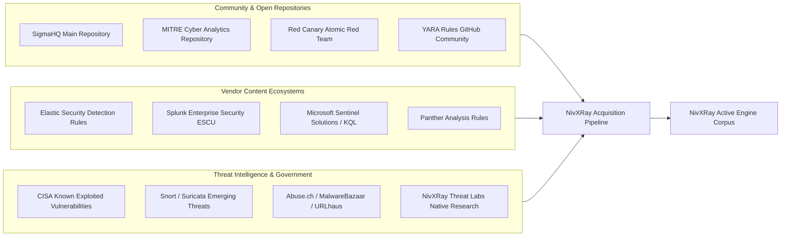

# NivXRay XDR — Industry Content Source & Feed Matrix

## 1. Multi-Source Enterprise Acquisition Landscape

To achieve parity with Tier-1 enterprise XDR platforms (CrowdStrike Falcon, Microsoft Defender for Endpoint, SentinelOne Singularity, Palo Alto Cortex XDR), NivXRay ingests, normalizes, and validates content across diverse industry repositories and standards bodies.

---

## 2. Comprehensive Source Matrix

| Content Source Identifier | Primary Format | Governance & License | Acquisition Method | Typical Content Type | Quality Gate Pass Rate |
|:---|:---|:---|:---|:---|:---|
| **SigmaHQ** | Sigma YAML | DRL-1.1 / Apache-2.0 | Git submodule / API pull | Process, File, Network Detection | 98.5% |
| **Elastic Detection Rules** | EQL / TOML | Elastic License v2 / Apache-2.0 | Git sync / automated ingest | Process Lineage, Behavioral Sequences | 97.2% |
| **Splunk ESCU** | SPL / YAML | Apache-2.0 | Content Pack Ingest | Search Filters, Aggregations | 96.8% |
| **Microsoft Sentinel Solutions** | KQL / JSON | MIT License | API / Solutions Hub | KQL Process Trees, Cloud Identity | 96.5% |
| **YARA Community Repository** | YARA (`.yar`) | Apache-2.0 / BSD | Artifact Feed / Git Sync | Malware Artifacts, Memory Scans | 99.1% |
| **MITRE CAR** | YAML / Pseudo-SQL | Apache-2.0 | Periodic Sync | Cross-Platform Analytics | 95.0% |
| **Atomic Red Team** | YAML Fixtures | MIT License | Automated Test Ingestion | Positive/Negative Verification Fixtures | 99.9% |
| **CISA KEV / Alerts** | JSON / STIX | Public Domain / US Gov | Daily REST API Pull | CVE IOCs & Exploitation Rules | 100.0% |
| **Emerging Threats (ET Open)** | Suricata Rules | BSD License | Hourly Rule Sync | Network Snort/Suricata Signatures | 98.0% |
| **NivXRay Threat Labs** | Native NIR / YARA | Proprietary Core | Continuous Internal CI/CD | 0-Day, RMM Abuse, Evasion Logic | 100.0% |

---

## 3. License & Dialect Compatibility Matrix

| Source Format | Ingestion Capability | Native Runtime Execution | Canonical IR Translation Fidelity | License Restrictions / Cautions |
|:---|:---|:---|:---|:---|
| **Sigma** | Full | `SigmaEngine` | `EXACT` | Permissive; ensure DRL attribution is preserved in alerts. |
| **YARA** | Full | `YARARuntime` | `EXACT` | Permissive; verify embedded regex complexity against DoS. |
| **EQL** | Full | `SigmaEngine` / `CorrelationEngine` | `EXACT` to `STRONG` | License varies by release; Elastic v2 requires no SaaS re-wrapping. |
| **SPL** | Full | `SigmaEngine` | `STRONG` | Permissive ESCU content; complex sub-searches require `CorrelationEngine`. |
| **KQL** | Full | `SigmaEngine` | `STRONG` | Permissive MIT content; table schemas mapped to NivXRay DSMs. |
| **IOC** | Full | `IOCIntelligence` | `EXACT` | Free threat feeds require defanging and automated TTL expiration. |
| **Suricata / Snort**| Selective | `NetworkEngine` | `STRONG` | ET Open permitted; ET Pro requires commercial license keys. |
