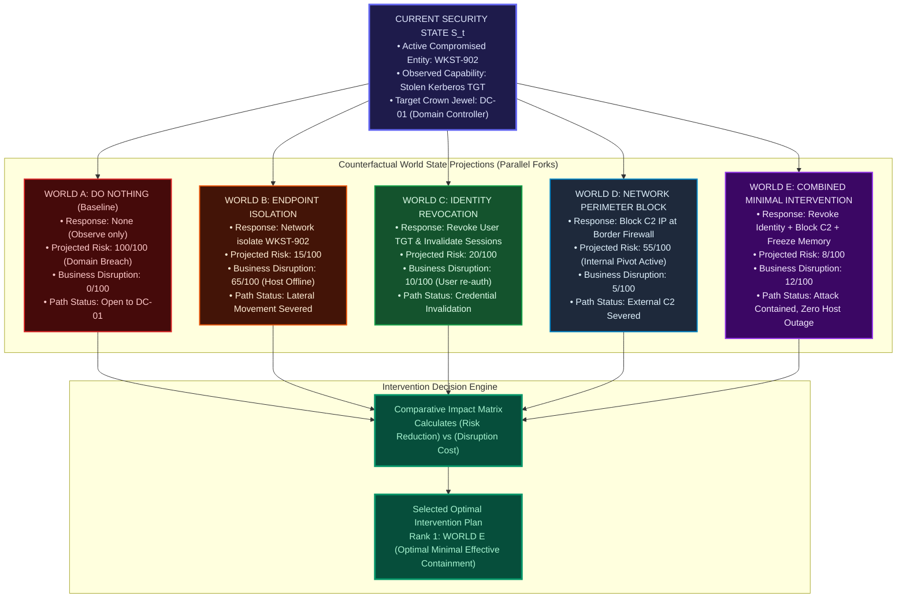

# NivXRay XDR — Security State Visual Architecture & Flow Diagrams
**Document Version:** 1.0.0  
**Status:** APPROVED ARCHITECTURAL SPECIFICATION  
**Authoritative Baseline:** Phase 8 Closed & Verified (13/13 Gates, 92/92 Master Tests)  
**Security Governance:** Shadow Mode Only · `AUTO_RESPONSE = FALSE` · `EXECUTE = LOCKED` · Phase 9 ON HOLD  

---

## Executive Overview & Architectural Intent

This document establishes the definitive **visual architecture and system data-flow diagrams** for NivXRay XDR and its **Security State Computing Layer**. 

### Purpose & Scope
While textual specifications and data-flow matrices define properties and invariant checks, visual architecture diagrams are required to prove:
1. **Component Boundaries**: Where the authoritative NivXRay XDR core stops and where the Security State Sidecar operates.
2. **Technological Differentiation**: How raw evidence is elevated into causal DAGs, attacker capability graphs, reachability analyses, and counterfactual intervention decisions—fundamentally distinguishing NivXRay XDR from legacy SIEM/SOAR/EDR rule correlation engines.
3. **Safety & Invariance Guarantees**: Complete architectural isolation ensuring that projected states never overwrite observed history, that zero duplicate graph engines or verdict engines are instantiated, and that autonomous response remains strictly locked behind human approval gates.

---

## Diagram 1: NivXRay XDR — Overall Architecture

The overall architecture illustrates the end-to-end data pipeline: from raw multi-telemetry ingestion through canonicalization, authoritative investigation, and down into the Security State Computing Sidecar and future response surfaces.

```mermaid
flowchart TD
    %% Styling Classes
    classDef telemetry fill:#1e293b,stroke:#475569,stroke-width:2px,color:#f8fafc;
    classDef core fill:#0f172a,stroke:#3b82f6,stroke-width:2px,color:#93c5fd;
    classDef secstate fill:#18181b,stroke:#8b5cf6,stroke-width:2px,color:#c4b5fd;
    classDef counterfactual fill:#1c1917,stroke:#f59e0b,stroke-width:2px,color:#fde68a;
    classDef safety fill:#450a0a,stroke:#ef4444,stroke-width:2px,color:#fecaca;
    classDef response fill:#064e3b,stroke:#10b981,stroke-width:2px,color:#a7f3d0;

    %% Telemetry Layer
    subgraph S_TELEMETRY ["1. Telemetry & Evidence Ingestion Plane"]
        D_SRC["Enterprise Data Sources<br/>(Endpoints, Network, Identity, Cloud, Sysmon, Auditd)"]:::telemetry
        COLLECT["XDR Collectors & Decoders<br/>(xdr_collectors.py / collector_runtime.py)"]:::telemetry
        NORM["Canonical Normalization & DSM Registry<br/>(xdr_pipeline.py / canonical_evidence)"]:::telemetry
        SSOT["Single Source of Truth (SSOT)<br/>(workspace_cases / xdr_canonical_evidence)"]:::telemetry
    end

    %% Authoritative Investigation Core
    subgraph S_CORE ["2. Authoritative Investigation Core (Authoritative Pipeline)"]
        IKG["Investigation Knowledge Graph (IKG)<br/>(Authoritative Unified Graph: Hosts, Users, Procs, IPs)"]:::core
        ICE["Incident Correlation Engine (ICE)<br/>(Stateful Multi-Window Event Correlator)"]:::core
        VERDICT["Authoritative Verdict Engine<br/>(VEEE / Stage 2 / Canonical Verdict)"]:::core
        STORY["Attack Story & ATT&CK Matrix<br/>(Technique Mapper / Device Trajectory)"]:::core
    end

    %% Security State Computing Layer
    subgraph S_SECSTATE ["3. Security State Computing Layer (Causal Intelligence Sidecar)"]
        HYDRATE["Case Hydrator (Read-Only)<br/>(case_hydrator.py / Zero Duplication)"]:::secstate
        CAUSAL["Causal Intelligence Engine<br/>(Structural Causal Model / Directed Acyclic Graph)"]:::secstate
        ATTACK_STATE["Attack State Machine<br/>(Continuous Progression: Pre -> Active -> Post)"]:::secstate
        CAPABILITY["Attacker Capability Profiler<br/>(Trusted Capability Abuse / RMM / VSS / Token)"]:::secstate
        REACH["Enterprise Reachability Engine<br/>(Crown Jewel Multi-Hop Blast Radius over IKG)"]:::secstate
    end

    %% Counterfactual & Optimization Plane
    subgraph S_CF ["4. Counterfactual Reasoning & Impact Plane"]
        CF_WORLDS["Counterfactual Engine<br/>(Parallel Worlds A-E Simulation)"]:::counterfactual
        IMPACT["Impact Scoring Engine<br/>(Business Disruption vs Residual Risk)"]:::counterfactual
        OPTIMIZER["Intervention Optimizer<br/>(Minimal Effective Containment Ranking)"]:::counterfactual
    end

    %% Response Safety & Future Action Plane
    subgraph S_SAFETY ["5. Response Safety, Governance & Verification"]
        SAFETY_GATE["Response Safety Gate<br/>(AUTO_RESPONSE=FALSE / Risk Thresholds)"]:::safety
        LOCK["Hard Execution Lock<br/>(Analyst Review / Dual Approval Required)"]:::safety
        EXEC_PLANE["Future Response Plane (Phase 9+)<br/>(Action Registry / Adapters / Cortex)"]:::response
        VERIFY["Closed-Loop Verification Engine<br/>(xdr_closed_loop.py / Observation Recompute)"]:::response
    end

    %% Pipeline Connections
    D_SRC --> COLLECT
    COLLECT --> NORM
    NORM --> SSOT
    SSOT --> IKG
    SSOT --> ICE
    IKG --> VERDICT
    ICE --> VERDICT
    VERDICT --> STORY

    %% Authoritative to Security State
    SSOT -.->|Read-Only Ingest| HYDRATE
    IKG -.->|Read-Only Graph Reference| HYDRATE
    VERDICT -.->|Authoritative Input| HYDRATE
    STORY -.->|ATT&CK Context| HYDRATE

    HYDRATE --> CAUSAL
    CAUSAL --> ATTACK_STATE
    ATTACK_STATE --> CAPABILITY
    CAPABILITY --> REACH
    REACH --> CF_WORLDS

    CF_WORLDS --> IMPACT
    IMPACT --> OPTIMIZER
    OPTIMIZER --> SAFETY_GATE

    SAFETY_GATE --> LOCK
    LOCK ==>|Explicit Manual Analyst Auth| EXEC_PLANE
    EXEC_PLANE --> VERIFY
    VERIFY -.->|Provenance Observation Feed| SSOT
```

---

## Diagram 2: Security State Computing Flow (14-Step Continuum)

This sequential flow diagram models the exact 14-stage deterministic progression from raw observation to a verified new security state.

```mermaid
flowchart TD
    classDef step fill:#0f172a,stroke:#38bdf8,stroke-width:2px,color:#e0f2fe;
    classDef lockStep fill:#450a0a,stroke:#f87171,stroke-width:2px,color:#fee2e2;
    classDef finalStep fill:#064e3b,stroke:#34d399,stroke-width:2px,color:#ecfdf5;

    S01["1. OBSERVE<br/>Telemetry stream ingestion across EDR, Firewall, Identity, Cloud"]:::step
    S02["2. EVIDENCE<br/>Canonical normalization, entity resolution, provenance stamping"]:::step
    S03["3. SECURITY STATE<br/>Initial Vector synthesis (State Vector S_t, timestamp, tenant)"]:::step
    S04["4. CAUSAL MODEL<br/>Directed Acyclic Graph generation with structural causal links"]:::step
    S05["5. ATTACK STATE<br/>Continuous progression: PRE_ATTACK -> ACTIVE -> POST_ATTACK"]:::step
    S06["6. ATTACKER CAPABILITY<br/>Contextual abuse profiling (RMM, VSS/NTDS, Kerberos, IMDS)"]:::step
    S07["7. ENTERPRISE REACHABILITY<br/>Multi-hop lateral path traversal to crown jewels over IKG"]:::step
    S08["8. COUNTERFACTUAL WORLDS<br/>Parallel world projections: World A (Do Nothing) to World E"]:::step
    S09["9. IMPACT<br/>Multi-criteria scoring: Disruption Score vs Residual Risk Score"]:::step
    S10["10. INTERVENTION<br/>Intervention plan synthesis (Minimal Effective Containment)"]:::step
    S11["11. POLICY / SAFETY<br/>Safety invariants check, blast radius verification, policy gate"]:::step
    S12["12. RESPONSE (LOCKED)<br/>Analyst review required: AUTO_RESPONSE = FALSE"]:::lockStep
    S13["13. VERIFICATION<br/>Post-response telemetry check: did the containment hold?"]:::step
    S14["14. NEW SECURITY STATE<br/>Committed state S_t+1 in append-only cryptographic ledger"]:::finalStep

    S01 --> S02
    S02 --> S03
    S03 --> S04
    S04 --> S05
    S05 --> S06
    S06 --> S07
    S07 --> S08
    S08 --> S09
    S09 --> S10
    S10 --> S11
    S11 --> S12
    S12 -->|Authorized Execution| S13
    S13 --> S14
```

---

## Diagram 3: Evidence → Causality → Decision Architecture

This diagram illustrates **the primary technology differentiator of NivXRay XDR**. While traditional XDRs map alerts directly to static response playbooks via simple if-then rules, NivXRay XDR constructs structural causal models, assesses attacker capability abuse, projects counterfactual outcomes, and balances disruption against risk before recommending action.

```mermaid
flowchart LR
    %% Subgraphs
    subgraph LEGACY ["Legacy XDR Approach (Correlation / Rule-Based)"]
        L_ALERT["Raw Event / Alert"]
        L_SIG["Static Rule / Regex Match"]
        L_PLAY["Hardcoded Playbook<br/>(e.g., Isolate Host)"]
        L_BLIND["Blind Automated Action<br/>(Business Outage / False Positive)"]

        L_ALERT --> L_SIG --> L_PLAY --> L_BLIND
    end

    subgraph NIVX_CORE ["NivXRay XDR: Evidence -> Causality -> Decision Architecture"]
        subgraph GROUNDING ["1. Empirical Evidence Grounding"]
            E_POS["Observed Positive Telemetry<br/>(Encoded PowerShell, LSASS handle)"]
            E_NEG["Observed Negative Evidence<br/>(No outbound network, No file write)"]
            E_IKG["Authoritative IKG Topology<br/>(DC, DB, Admin workstation)"]
        end

        subgraph CAUSALITY ["2. Structural Causal Intelligence"]
            C_DAG["Causal DAG Construction<br/>Nodes = Events & Capabilities<br/>Edges = Deterministic Causal Links"]
            C_ABUSE["Trusted Capability Abuse Engine<br/>Contextual evaluation of dual-use tools"]
            C_REACH["Reachability Blast Radius<br/>Active Paths to Crown Jewels"]
        end

        subgraph COUNTERFACTUALS ["3. Counterfactual Optimization Plane"]
            CF_SIM["Pearl's Do-Calculus Projections<br/>do(No Action) vs do(Isolate) vs do(Revoke)"]
            CF_MATRIX["Security vs Business Impact Matrix<br/>Residual Risk vs Disruption Score"]
            CF_OPT["Intervention Optimizer<br/>Minimal Effective Containment Plan"]
        end

        subgraph DECISION ["4. Explainable Decision & Human Gate"]
            D_RATIONALE["Deterministic Audit Rationale<br/>(Why this action cuts reachability)"]
            D_GATE["Safety Gate: AUTO_RESPONSE=FALSE<br/>Analyst Approval Required"]
            D_EXEC["Targeted, Reversible Response<br/>(Protected Crown Jewels, Zero Outage)"]
        end

        GROUNDING --> CAUSALITY
        CAUSALITY --> COUNTERFACTUALS
        COUNTERFACTUALS --> DECISION
    end

    classDef legacyStyle fill:#334155,stroke:#64748b,stroke-width:1px,color:#cbd5e1;
    classDef groundStyle fill:#0f172a,stroke:#3b82f6,stroke-width:2px,color:#93c5fd;
    classDef causalStyle fill:#18181b,stroke:#8b5cf6,stroke-width:2px,color:#c4b5fd;
    classDef cfStyle fill:#1c1917,stroke:#f59e0b,stroke-width:2px,color:#fde68a;
    classDef decStyle fill:#064e3b,stroke:#10b981,stroke-width:2px,color:#a7f3d0;

    class L_ALERT,L_SIG,L_PLAY,L_BLIND legacyStyle;
    class E_POS,E_NEG,E_IKG groundStyle;
    class C_DAG,C_ABUSE,C_REACH causalStyle;
    class CF_SIM,CF_MATRIX,CF_OPT cfStyle;
    class D_RATIONALE,D_GATE,D_EXEC decStyle;
```

---

## Diagram 4: Phase 8 World A–E Architecture

Phase 8 introduces **parallel counterfactual world simulation**. Rather than executing a single preconceived action, the engine projects the future trajectory of multiple response options across security risk and business disruption.

---

## Diagram 5: NivXRay XDR vs Existing Systems (Architectural Boundary & Invariance)

This diagram establishes the **strict architectural boundary** between the authoritative NivXRay XDR platform, the new Security State layer, and the downstream response components. It visually proves that the Security State layer is a **read-only consumer** of the authoritative pipeline and does **not** duplicate the IKG, Verdict, or SSOT.

```mermaid
flowchart TD
    %% Styling Classes
    classDef existing fill:#0f172a,stroke:#3b82f6,stroke-width:2px,color:#bfdbfe;
    classDef boundary fill:#334155,stroke:#cbd5e1,stroke-dasharray: 5 5,stroke-width:2px,color:#f8fafc;
    classDef newLayer fill:#18181b,stroke:#8b5cf6,stroke-width:2px,color:#ddd6fe;
    classDef futureResp fill:#064e3b,stroke:#10b981,stroke-width:2px,color:#a7f3d0;

    %% Existing NivXRay XDR Authoritative Core
    subgraph EXIST ["EXISTING AUTHORITATIVE NIVXRAY XDR CORE (Immutable Baseline)"]
        E_EVID["Canonical Evidence Store<br/>(xdr_canonical_evidence)"]:::existing
        E_SSOT["Single Source of Truth<br/>(workspace_cases / incidents)"]:::existing
        E_IKG["Investigation Knowledge Graph<br/>(Authoritative IKG)"]:::existing
        E_VERDICT["Authoritative Verdict Engine<br/>(VEEE / Canonical Verdict)"]:::existing
        E_STORY["Attack Story & MITRE ATT&CK<br/>(Deterministic Narrative)"]:::existing
        E_TRAJ["Device Trajectory Engine<br/>(Process Ancestry / Timelines)"]:::existing

        E_EVID --> E_SSOT
        E_SSOT --> E_IKG
        E_IKG --> E_VERDICT
        E_VERDICT --> E_STORY
        E_STORY --> E_TRAJ
    end

    %% Read-Only Boundary Interface
    subgraph BOUNDARY ["READ-ONLY ARCHITECTURAL BOUNDARY (Anti-Duplication Gate)"]
        CONTRACT["Hydration Contracts (case_hydrator.py)<br/>• ZERO duplicate IKG graph creation<br/>• ZERO duplicate Verdict engine<br/>• Invariant: Read-only access to cases, IKG, and evidence"]:::boundary
    end

    %% New Security State Layer
    subgraph SECSTATE ["NEW SECURITY STATE TECHNOLOGY LAYER (Enterprise Intelligence)"]
        S_CAUSAL["Causal Structural Modeling<br/>(causal/engine.py)"]:::newLayer
        S_CAP["Trusted Capability Abuse<br/>(capability/engine.py)"]:::newLayer
        S_PROG["Attack Progression Machine<br/>(attack_state/machine.py)"]:::newLayer
        S_REACH["Enterprise Reachability Engine<br/>(Uses existing IKG nodes & edges)"]:::newLayer
        S_CF["Counterfactual Worlds A-E<br/>(counterfactual/engine.py)"]:::newLayer
        S_IMP["Impact Scoring Engine<br/>(impact/engine.py)"]:::newLayer
        S_OPT["Intervention Optimizer<br/>(intervention/optimizer.py)"]:::newLayer
        S_GATE["Response Safety Gate<br/>(AUTO_RESPONSE=FALSE / Risk Gate)"]:::newLayer

        S_CAUSAL --> S_CAP
        S_CAP --> S_PROG
        S_PROG --> S_REACH
        S_REACH --> S_CF
        S_CF --> S_IMP
        S_IMP --> S_OPT
        S_OPT --> S_GATE
    end

    %% Future Response Plane
    subgraph RESP ["FUTURE RESPONSE & ORCHESTRATION LAYER (Phase 9+ / ON HOLD)"]
        R_REG["Action Registry<br/>(xdr_action_registry.py)"]:::futureResp
        R_EXEC["Action Executor & Adapters<br/>(xdr_response_executor.py / apps/response)"]:::futureResp
        R_VERIF["Closed-Loop Verification<br/>(xdr_closed_loop.py)"]:::futureResp
        R_FEEDBACK["Observation Feedback Loop<br/>(Produces new evidence row)"]:::futureResp

        R_REG --> R_EXEC
        R_EXEC --> R_VERIF
        R_VERIF --> R_FEEDBACK
    end

    %% Cross-boundary Links
    E_SSOT -.->|Read-Only Ingest| CONTRACT
    E_IKG -.->|Authoritative Reference| CONTRACT
    E_VERDICT -.->|Verdict Input| CONTRACT
    E_TRAJ -.->|Timeline Context| CONTRACT

    CONTRACT ==>|Hydrated Context Vector| S_CAUSAL

    S_GATE ==>|Manual Approval Required| R_REG
    R_FEEDBACK -.->|Append-Only Ingest| E_EVID
```

---

## Architectural Verification & Invariant Checklist

| Invariant | Visual Verification in Diagram | Status |
| :--- | :--- | :--- |
| **No Duplicate IKG** | Diagram 5 demonstrates `case_hydrator.py` referencing the existing IKG without instantiating a second graph database. | 🟢 PASS |
| **Authoritative Verdict Invariance** | Diagram 1 & Diagram 5 show Verdict Engine upstream of the Security State layer. Security State never alters or recomputes verdicts. | 🟢 PASS |
| **Projected != Observed** | Diagram 4 isolates Worlds A–E in a parallel simulation subgraph that never writes to the canonical evidence store. | 🟢 PASS |
| **Zero Blind Automation** | Diagram 1, 2, 3, & 5 show `AUTO_RESPONSE = FALSE` and explicit manual analyst authorization gates prior to response dispatch. | 🟢 PASS |
| **Closed-Loop Provenance** | Diagram 1 & 5 show post-response telemetry feeding back into `xdr_canonical_evidence` as an audited observation, preserving provenance. | 🟢 PASS |

---
*End of Architectural Diagrams Package.*
