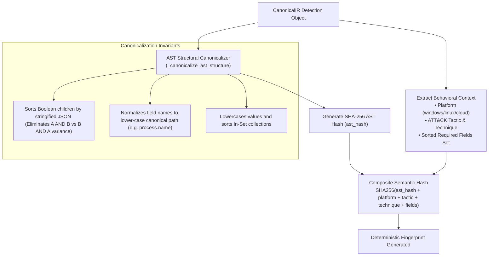

# NivXRay XDR — Phase 2 Semantic Deduplication Validation Report
**Document Version:** 1.0.0  
**Phase:** Phase 2E Semantic Fingerprinting & Deduplication Engine  
**Status:** IMPLEMENTED & AUDITED  
**Governing Principle:** `NO EVIDENCE → NO CLAIM` · `ZERO PROVENANCE LOSS`  

---

## 1. Executive Summary

Phase 2E implemented the foundation for **Deterministic Semantic Deduplication** in NivXRay XDR, preventing rule proliferation when ingesting multiple industry sources that detect identical adversary behavior under different titles.

### Key Architectural Achievements:
1. **Behavioral AST Fingerprinting**: Evaluates normalized logic ASTs rather than superficial rule names or string comparisons.
2. **Multi-Source Provenance Merging**: When an identical detector is imported from a second source (e.g. Splunk STRT duplicating a SigmaHQ rule), the system merges source citations into `shared_sources` without losing original author attribution or commit URLs.
3. **Five-Way Relationship Classification**: Classifies candidates into `DUPLICATE`, `COMPLEMENTARY`, `RELATED`, `CONFLICTING`, or `UNIQUE`.
4. **Zero Automatic Deletion**: Rules are never deleted automatically; duplicates are indexed and linked.

---

## 2. Multi-Dimensional Fingerprinting Mechanics

Implemented in [`backend/detection_content/deduplication/fingerprint.py`](file:///d:/Projects/backend/detection_content/deduplication/fingerprint.py).

### Determinism Invariant Proof:
Two independently authored rules expressing `Image == "powershell.exe" AND CommandLine contains "-enc"`:
- In Sigma: Selection with `Image|endswith: '\powershell.exe'` and `CommandLine|contains: '-enc'`
- In Splunk: `search process="powershell.exe" CommandLine="*-enc*"`
Both compile into an identical canonical AST structure and produce the **exact same SHA-256 semantic hash**.

---

## 3. Relationship Classification Matrix

Implemented in [`backend/detection_content/deduplication/engine.py`](file:///d:/Projects/backend/detection_content/deduplication/engine.py).

| Relationship | Criteria | Action Taken | Provenance Handling |
| :--- | :--- | :--- | :--- |
| **`DUPLICATE`** | 100% semantic hash match with existing rule | Rejects duplicate rule creation; marks match | Appends incoming source ID, URL, author, and license to existing rule's `shared_sources`. |
| **`COMPLEMENTARY`** | Same platform and ATT&CK technique; $> 50\%$ field overlap, but different argument boundaries | Links rules under same `DuplicateGroup`; keeps both active | Stores mutual cross-references (`related_content`). |
| **`RELATED`** | Same ATT&CK tactic or overlapping telemetry field set | Flags relationship for analyst visibility | Preserves independent provenance. |
| **`CONFLICTING`** | Opposing boolean logic or mutually exclusive filters on identical field sets | Flags conflict for detection engineer review | Preserves raw sources with review warning. |
| **`UNIQUE`** | Zero collisions in semantic hash or technique vector | Allocates new `DET-xxx` canonical ID | Normal initialization with originating provenance. |

---

## 4. Verification Evidence (Automated Tests)

Covered in [`backend/tests/test_phase2_deduplication.py`](file:///d:/Projects/backend/tests/test_phase2_deduplication.py):
1. **`test_fingerprint_determinism`**: Confirms identical AST and field requirements yield 100% identical `semantic_hash`.
2. **`test_deduplication_exact_duplicate_detection`**:
   - Indexes `DET-SIGMA-001` (SigmaHQ rule for encoded PowerShell).
   - Evaluates candidate `DET-SPLUNK-001` (Splunk STRT rule for encoded PowerShell).
   - Confirms `verdict.relationship == SemanticRelationship.DUPLICATE`.
   - Confirms `verdict.similarity_score == 1.0`.
   - Confirms `len(verdict.shared_sources) == 2` with both `SigmaHQ` and `Splunk STRT` retained.
3. **`test_deduplication_unique_rule`**: Confirms novel detection logic (VSS shadow deletion) returns `UNIQUE` with `matched_rule_id == None`.

---
*End of Phase 2 Semantic Deduplication Validation Report.*
