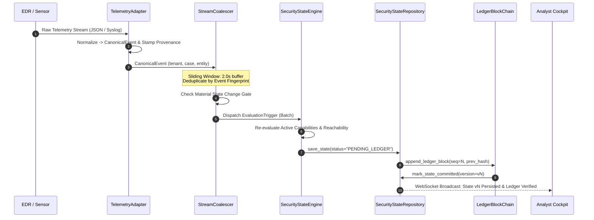
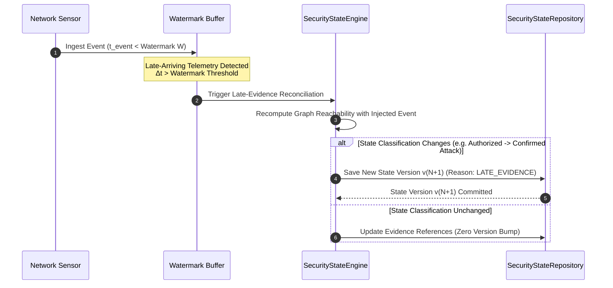
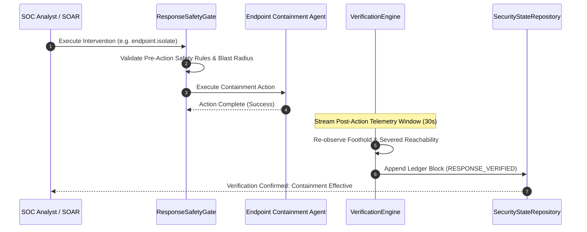

# NivXRay Phase 4A: Live Evidence Streaming Protocol & Data Contracts

> **Document Type:** Data Contracts & Protocol Specification  
> **Status:** Final & Authoritative  
> **Target Subsystems:** Telemetry Ingestion, Canonical Evidence Adapter, Security State Core  
> **Feature Flag Gate:** `NIVX_FLAG_SECURITY_STATE=disabled` (Safe Baseline Lock)  

---

## 1. Streaming Protocol Data Contracts

### 1.1 `StreamingEventEnvelope` (Ingestion Boundary)
Carries incoming raw telemetry from vendor collectors into the Telemetry Adapter Framework:

```json
{
  "$schema": "https://json-schema.org/draft/2020-12/schema",
  "title": "StreamingEventEnvelope",
  "type": "object",
  "required": [
    "tenant_id",
    "source_id",
    "source_kind",
    "vendor",
    "raw_event_id",
    "source_event_time",
    "ingested_at",
    "payload"
  ],
  "properties": {
    "tenant_id": { "type": "string", "pattern": "^[a-zA-Z0-9_-]{3,64}$" },
    "source_id": { "type": "string" },
    "source_kind": { "type": "string", "enum": ["endpoint", "identity", "cloud", "network", "email"] },
    "vendor": { "type": "string" },
    "raw_event_id": { "type": "string" },
    "source_event_time": { "type": "string", "format": "date-time" },
    "ingested_at": { "type": "string", "format": "date-time" },
    "payload": { "type": "object" },
    "signature": { "type": "string" }
  },
  "additionalProperties": false
}
```

---

### 1.2 `CanonicalEvidenceStreamingContract` (SSOT Boundary)
Emitted by the Telemetry Adapter Framework to represent a normalized, vendor-agnostic signal:

```json
{
  "$schema": "https://json-schema.org/draft/2020-12/schema",
  "title": "CanonicalEvidenceStreamingContract",
  "type": "object",
  "required": [
    "canonical_id",
    "tenant_id",
    "case_id",
    "event_type",
    "entity_ref",
    "observation",
    "confidence",
    "provenance",
    "context"
  ],
  "properties": {
    "canonical_id": { "type": "string" },
    "tenant_id": { "type": "string" },
    "case_id": { "type": "string" },
    "event_type": { "type": "string", "enum": ["process", "network", "identity", "file", "registry"] },
    "entity_ref": {
      "type": "object",
      "required": ["category", "entity_id", "tenant_id"],
      "properties": {
        "category": { "type": "string", "enum": ["DEVICE", "USER", "CLOUD_ROLE", "SERVICE", "IP"] },
        "entity_id": { "type": "string" },
        "tenant_id": { "type": "string" }
      }
    },
    "observation": { "type": "string" },
    "confidence": { "type": "integer", "minimum": 0, "maximum": 100 },
    "provenance": {
      "type": "object",
      "required": ["source_id", "vendor", "adapter_version", "raw_ref", "ingested_at"],
      "properties": {
        "source_id": { "type": "string" },
        "vendor": { "type": "string" },
        "adapter_version": { "type": "string" },
        "raw_ref": { "type": "string" },
        "ingested_at": { "type": "string", "format": "date-time" },
        "source_event_time": { "type": "string", "format": "date-time" }
      }
    },
    "context": { "type": "object" }
  },
  "additionalProperties": false
}
```

---

### 1.3 `SecurityStateEvaluationTriggerEvent` (Coalescer -> Core)
Dispatched to initiate Security State evaluation when coalesced evidence exhibits material change:

```json
{
  "$schema": "https://json-schema.org/draft/2020-12/schema",
  "title": "SecurityStateEvaluationTriggerEvent",
  "type": "object",
  "required": [
    "batch_id",
    "tenant_id",
    "case_id",
    "target_entity",
    "coalesced_evidence_refs",
    "trigger_reason",
    "watermark_timestamp"
  ],
  "properties": {
    "batch_id": { "type": "string" },
    "tenant_id": { "type": "string" },
    "case_id": { "type": "string" },
    "target_entity": {
      "type": "object",
      "required": ["category", "entity_id", "tenant_id"],
      "properties": {
        "category": { "type": "string" },
        "entity_id": { "type": "string" },
        "tenant_id": { "type": "string" }
      }
    },
    "coalesced_evidence_refs": {
      "type": "array",
      "items": {
        "type": "object",
        "required": ["evidence_id", "type", "source", "timestamp"],
        "properties": {
          "evidence_id": { "type": "string" },
          "type": { "type": "string" },
          "source": { "type": "string" },
          "timestamp": { "type": "string", "format": "date-time" }
        }
      }
    },
    "trigger_reason": {
      "type": "string",
      "enum": [
        "NEW_CAPABILITY_OBSERVED",
        "ATTACK_STATE_TRANSITION",
        "INTENT_RISK_ELEVATION",
        "FOOTHOLD_EXPANSION",
        "PERIODIC_WATERMARK_FLUSH"
      ]
    },
    "watermark_timestamp": { "type": "string", "format": "date-time" }
  },
  "additionalProperties": false
}
```

---

### 1.4 `SecurityStateTransitionNotification` (Core -> UI & Response Engine)
Broadcast when a new state version is persisted:

```json
{
  "$schema": "https://json-schema.org/draft/2020-12/schema",
  "title": "SecurityStateTransitionNotification",
  "type": "object",
  "required": [
    "tenant_id",
    "case_id",
    "version",
    "previous_state_hash",
    "new_state_hash",
    "classification",
    "attack_state",
    "active_capabilities",
    "recommended_intervention",
    "ledger_block_sequence"
  ],
  "properties": {
    "tenant_id": { "type": "string" },
    "case_id": { "type": "string" },
    "version": { "type": "integer" },
    "previous_state_hash": { "type": ["string", "null"] },
    "new_state_hash": { "type": "string" },
    "classification": { "type": "string" },
    "attack_state": { "type": "string" },
    "active_capabilities": { "type": "array", "items": { "type": "string" } },
    "recommended_intervention": { "type": "object" },
    "ledger_block_sequence": { "type": "integer" },
    "timestamp": { "type": "string", "format": "date-time" }
  }
}
```

---

## 2. Sequence Diagrams

### Sequence 1: Ingestion & Coalesced State Evaluation



---

### Sequence 2: Deduplication & Idempotent Event Replay

```mermaid
sequenceDiagram
    autonumber
    participant Collector as EDR Collector (Retry)
    participant Coalescer as StreamCoalescer
    participant Repo as SecurityStateRepository

    Collector->>Coalescer: Replayed / Retried Event (Duplicate)
    Coalescer->>Coalescer: Compute H_event
    alt Exists in LRU Deduplication Ring Buffer
        Coalescer-->>Collector: ACK (Dropped at Buffer Boundary)
    else Buffer Miss (Historical Replay)
        Coalescer->>Repo: Inspect Existing Evidence References
        Repo-->>Coalescer: Evidence ID Already Present in State vN
        Coalescer-->>Collector: ACK (Idempotent No-Op; Zero DB Write)
    end
```

---

### Sequence 3: Out-of-Order / Late Event Re-evaluation



---

### Sequence 4: Response Intervention & Closed-Loop Verification



---

## 3. Mathematical Invariants & Error Codes

### Streaming Invariants:
1. **Monotonic Sequence Invariant**:
   $$\text{seq}(B_{n}) = \text{seq}(B_{n-1}) + 1 \quad \forall n > 1$$
2. **Hash Chaining Invariant**:
   $$H(B_n) = \text{SHA256}(\text{seq}_n \parallel H(B_{n-1}) \parallel \text{type}_n \parallel \text{entity}_n \parallel \text{payload}_n \parallel t_n)$$
3. **Tenant Containment Invariant**:
   $$\forall \text{ event } e \in \text{Batch}_k, \quad \text{tenant\_id}(e) \equiv \text{tenant\_id}(\text{State}_k)$$

### Protocol Error Codes:
- `ERR_STREAM_TENANT_MISMATCH (4001)`: Ingested event tenant does not match active case tenant.
- `ERR_STREAM_PAYLOAD_UNPARSEABLE (4002)`: Event payload fails schema validation; routed to DLQ.
- `ERR_STREAM_DUPLICATE_REJECTED (4003)`: Duplicate event dropped by dedup ring buffer.
- `ERR_STREAM_BACKPRESSURE_SHED (4004)`: Low-priority event deferred under queue exhaustion.
- `ERR_STREAM_LEDGER_CHAIN_CORRUPT (5001)`: Verification detected hash mismatch; evaluation aborted.
