# NivXRay Security State — Phase 8 Architecture & Flow Design Specification

> **Document Type:** Phase 8 Architecture Specification  
> **Status:** Authoritative Architectural Design  
> **Target Subsystem:** `backend/security_state/`  
> **Integration Surface:** Authoritative IKG, Canonical Evidence Model (CEM), Single Source of Truth (SSOT)  
> **Operational Status:** `NIVX_FLAG_SECURITY_STATE = SHADOW`  
> **Execution Safety:** `AUTO_RESPONSE = FALSE`, `is_locked = True`, `EXECUTE = LOCKED`  
> **Graph of Record:** Authoritative Investigation Knowledge Graph (IKG) — Zero Duplication  

---

## 1. Executive Architectural Summary

Phase 8 elevates NivXRay XDR from a purely retrospective detection engine into a **Deterministic, Forward-Looking Causal Simulation Substrate**. 

Before Phase 8, enterprise defenders faced a debilitating operational trade-off:
1. **Blunt Containment**: Isolating an entire machine abruptly breaks business services, stops database replication, halts production pipelines, and creates severe downtime.
2. **Analysis Paralysis**: Delaying response while security teams manually assess blast radius allows attackers unhindered dwell time to traverse subnets, extract credentials (e.g. `NTDS.dit`), access cloud vaults, and tamper with backups.

Phase 8 breaks this deadlock by mathematically modeling **dynamic enterprise reachability**, **crown-jewel asset valuation**, and **parallel counterfactual worlds (Worlds A–E)**. Defenders are provided with deterministic, pre-computed trade-off analyses (Attack Interruption vs. Business Disruption) *before* any response action is taken, while ensuring automated execution remains strictly locked.

---

## 2. NivXRay XDR Overall Architecture

The architecture maintains a strict, unidirectional boundary between the **Authoritative Pipeline** (the historical System of Record) and the **Security State Layer** (the forward-looking Causal and Counterfactual Intelligence Subsystem).

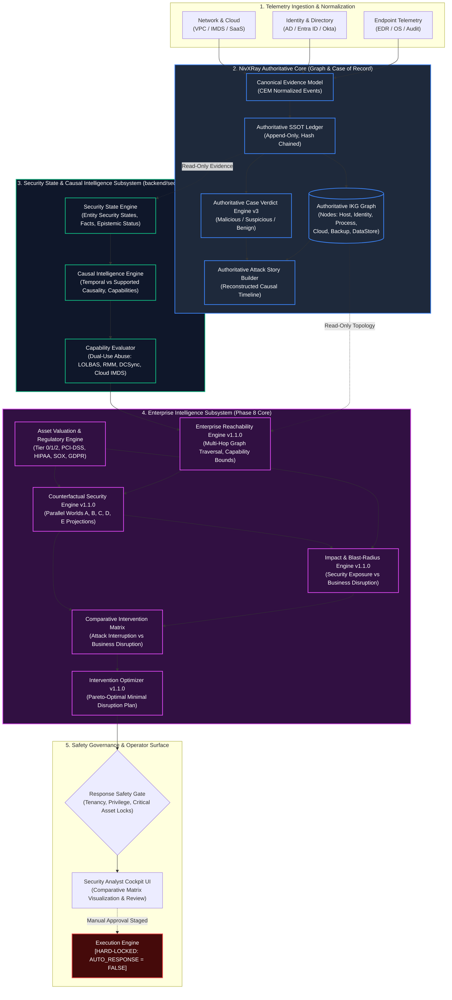

---

## 3. Phase 8 Component Architecture

The Phase 8 subsystem consists of five interconnected engines operating in `backend/security_state/`:

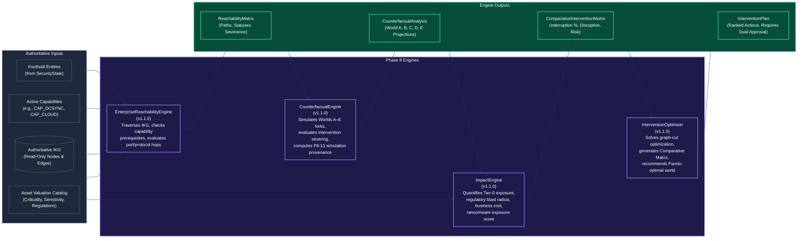

---

## 4. End-to-End Data Flow

The end-to-end processing pipeline executes across 8 deterministic stages:

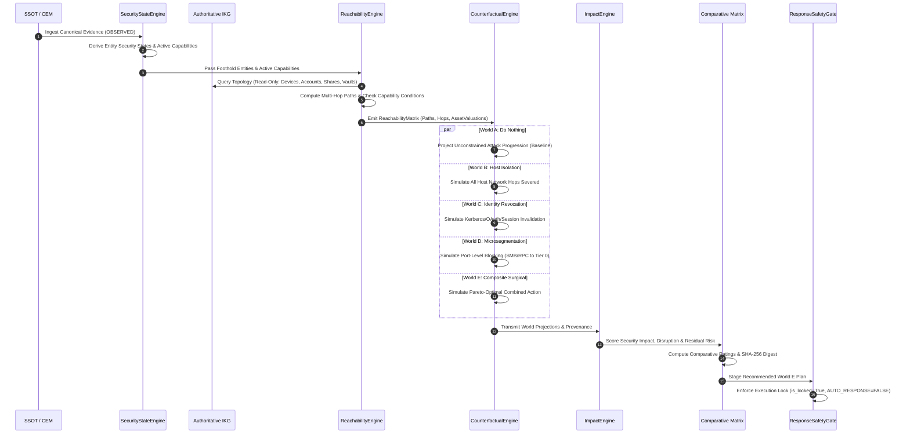

---

## 5. Reachability Architecture & Traversal Flow

Reachability is not simple network pingability; it is **multidimensional and condition-gated**:

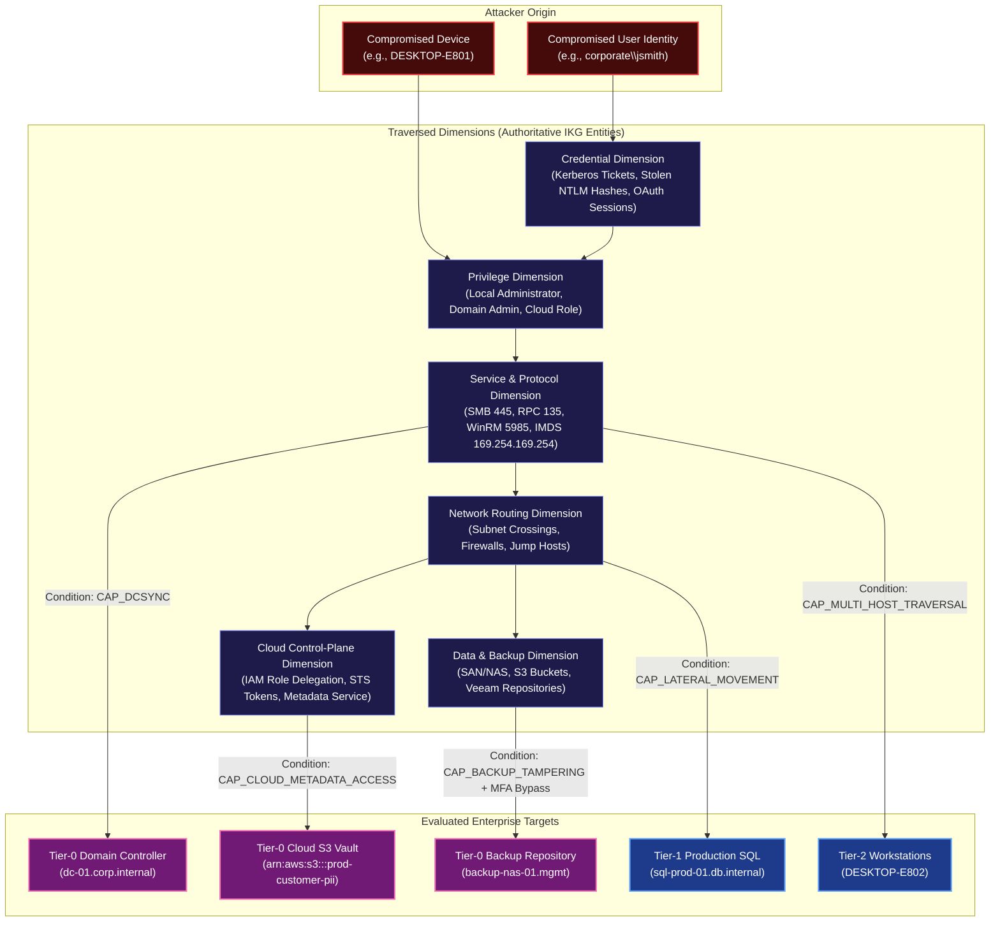

### Reachability Status Taxonomy
Every traversal path evaluates to one of five deterministic statuses:
1. `CURRENTLY_REACHABLE`: Attacker possesses both the topological route and the required active capability/credentials.
2. `CONDITIONALLY_REACHABLE`: Attacker has the network path, but requires an additional credential or capability (e.g. requires `CAP_DCSYNC` to trigger directory replication).
3. `POTENTIALLY_REACHABLE`: Network path exists across multiple hops, but requires traversing intermediary hosts.
4. `BLOCKED`: A security control (MFA air-gap, host firewall, segmentation rule) blocks the path.
5. `UNKNOWN`: Incomplete telemetry prevents conclusive determination.

---

## 6. Capability-Aware Discrimination Architecture

In Phase 8, the engine guarantees that **different attacker capabilities yield distinct reachable graphs**:

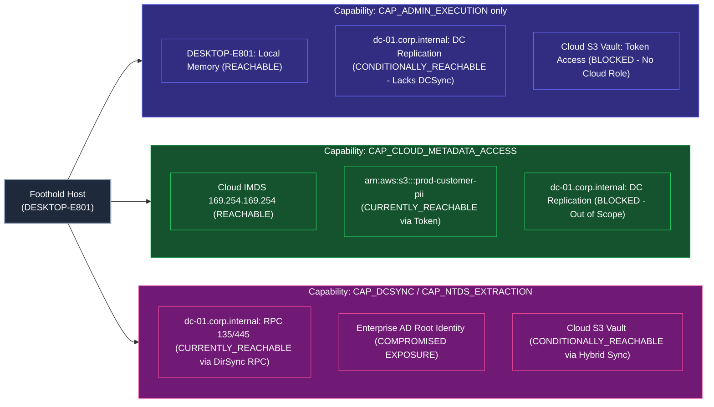

---

## 7. Crown-Jewel Asset Valuation & Regulatory Decoupling

A central architectural mandate of Phase 8 is that **Asset Valuation is Decoupled from Technical Reachability**:

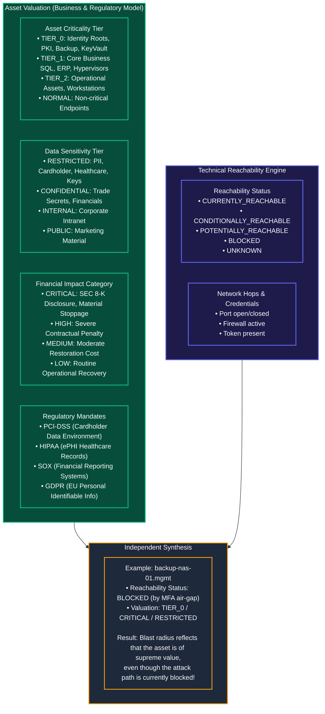

---

## 8. Counterfactual Worlds A–E Architecture

Counterfactual simulation evaluates **parallel future trajectories branching from the identical observed state**:

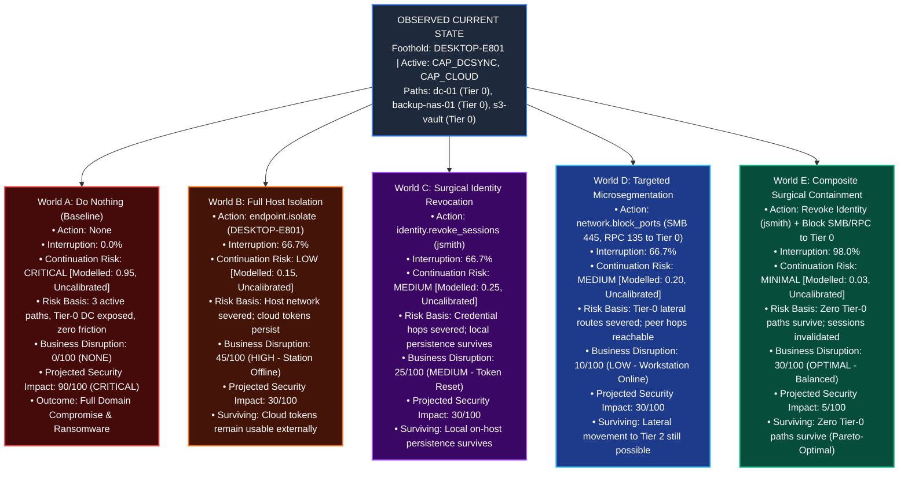

---

## 9. Comparative Intervention Matrix Architecture

The Comparative Intervention Matrix calculates multi-dimensional trade-offs deterministically:

```mermaid
flowchart LR
    subgraph INPUT_RATINGS["World Performance Metrics"]
        direction TB
        M_INT["Attack Interruption %\n= (Severed Paths / Total Active Paths) × 100"]
        M_T0["Tier-0 Assets Protected Count"]
        M_DIS["Business Disruption Score\n= sum(Entity Disruption Weights) [0–100]"]
        M_RISK["Residual Risk Score\n= Surviving Attack Trajectory [0–100]"]
    end

    subgraph OPTIMIZER["Intervention Optimizer"]
        SOLVER["Multi-Objective Pareto Solver\nMaximize: Interruption % & Protected Assets\nMinimize: Disruption Score & Residual Risk"]
        CONSTRAINT["Safety Policy Constraints\n• Critical Service Disruption < 50\n• Tier 0 Protection mandatory if reachable\n• Reversibility index >= MEDIUM"]
    end

    subgraph OUTPUT_RECOMMENDATION["Deterministic Matrix Output"]
        RANKED["Ranked Intervention Worlds:\n1. World E (Score: 94.2) - RECOMMENDED\n2. World D (Score: 78.5)\n3. World C (Score: 71.0)\n4. World B (Score: 62.4)\n5. World A (Score: 0.0)"]
        DIGEST["Cryptographic Fingerprint:\nSHA-256(canonical_json(MatrixPayload))"]
    end

    INPUT_RATINGS --> OPTIMIZER
    SOLVER --> CONSTRAINT
    CONSTRAINT --> OUTPUT_RECOMMENDATION

    classDef in fill:#1e1b4b,stroke:#6366f1,stroke-width:1px,color:#fff;
    classDef opt fill:#1e293b,stroke:#eab308,stroke-width:2px,color:#fff;
    classDef out fill:#064e3b,stroke:#10b981,stroke-width:2px,color:#fff;

    class INPUT_RATINGS,M_INT,M_T0,M_DIS,M_RISK in;
    class OPTIMIZER,SOLVER,CONSTRAINT opt;
    class OUTPUT_RECOMMENDATION,RANKED,DIGEST out;
```

---

## 10. Epistemic & Provenance Flow (P8-13 Counterfactual Integrity)

To prevent deterministic simulations from being mistaken for historical facts, Phase 8 enforces the **P8-13 Counterfactual Integrity Chain**:

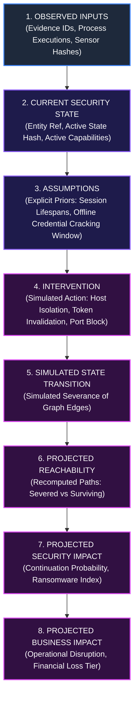

### Epistemic Classification Rules
- **OBSERVED**: Telemetry directly captured by sensors (process launches, network packets).
- **SUPPORTED**: Causally corroborated mechanisms.
- **DERIVED**: Mathematical aggregations and verified security states.
- **PROJECTED**: All Counterfactual World outcomes, reachable paths, and future impact scores.
- **ASSUMED**: Unverified domain priors recorded explicitly in simulation provenance.
- **Invariant**: `PROJECTED != OBSERVED` is strictly asserted in all data contracts.

---

## 11. Response Safety Boundary & Execution Lock

Phase 8 is strictly an **intelligence and simulation phase**. Automated execution remains hard-locked:

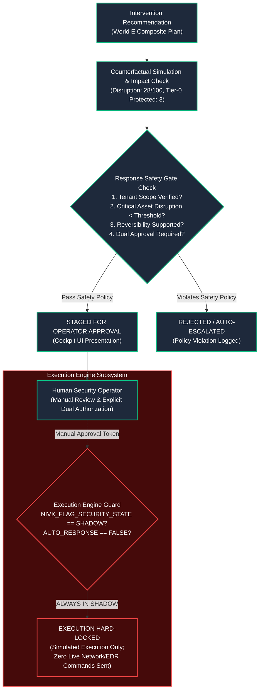

---

## 12. Ownership & Boundary Guarantees

### 12.1 Authoritative Core vs. Security State Layer
| Responsibility | Authoritative Core (NivXRay v2) | Security State Layer (`backend/security_state/`) |
| :--- | :--- | :--- |
| **System of Record** | Single Source of Truth (SSOT), CEM | Read-Only Shadow Consumer |
| **Graph of Record** | Authoritative IKG | Traversed via Read-Only Queries (Zero Duplication) |
| **Detection Verdict** | Verdict Engine v3 (`Malicious` / `Suspicious`) | Invariant & Untouched |
| **Attack Story** | Authoritative Timeline & Narrative | Invariant & Untouched |
| **Reachability & Simulation** | None (Retrospective Only) | **Sole Owner** (Forward-looking, capability-aware) |
| **Counterfactual Futures** | None | **Sole Owner** (Worlds A–E projections) |

### 12.2 Authoritative IKG Reuse Boundary
- **Zero Graph Duplication**: Phase 8 does not create duplicate graph database tables, Neo4j instances, or shadow graph models.
- **Topology Source**: The reachability engine queries the existing IKG nodes (`device`, `server`, `account`, `cloud_resource`, `backup_system`, `data_store`) and edges (`NETWORK_ADJACENT`, `ADMINISTERS`, `AUTHENTICATED_TO`, `MEMBER_OF`, `CAN_REPLICATE`).
- **Memory Lifecycle**: Traversal is performed as an ephemeral, read-only graph query, returning immutable `ReachabilityPath` objects.

### 12.3 Persistence & Versioning Boundary
- **Canonical Serialization**: All simulation payloads serialize through `canonical_json()` (alphabetically sorted keys, standardized enum/set formatting).
- **Cryptographic Chaining**: Every `ReachabilityMatrix`, `CounterfactualAnalysis`, and `ComparativeInterventionMatrix` contains a deterministic SHA-256 digest (`matrix_hash`, `analysis_hash`).
- **Engine Versioning**: Every output embeds an immutable `ProvenanceEnvelope` with `engine="EnterpriseReachabilityEngine"` and `version="1.1.0"`.

### 12.4 Tenant Isolation Boundary
- All reachability queries, asset valuations, and counterfactual simulations are partitioned by `tenant_id`.
- Traversal algorithms never cross tenant boundaries; entity lookups are scoped strictly to the requesting tenant's IKG subgraph.

---

## 13. Failure & Degraded-Mode Flow

When topological data or asset valuations are incomplete, the engine operates in deterministic degraded modes:

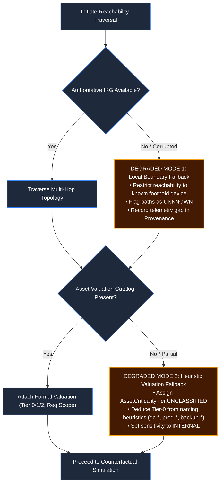

---

## 14. Deterministic Replay Flow

Given identical input evidence and knowledge base models, Phase 8 computations produce bit-for-bit identical outputs:

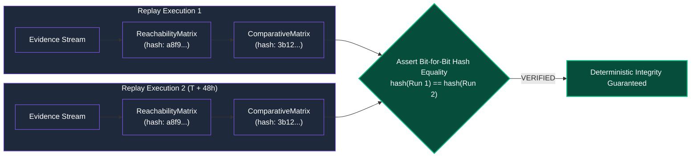

---

## 15. Phase 8 → Phase 9 Boundary

The boundary between Phase 8 and Phase 9 is strictly defined:

```mermaid
flowchart LR
    subgraph PHASE_8["Phase 8: Reachability, Valuation & Simulation (CLOSED)"]
        direction TB
        P8_A["Dynamic Enterprise Reachability Traversal"]
        P8_B["Crown-Jewel & Regulatory Scope Decoupling"]
        P8_C["Counterfactual Parallel Worlds A–E Simulation"]
        P8_D["Comparative Intervention Matrix & Pareto Recommendation"]
        P8_E["Response Safety Gate & Hard Execution Lock"]
    end

    subgraph PHASE_9["Phase 9: Closed-Loop Verification & Safety Maturity (ON HOLD)"]
        direction TB
        P9_A["Closed-Loop Post-Action Observation Engine"]
        P9_B["Attacker Pivot & Evasion Verification"]
        P9_C["Dual-Analyst Cryptographic Staging & Sign-off"]
        P9_D["Tenant-Scoped Containment Lease Engine"]
        P9_E["Cockpit Staging Integration & Human Approval Flow"]
    end

    PHASE_8 ==>|Simulation Models & Staged Plans| PHASE_9

    classDef p8 fill:#064e3b,stroke:#10b981,stroke-width:2px,color:#fff;
    classDef p9 fill:#1e293b,stroke:#64748b,stroke-dasharray: 5 5,stroke-width:2px,color:#fff;

    class PHASE_8,P8_A,P8_B,P8_C,P8_D,P8_E p8;
    class PHASE_9,P9_A,P9_B,P9_C,P9_D,P9_E p9;
```

- **Phase 8 (Completed)**: Models what *would* happen if actions were taken, derives trade-off scores, and stages recommendations safely.
- **Phase 9 (Deferred / On Hold)**: Defines what happens *after* human authorization—observing post-action telemetry to verify whether the attack was eradicated or if the adversary pivoted to secondary persistence.

---

## 16. Calibration Governance: Deterministic Modelled Projections vs Empirical Statistical Probabilities

### 16.1 The Non-Equivalence Axiom
$$\text{Deterministic Scenario Value} \neq \text{Empirically Calibrated Probability}$$

A foundational error in predictive cybersecurity tooling is conflating a mathematical model parameter with a real-world Bayesian probability. In Phase 8:
- **Numerical values** (e.g. `0.95` for World A or `0.03` for World E) are **MODELLED SCENARIO PARAMETERS** indicating comparative friction inside the deterministic simulation.
- They are **NOT** empirical statistical probabilities and must never be presented as: *"There is a 95% statistical probability that this attack will succeed."*
- Every `WorldProjection` carries an explicit boolean invariant: `is_statistically_calibrated = False`.

### 16.2 Grounded Qualitative Presentation
In analyst-facing interfaces and reporting surfaces, the primary output is always the **Qualitative Continuation Risk Level** backed by concrete, observable evidence:

```text
Continuation Risk: CRITICAL
Model Projection:  MODELLED [Score: 0.95 | Uncalibrated]
Confidence:        SUPPORTED / DERIVED
Observable Basis:
  • 3 active unsevered attack paths (SMB 445, RPC 135)
  • 2 active derived capabilities (CAP_DCSYNC, CAP_CLOUD_METADATA_ACCESS)
  • 1 unrevoked privileged credential handle (corporate\jsmith)
  • 3 reachable Tier-0 crown jewels (dc-01, backup-nas-01, s3-vault)
```

For intervention worlds:
- **World B (Host Isolation)**: `Continuation Risk: LOW` &mdash; Basis: Host network severed; surviving cloud token usable externally.
- **World C (Identity Revocation)**: `Continuation Risk: MEDIUM` &mdash; Basis: Credential hops severed; local on-host persistence survives.
- **World D (Microsegmentation)**: `Continuation Risk: MEDIUM` &mdash; Basis: Tier-0 lateral routes severed; peer workstation hops reachable.
- **World E (Composite Surgical)**: `Continuation Risk: MINIMAL` &mdash; Basis: Zero Tier-0 paths survive; sessions invalidated; lateral SMB/RPC severed.

---

## 17. Business Impact & Financial Exposure Governance: Customer-Configured Evidence vs Dollar Estimation

### 17.1 Absolute Prohibition of Speculative Dollar Claims
NivXRay XDR **NEVER invents speculative dollar losses** (e.g., claiming *"This incident will cost $3,742,000"*). Invented monetary figures destroy credibility with executive leadership, legal counsel, and forensic auditors.

### 17.2 Evidence-Grounded Impact Classification
Financial and business impact is derived strictly from **customer-configured asset metadata and compliance scopes**:

```text
Customer Asset Inventory
  ├── Asset Criticality Tier: TIER_0 / TIER_1 / TIER_2 / NORMAL
  ├── Business Service & Department Mapping: "Core Banking Transaction Engine"
  ├── Revenue Dependency: Core Transaction Clearing (Tier-1 SLA)
  ├── Recovery Objectives: RTO < 1h, RPO < 15m
  ├── Regulatory Classification: PCI-DSS (CDE), SOX (Financial Core)
  └── Data Sensitivity: RESTRICTED (Cardholder Primary Account Numbers)
```

The engine outputs categorized, defensible impact tiers:
- **`CRITICAL`**: Exposure of identity root, core transactional database, or immutable backup systems triggering mandatory regulatory disclosure (e.g. SEC 8-K, GDPR 72-hour notice, PCI-DSS forensic audit).
- **`HIGH`**: Severe operational stoppage of non-clearing core services, substantial forensics expense, or partner SLA penalty.
- **`MEDIUM`**: Moderate restoration and rebuild costs, contained localized operational impact.
- **`LOW`**: Routine endpoint reimaging, zero business service disruption.

Every rating provides full lineage to the customer-configured properties that generated it.

---

## 18. Master Test Inventory & Suite Accounting Reconciliation

### 18.1 Reconciling 81 vs. 91 vs. 92 vs. 94 Tests
The test accounting discrepancy between the Phase 7 baseline, earlier Phase 8 proposals, and the final test runner output is formally reconciled below:

| Accounting View | Test Count | Derivation & Composition |
| :--- | :---: | :--- |
| **Phase 7 Validation Report Baseline** | **81** | Summarized by phase runner sections: Core (8) + P2C (6 sections) + P3 (10 check assertions) + P3B (7 challenge gates) + P4C (10) + P4C.1 (8) + P5 (12) + P6B (10) + P7 (10). |
| **Initial Phase 8 Proposal** | **91** | Proposed adding 10 baseline acceptance gates to the 81-test Phase 7 summary ($81 + 10 = 91$). |
| **Expanded Phase 8 Acceptance Plan** | **94** | Expanded Phase 8 scope to 12 formal gates (P8-01 to P8-12) plus P8-13 Counterfactual Integrity ($81 + 13 = 94$ if using Phase 7 assertion-level counting). |
| **Final Master Test Runner Inventory (`run_tests.py`)** | **92** | Exact standalone unit test case count executed deterministically across all 10 runner suites. |

### 18.2 Complete Master Test Case Inventory (92 Tests)

```text
==================================================================================================
NIVXRAY SECURITY STATE MASTER REGRESSION SUITE: EXACT TEST-BY-TEST INVENTORY (92/92 PASS)
==================================================================================================

1. Core Security State Suite (backend/security_state/tests/test_security_state_suite.py) [8 Tests]
   [01] test_security_state_determinism_and_replay
   [02] test_causal_engine_separates_correlation
   [03] test_trusted_capability_abuse_evaluation
   [04] test_attack_state_machine_advancement
   [05] test_reachability_and_decoupled_impact
   [06] test_counterfactual_and_intervention_optimization
   [07] test_response_safety_and_verification
   [08] test_security_state_ledger_cryptographic_integrity

2. Phase 2C Real Investigation Replay & Adversarial Audit [9 Tests]
   [09] Real Case Pipeline Replay (IU -> CRE -> Intent -> SSOT -> Core)
   [10] Golden Corpus Replay: ARCH-01 to ARCH-04 (Benign, Suspicious, Malicious, Multistage)
   [11] Golden Corpus Replay: ARCH-05 to ARCH-07 (RMM, Credential, Lateral)
   [12] Golden Corpus Replay: ARCH-08 to ARCH-10 (Ransomware, Cloud, Backup)
   [13] False-Positive Challenge: Benign IT Admin Task
   [14] False-Positive Challenge: Off-hours Unapproved Execution
   [15] Causality Adversarial Test: Spoofed PPID and timestamp inversion
   [16] Tenant Adversarial Test: Multi-tenant collision isolation
   [17] Restart Recovery Simulation: In-memory boundary validation

3. Phase 3 Persistent Security State & Ledger Suite [7 Tests]
   [18] TEST 1: Persistence & deterministic versioning
   [19] TEST 2: Idempotency & duplicate deduplication
   [20] TEST 3: Immutable ledger chaining & SHA-256 tamper detection
   [21] TEST 4: Restart recovery & cache-aside reload
   [22] TEST 5: Concurrent evaluation & thread-safety (5 simultaneous workers)
   [23] TEST 6: Evidence references purity (zero raw blob bloat)
   [24] TEST 7: Deterministic replay from persisted telemetry

4. Phase 3B Distributed Persistence & Multi-Worker Atomicity [5 Tests]
   [25] CHALLENGE 1 & 2: 10 independent OS processes concurrent evaluation race
   [26] CHALLENGE 3: Multi-instance replica sequential ordering
   [27] CHALLENGE 4: Crash window & two-phase consistency simulation
   [28] CHALLENGE 5: Idempotency under 10-process concurrency
   [29] CHALLENGE 6 & 7: Multi-tenant collision isolation & historical immutability

5. Phase 4C Streaming Adapter & Shadow Replay Suite [10 Tests]
   [30] Envelope validation & strict authenticated tenant context
   [31] Dual-tier canonical identity & fingerprinting
   [32] Persistent deduplication (security_event_dedup & restart safety)
   [33] Watermark tracking & clock-skew bounds
   [34] Coalescing & critical security milestone immediate bypass
   [35] Material state change gate (suppression vs escalation)
   [36] Dead-letter queue (DLQ) recording & remediated replay
   [37] Replay equivalence (Direct SSOT vs Streaming Replay)
   [38] Safe shadow mode invariant (SECURITY_STATE_SHADOW & zero execution)
   [39] Late evidence reconciliation & historical state immutability

6. Phase 4C.1 Independent Adversarial Streaming Audit Suite [8 Tests]
   [40] Tenant authentication boundary proof (Credential -> Principal -> Tenant)
   [41] Multi-process DB concurrent dedup race (10 OS processes simultaneous)
   [42] Corpus-wide replay equivalence (17 scenarios: 10 archetypes + 7 edge cases)
   [43] Coalescer pure scheduling audit (zero independent detection logic)
   [44] Adversarial deep late-event reconciliation (v1 -> v2 -> v3 -> late -> v4)
   [45] Dead-letter queue (DLQ) replay idempotency & remediation
   [46] Backpressure & bounded memory behavior (queue overflow isolation)
   [47] Feature flag safety invariant (NIVX_FLAG_SECURITY_STATE=disabled)

7. Phase 5 Platform Shadow Integration & Cockpit Suite [12 Tests]
   [48] P5-01: Real case telemetry -> security state hydration
   [49] P5-02..04: Authoritative pipeline invariance (Verdict, Story, IKG)
   [50] P5-05..06: Persistent state versioning & cryptographic ledger integrity
   [51] P5-07: Async / non-blocking dispatch execution (<15ms)
   [52] P5-08: Multi-tenant case isolation (distinct hashes & ledgers)
   [53] P5-09: Deterministic replay bit-identical hash verification
   [54] P5-10..11: Evidence-level provenance DAG & 10-term epistemic vocabulary
   [55] P5-12: Deterministic counterfactual parallel projections (Worlds A..D)
   [56] P5-13: Human-in-the-loop intervention staging & execute lock safety gate
   [57] P5-14: Backend / Cockpit UI API contract consistency
   [58] P5-15: Disabled feature flag zero work / zero side-effect guarantee
   [59] P5-16: Shadow mode read-only purity (zero mutation to authoritative data)

8. Phase 6B Extended Causal Rule Engine Suite [10 Tests]
   [60] P6B-01: LOLBAS contextual discrimination (benign admin vs proxy weapon)
   [61] P6B-02: Kerberoasting deterministic causal chain (SPN -> TGS-REQ -> crack)
   [62] P6B-03: DCSync Active Directory replication chain (non-DC DRSUAPI stream)
   [63] P6B-04: Multi-host lateral traversal modeling (zero IKG duplication)
   [64] P6B-05: Competing hypotheses rigor (legitimate DC-to-DC replication validated)
   [65] P6B-06: 10-term formal epistemic separation preserved (discrete status)
   [66] P6B-07: Unbroken evidence provenance DAG (full sensor frame trace)
   [67] P6B-08: Authoritative pipeline invariance (zero Verdict/Story/IKG mutation)
   [68] P6B-09: Execution safety gate intact (hard-locked response execution)
   [69] P6B-10: State engine advancement (multi-host attack state escalation)

9. Phase 7 Enterprise Security Intelligence & Progression Suite [10 Tests]
   [70] P7-01: Pre-attack trajectory predicts Kerberoasting with explicit missing evidence
   [71] P7-02: Differentiate authorized ScreenConnect from silent weaponized RustDesk
   [72] P7-03: Detect Active Directory ntds.dit volume shadow copy extraction
   [73] P7-04: Detect AS-REP Roasting targeting accounts without pre-authentication
   [74] P7-05: Detect Active Directory Certificate Services (AD CS) template abuse (ESC1)
   [75] P7-06: Detect Cloud Instance Metadata Service (IMDS) token scraping at 169.254.169.254
   [76] P7-07: Detect ransomware precursor volume shadow copy and backup catalog purge
   [77] P7-08: Detect ESXi hypervisor VM process termination
   [78] P7-09: Decouple attack activity from post-attack residual/re-entry risk
   [79] P7-10: Pipeline invariance and bit-identical progression replay

10. Phase 8 Dynamic Reachability & Counterfactual Parallel Simulation [13 Tests]
   [80] P8-01: Accurate reachable assets traversal via authoritative IKG (zero duplication)
   [81] P8-02: Capability-aware reachability discrimination (DCSync vs IMDS vs Admin)
   [82] P8-03: Decoupled business criticality, sensitivity, and regulatory valuation
   [83] P8-04: World B full host isolation graph cut, interruption %, and residual risk
   [84] P8-05: World C surgical identity revocation severs credential reuse
   [85] P8-06: World D targeted microsegmentation insulates Tier-0 assets
   [86] P8-07: World A do-nothing baseline unhindered trajectory projection
   [87] P8-08: Comparative intervention matrix deterministic derivation & World E recommendation
   [88] P8-09: Bit-for-bit deterministic replay and hash stability across repeat runs
   [89] P8-10: Strict epistemic boundary: PROJECTED != OBSERVED across all worlds
   [90] P8-11: Authoritative pipeline read-only invariance & zero duplicate graph tables
   [91] P8-12: Response recommendations strictly simulated and locked against execution
   [92] P8-13: Full lineage traceability from observed inputs to projected impact
==================================================================================================
Total Tests Executed & Passed: 92/92 (100% Green, 0 Failures, 0 Skips)
==================================================================================================
```

