# NivXRay XDR — Enterprise Playbook Orchestration Architecture
**Document Version:** 1.0.0  
**Status:** IMPLEMENTED & OPERATIONAL  
**Design Philosophy:** Deterministic, Audit-First, Security-State-Aware (Anti-Bloat SOAR)  

---

## 1. Executive Summary & Design Principles

NivXRay XDR's Playbook Orchestration capability is designed specifically around **Security State Computing**, **Causal Intelligence**, and **Counterfactual World Simulation**.

### What This Orchestration Layer Is:
1. **Deterministic & Auditable**: Every execution generates an immutable, cryptographically verifiable `PlaybookExecutionTrace` detailing every stage, parameter, simulated world, approval event, and verification hash.
2. **Intervention-Driven**: Does not blindly execute a static list of 20 actions. Instead, playbooks are recommended by the **Intervention Optimizer** (`backend/security_state/intervention/optimizer.py`) based on which minimal actions cut attacker reachability with the least business disruption.
3. **Safety-Locked by Invariant**: All executions default to `is_dry_run = True` and are held behind `ExecutionSafetyGate(execution_lock_engaged = True)`. Automated live dispatch is blocked until an analyst explicitly approves via human-in-the-loop review.
4. **Closed-Loop Provenance**: Successful containment feeds back into the Canonical Evidence Store via `xdr_closed_loop.py` as an audited observation, recomputing post-response residual risk.

### What This Orchestration Layer Is NOT:
- **NOT an arbitrary visual BPMN / heavy SOAR clone**: Does not introduce Apache Airflow, Temporal, or heavy asynchronous worker clusters into the core product.
- **NOT a duplicate Action Registry or Execution engine**: Directly dispatches to the authoritative `xdr_action_registry.py` (13 actions) and `xdr_response_executor.py`.

---

## 2. The 11-Stage Playbook Orchestration Lifecycle

```mermaid
flowchart TD
    classDef stage fill:#0f172a,stroke:#38bdf8,stroke-width:2px,color:#e0f2fe;
    classDef gate fill:#450a0a,stroke:#f87171,stroke-width:2px,color:#fee2e2;
    classDef final fill:#064e3b,stroke:#34d399,stroke-width:2px,color:#ecfdf5;

    P01["1. TRIGGER<br/>Detection, Correlation, Incident, or Security State shift"]:::stage
    P02["2. ASSESS<br/>Evaluate current Security State, active capabilities, reachability to crown jewels"]:::stage
    P03["3. COLLECT EVIDENCE<br/>Assemble canonical evidence rows, correlation matches, and entity graph"]:::stage
    P04["4. RECOMMEND<br/>Select matching Playbook from Playbook Registry or Intervention Optimizer"]:::stage
    P05["5. SIMULATE<br/>Evaluate Worlds A–E in dry-run mode; calculate residual risk reduction & disruption"]:::stage
    P06["6. STAGE<br/>Validate parameters against Action Registry schemas and stage execution trace"]:::stage
    P07["7. APPROVE<br/>Evaluate Approval Policy: AUTO_APPROVE / APPROVAL_REQUIRED / DUAL_APPROVAL"]:::gate
    P08["8. EXECUTE<br/>Dispatch actions via Response Executor (dry-run simulation or authorized live)"]:::stage
    P09["9. VERIFY<br/>Post-action evidence check: verify lateral path is severed via loop hash"]:::stage
    P10["10. REASSESS<br/>Recompute Security State vector and decrement residual risk score"]:::stage
    P11["11. COMPLETED<br/>Commit audited execution trace to Security State ledger"]:::final

    P01 --> P02 --> P03 --> P04 --> P05 --> P06 --> P07 --> P08 --> P09 --> P10 --> P11
```

---

## 3. Playbook vs Counterfactual Worlds Integration

Every playbook execution simulates the intervention against the **Phase 8 Counterfactual World Model**:

| World Option | Counterfactual Action | Projected Risk Impact | Business Disruption | When Recommended |
| :--- | :--- | :---: | :---: | :--- |
| **WORLD A** | Do Nothing (Observe Only) | 100% (No reduction) | 0/100 | Baseline reference world only |
| **WORLD B** | Host Endpoint Isolation | $\downarrow$ 75% | 60/100 | Active lateral spread, ransomware encryptor running |
| **WORLD C** | Identity / Session Revocation | $\downarrow$ 70% | 15/100 | Compromised credentials, Kerberoasting, token theft |
| **WORLD D** | Network Perimeter Block | $\downarrow$ 60% | 5/100 | External C2 beaconing, exfiltration IP communication |
| **WORLD E** | Combined Minimal Intervention | $\downarrow$ 85% | 15/100 | **Optimal**: Identity Revoke + Memory Freeze + C2 Drop |

---

## 4. Initial 22 Enterprise Playbooks Catalogue

| Playbook ID | Name | Domain | Action IDs | Risk | Approval Policy | Reversible? | Expected Risk $\Delta$ | Disruption Score |
| :--- | :--- | :--- | :--- | :---: | :---: | :---: | :---: | :---: |
| **`PB-END-01`** | Host Endpoint Isolation | Endpoint | `COLLECT_FORENSIC_SNAPSHOT`, `ENDPOINT_ISOLATE` | HIGH | APPROVAL_REQUIRED | YES | -75% | 60/100 |
| **`PB-END-02`** | Malicious Process Termination | Endpoint | `PROCESS_KILL` | MEDIUM | APPROVAL_REQUIRED | NO | -50% | 15/100 |
| **`PB-END-03`** | File Artifact Quarantine | Endpoint | `FILE_QUARANTINE` | MEDIUM | APPROVAL_REQUIRED | YES | -40% | 10/100 |
| **`PB-END-04`** | Volatile Memory & Forensics | Endpoint | `COLLECT_FORENSIC_SNAPSHOT` | LOW | AUTO_APPROVE | NO | -10% | 5/100 |
| **`PB-NET-01`** | Perimeter Edge C2 IP Block | Network | `IP_BLOCK` | MEDIUM | APPROVAL_REQUIRED | YES | -60% | 5/100 |
| **`PB-NET-02`** | Malicious Domain DNS Sinkhole | Network | `DNS_SINKHOLE_DOMAIN` | MEDIUM | APPROVAL_REQUIRED | YES | -55% | 5/100 |
| **`PB-NET-03`** | Lateral Subnet Micro-Segmentation| Network | `FIREWALL_RULE_ADD` | HIGH | DUAL_APPROVAL | YES | -70% | 30/100 |
| **`PB-ID-01`** | Compromised Account Suspension | Identity | `USER_SUSPEND` | HIGH | DUAL_APPROVAL | YES | -80% | 40/100 |
| **`PB-ID-02`** | Kerberos TGT & Session Revoke | Identity | `USER_FORCE_PASSWORD_RESET` | MEDIUM | APPROVAL_REQUIRED | NO | -70% | 15/100 |
| **`PB-ID-03`** | Forced Password Reset & MFA | Identity | `USER_FORCE_PASSWORD_RESET` | LOW | AUTO_APPROVE | NO | -65% | 10/100 |
| **`PB-ID-04`** | Privileged Group Membership Strip| Identity | `USER_SUSPEND` | HIGH | DUAL_APPROVAL | YES | -85% | 35/100 |
| **`PB-PERS-01`**| Registry Run Key Removal | Endpoint | `FILE_QUARANTINE` | MEDIUM | APPROVAL_REQUIRED | YES | -45% | 5/100 |
| **`PB-PERS-02`**| Task & Service Deregistration | Endpoint | `PROCESS_KILL`, `FILE_QUARANTINE` | MEDIUM | APPROVAL_REQUIRED | YES | -60% | 10/100 |
| **`PB-RMM-01`** | Unauthorized RMM Containment | Endpoint | `PROCESS_KILL`, `DOMAIN_BLOCK` | HIGH | APPROVAL_REQUIRED | YES | -75% | 15/100 |
| **`PB-RAN-01`** | Ransomware Emergency Kill Switch| Endpoint | `ENDPOINT_ISOLATE`, `PROCESS_KILL` | CRITICAL | APPROVAL_REQUIRED | YES | -90% | 70/100 |
| **`PB-BAK-01`** | Backup Repository Lockdown | Backup | `FIREWALL_RULE_ADD` | HIGH | DUAL_APPROVAL | YES | -85% | 25/100 |
| **`PB-CLD-01`** | Cloud IAM Temporary Key Revoke | Cloud | `USER_SUSPEND` | HIGH | APPROVAL_REQUIRED | NO | -80% | 20/100 |
| **`PB-CLD-02`** | Cloud Role Boundary Restriction | Cloud | `USER_SUSPEND` | HIGH | DUAL_APPROVAL | YES | -85% | 35/100 |
| **`PB-CLD-03`** | Malicious OAuth App Revocation | Cloud | `USER_SUSPEND` | HIGH | APPROVAL_REQUIRED | YES | -80% | 15/100 |
| **`PB-EML-01`** | Phishing Email Quarantine Cluster| Email | `FILE_QUARANTINE` | MEDIUM | APPROVAL_REQUIRED | YES | -60% | 5/100 |
| **`PB-EML-02`** | Malicious Inbox Rule Deletion | Email | `FILE_QUARANTINE` | LOW | AUTO_APPROVE | NO | -50% | 5/100 |
| **`PB-EXF-01`** | Outbound Exfiltration Severance | Network | `IP_BLOCK`, `ENDPOINT_ISOLATE` | CRITICAL | APPROVAL_REQUIRED | YES | -85% | 60/100 |

---
*End of Playbook Orchestration Architecture.*
