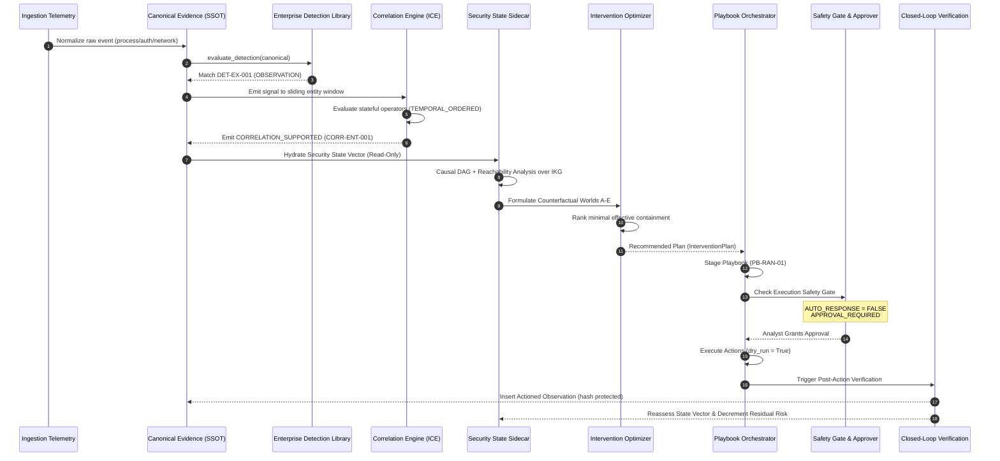

# NivXRay XDR — Rule, Correlation & Playbook Data Flow Architecture
**Document Version:** 1.0.0  
**Status:** DELIVERED & OPERATIONAL  

---

## 1. End-to-End Data Flow Architecture

The data pipeline connects raw telemetry ingestion directly through canonical evidence, detection rule evaluation, multi-stage correlation, Security State synthesis, and down to playbook orchestration.

---

## 2. In-Flight Data Contracts

| Stage | Input Data Object | Output Data Object | Storage Collection |
| :--- | :--- | :--- | :--- |
| **Ingestion** | Raw Syslog / EVE / WinEvent JSON | Canonical Event Dict | `xdr_canonical_evidence` |
| **Detection** | Canonical Event Dict | `DetectionOutcome` (Rule ID, Tactic, Severity) | Memory / Audit Trail |
| **Correlation** | Signal (`detection_id`, `host_id`, `at`) | `CorrelationMatch` (Evidence Chain, ATT&CK) | `xdr_correlation_matches` |
| **Security State** | Canonical Evidences + Correlation Matches | `SecurityStateVector` (Stage, Caps, Residual Risk) | `xdr_security_state_ledger` |
| **Intervention** | `SecurityStateVector` + Reachability Paths | `InterventionPlan` (Actions, World A-E scores) | Memory / Cache |
| **Playbook** | `InterventionPlan` + `PlaybookDefinition` | `PlaybookExecutionTrace` (Stages, Steps, Timestamps)| `xdr_playbook_traces` |
| **Verification** | `PlaybookExecutionTrace` + Telemetry Check | Post-Action Intelligence Observation | `xdr_intelligence_observations` |

---
*End of Rule, Correlation & Playbook Data Flow Specification.*
