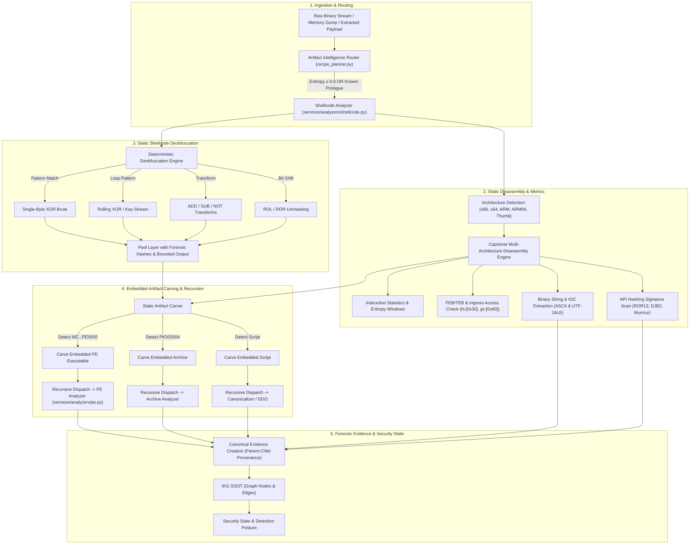

# NivXRay XDR — Shellcode Analysis & Static Deobfuscation Architecture

## 1. Objective & Scope

Shellcode is an authoritative, first-class binary artifact in NivXRay XDR. It is analyzed via an isolated **artifact-analysis path** rather than being forced through command-line text string decoders.

The analysis pipeline strictly enforces a **static-first, zero-execution security boundary**:

$$\text{Artifact Router} \to \text{Shellcode Analyzer} \to \text{Arch Detection} \to \text{Static Disassembly} \to \text{Static Deobfuscation} \to \text{Embedded PE Carving} \to \text{Recursive Analysis} \to \text{Evidence / IKG / Security State}$$

---

## 2. Shellcode Processing Lifecycle

---

## 3. Core Technical Capabilities

### A. Multi-Architecture Detection & Instruction Scoring
- **Automated Density Scoring**: Evaluates candidate instruction decodings using Capstone across 5 architectures:
  - `x86` (32-bit IA-32)
  - `x86_64` (AMD64 / Intel 64)
  - `arm` (ARMv7-A / Thumb-2)
  - `arm64` (AArch64)
  - `thumb` (16-bit Thumb)
- **Known Binary Prologues**:
  - `\xfc\xe8`: `cld; call` (classic Metasploit/MSFVenom stagers)
  - `\xfc\xeb`: `cld; jmp`
  - `\xfc\x48\x83\xe4\xf0`: `cld; and rsp, -16` (x64 alignment)
  - `\x65\x48\x8b`: `mov rax, gs:[...]` (TEB/PEB lookup)
  - `\x31\xc0\x50`: `xor eax, eax; push eax`
  - `\x64\xa1`: `mov eax, fs:[...]` (x86 TEB/PEB lookup)
  - `\xff\xb5`: `push {r0-r7, lr}` (ARM Thumb prologue)
  - `\xfd\x7b`: `stp x29, x30, [sp, ...]` (ARM64 frame setup)

### B. Static Deobfuscation Engine (Zero-Execution)
When shellcode uses a decoder stub to unpack its inner payload, NivXRay XDR identifies the decoding loop pattern through instruction sequences and applies the mathematical transformation statically:
- **Single-Byte XOR**: Evaluates keys `0x01..0xFF` against English density, PE header markers (`MZ`), and instruction valid ratios.
- **Rolling XOR**: Detects loop counters incrementing or rotating the XOR key byte-by-byte (`key = (key + 1) & 0xFF` or `key = ROR(key, 13)`).
- **ADD / SUB / NOT Transformations**: Static arithmetic unrolling without CPU register emulation.
- **ROL / ROR Bit Shifts**: Circular bit rotation unmasking.

### C. Embedded Artifact Carving & Recursion
Attackers commonly use shellcode as an in-memory reflective loader that contains an embedded Windows executable.
- The carver scans the raw or deobfuscated byte buffer for `MZ`DOS headers.
- **Anti-Hallucination PE Validation**: Validates `e_lfanew` at offset `0x3c` pointing to `PE\0\0`. If verified, the embedded binary is sliced and emitted as a **Child Artifact**.
- **Parent-Child Provenance**:
  $$\text{Parent: Shellcode Artifact (SHA-256)} \xrightarrow{\text{carved\_at: 0x0140}} \text{Child: PE Artifact (SHA-256)}$$
- The child PE is automatically handed to `services.analyzers.pe` for full static section, export, import, and compile timestamp analysis.

### D. API Hashing Recognition & Resolution
Shellcode rarely imports APIs by name. Instead, it walks the InMemoryOrderModuleList in the PEB and matches pre-computed hashes of exported function names.
- **Signature Detection**: Identifies the hashing loop pattern in disassembly (e.g. `ror eax, 13; add edx, eax`).
- **Algorithm Classification**:
  - `ROR13` (Metasploit / Cobalt Strike standard)
  - `DJB2` / `DJB2a` (hash = ((hash << 5) + hash) ^ c)
  - `MurmurHash` variants
- **Deterministic Resolution**: Compares detected 32-bit hash constants against an offline pre-computed dictionary of Windows standard exports (`ntdll.dll`, `kernel32.dll`, `user32.dll`, `advapi32.dll`, `ws2_32.dll`, `wininet.dll`).
- **Honest Labeling**:
  - If the hash matches a known export: emits `API_NAME_RESOLVED: VirtualAlloc (0x0e8afe98)`.
  - If the hash is unmapped: emits `API_HASH_DETECTED: 0x8a9b0c12 (Unknown export)`.
  - **Never fabricates an API mapping.**

---

## 4. Hard Safety Invariants

1. **No Memory Allocation as Executable**:
   Buffers are allocated strictly as data bytearrays. Windows API `VirtualAlloc` with `PAGE_EXECUTE_READWRITE` or Linux `mprotect` with `PROT_EXEC` is strictly prohibited.
2. **No Payload Execution**:
   Code is parsed using Capstone disassembly libraries. CPU instruction pointers are never directed to user-supplied shellcode.
3. **No Network Sockets**:
   Extracted IP addresses and C2 domains are treated strictly as passive indicator evidence. No connections, pings, or DNS requests are initiated.
