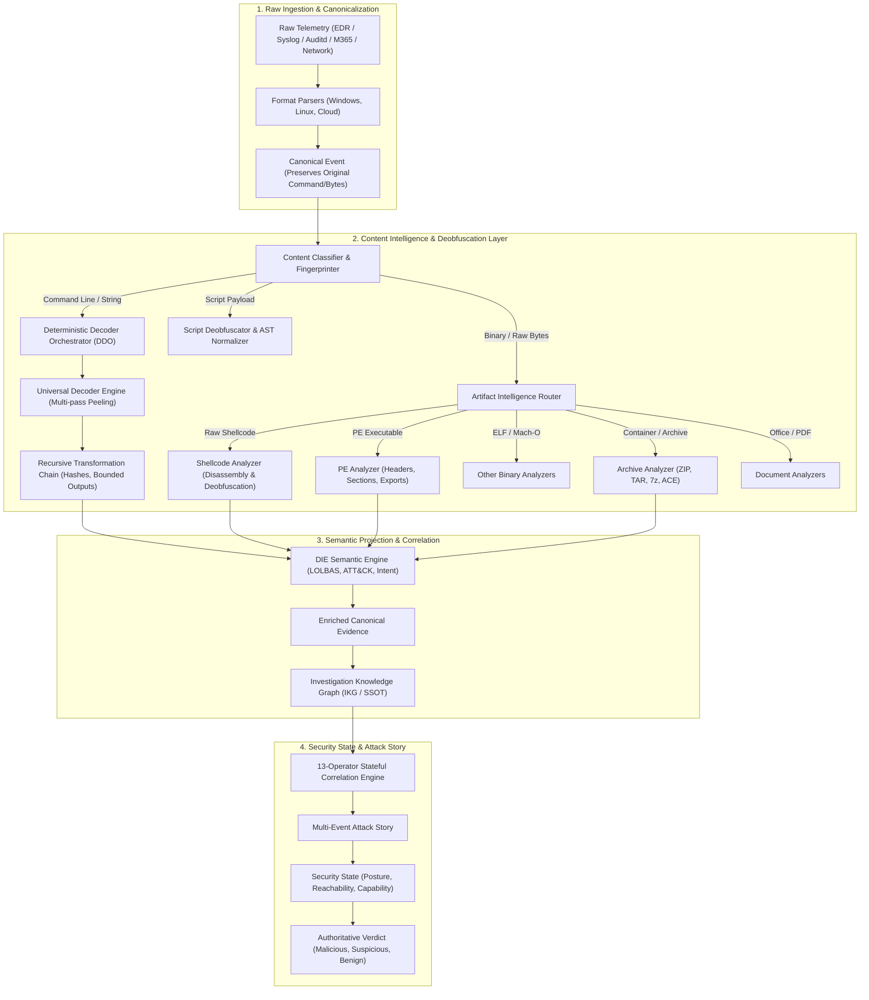

# NivXRay XDR — Universal Content Analysis & Deobfuscation Architecture

## 1. Executive Mission & Architectural Shift

NivXRay XDR does not treat decoding as an isolated utility or a vanity catalog of standalone scripts. 

Instead, it establishes a native **Content Intelligence & Deobfuscation Layer** embedded directly within the ingestion and evidence processing pipeline. The core objective is deterministic understanding:

$$\text{Raw Security Telemetry} \xrightarrow{\text{Parse}} \text{Canonical Event} \xrightarrow{\text{Content Intelligence}} \text{Enriched Evidence} \xrightarrow{\text{IKG / SSOT}} \text{Correlation \& Attack Story} \xrightarrow{\text{Security State}} \text{Verdict}$$

Whenever telemetry arrives—whether process command lines, scripts, memory buffers, files, email bodies, network metadata, or cloud API parameters—NivXRay XDR deterministically unpacks obfuscation, extracts structured intelligence, and correlates it with enterprise-wide observations while preserving immutable forensic custody.

---

## 2. The Three-Tier Evidence Representation Invariant

To maintain forensic integrity, legal defensibility, and deterministic detection, NivXRay XDR strictly isolates three representations for every content-bearing event:

```
┌─────────────────────────────────────────────────────────────────────────────┐
│ 1. ORIGINAL (Immutable Telemetry)                                           │
│    • Exact raw bytes/string received from sensor, EDR, or log source        │
│    • Never modified, normalized, or overwritten                             │
│    • Cryptographic SHA-256 hash computed at ingestion                       │
│    Example: powershell.exe -enc SQBFAFgA...                                │
├─────────────────────────────────────────────────────────────────────────────┤
│ 2. DERIVED (Deterministic Forensic Recovery)                                │
│    • Step-by-step transformation trace (L0 → L1 → ... → Terminal)           │
│    • Per-stage in/out hashes, lengths, execution duration, and why-selected  │
│    • Size-bounded payload retention (≤ 64 KB per stage)                     │
│    • Deterministic stop reason stamped on termination                       │
│    Example: IEX (New-Object Net.WebClient).DownloadString('http://...')     │
├─────────────────────────────────────────────────────────────────────────────┤
│ 3. INTERPRETED (Semantic Intelligence & Posture)                            │
│    • Extracted IOCs (IPs, URLs, domains, hashes, mutexes, regkeys)          │
│    • Syntax & language classification (PowerShell AST, CMD, Shellcode, PE)  │
│    • MITRE ATT&CK technique mapping (T1059.001, T1105)                      │
│    • LOLBAS identification and intent scoring                               │
│    • Malware family attribution & C2 configuration profiling                │
└─────────────────────────────────────────────────────────────────────────────┘
```

---

## 3. End-to-End Architectural Data Flow



---

## 4. Subsystem Roles & Authoritative Ownership

1. **Deterministic Decoder Orchestrator (DDO)** (`services/decoder/orchestrator.py`):
   - Authoritative orchestrator for text-bearing strings and multi-layered encodings.
   - Evaluates transformations iteratively using confidence-scored candidates.
   - Preserves all intermediate layers in the execution trace.
2. **Canonicalizer & CRE** (`services/canonicalizer/`):
   - Standardizes command-line invocations, strips cmd.exe carets/quotes, normalizes PowerShell parameters, expands aliases, and reconstructs environment variables.
3. **Artifact Intelligence Router** (`services/artifact_intelligence/`):
   - Fast magic-byte and structural classifier routing binary buffers to specialized analyzers without executing them.
4. **Shellcode Analyzer** (`services/analyzers/shellcode.py`):
   - Disassembles instructions via Capstone, computes Shannon entropy, detects PEB/TEB access and API hashing, performs static rolling-XOR deobfuscation, and carves embedded PEs.
5. **PE Analyzer** (`services/analyzers/pe.py`):
   - Inspects headers, sections, exports, imports, overlays, and detects packer anomalies.
6. **DIE Semantic Engine** (`services/die/`):
   - Synthesizes recovered plaintexts into structured intelligence: language classification, LOLBAS references, MITRE ATT&CK mapping, and intent narratives.

---

## 5. Non-Negotiable Safety & Governance Invariants

- **Strictly Static-First**: Under no circumstances does the engine execute shellcode, allocate executable memory (`PAGE_EXECUTE_READWRITE`), or launch sub-processes to run untrusted input.
- **Zero Network Egress**: Deobfuscation and analysis operate completely offline. No network requests are initiated to resolve C2 domains, download secondary stages, or verify URLs.
- **Defensive Security Control Analysis**:
  - AMSI and ETW tampering patterns are analyzed to detect attacker evasion.
  - **No bypass or evasion techniques are implemented.**
- **Bounded Resource Consumption**:
  - Maximum recursion depth: 8 layers.
  - Maximum per-stage output size: 64 KB (bounded forensic preview).
  - Strict CPU timeout: 500 ms per artifact pipeline pass.
  - Maximum carved child artifacts: 10 per container.
