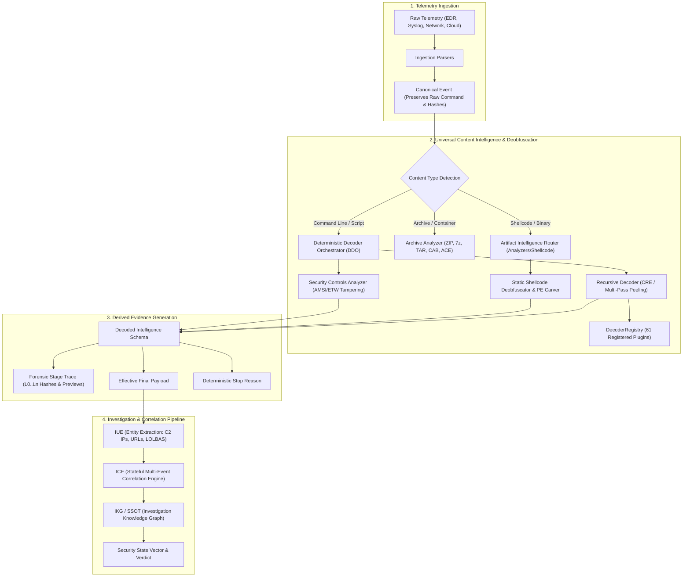

# NivXRay XDR — Universal Content Intelligence Architecture
**Document Version:** 1.0.0  
**Status:** DELIVERED & OPERATIONAL  

---

## 1. Executive Mission & Foundational Principle

NivXRay XDR does not treat decoding as an isolated display utility or a standalone script collection. 

**NivXRay XDR decoders are not a separate feature. They are an integral part of the Evidence Intelligence pipeline.**

The objective is deterministic understanding:
$$\text{Raw Telemetry} \xrightarrow{\text{Ingest}} \text{Canonical Event} \xrightarrow{\text{Content Intelligence / Decode}} \text{Derived Evidence} \xrightarrow{\text{IUE / Semantic Analysis}} \text{ICE Correlation} \xrightarrow{\text{IKG / SSOT}} \text{Security State} \xrightarrow{} \text{Verdict / Impact}$$

When raw security telemetry arrives containing encoded, obfuscated, containerized, or binary content, NivXRay XDR deterministically unpacks the layers, extracts structured intelligence, and correlates it with enterprise-wide observations while strictly maintaining an unbroken chain of custody.

---

## 2. Three-Tier Representation Contract

Forensic defensibility requires absolute separation between immutable facts, deterministic transformations, and interpretive analysis:

```
┌─────────────────────────────────────────────────────────────────────────────┐
│ 1. ORIGINAL (Immutable Evidence)                                            │
│    • Exact raw bytes or string received directly from endpoint/network/cloud│
│    • Never modified, mutated, or overwritten in place                       │
│    • Cryptographic SHA-256 computed immediately upon receipt                │
│    • Example: powershell.exe -enc SQBFAFgA...                               │
├─────────────────────────────────────────────────────────────────────────────┤
│ 2. DERIVED (Deterministic Transformation Chain)                             │
│    • Complete multi-stage unpeeling history: L0 → L1 → L2 → ... → Terminal  │
│    • Per-stage in/out SHA-256 hashes, input/output lengths, elapsed latency │
│    • Exact decoder engine/operation, why selected, and heuristic confidence │
│    • Size-bounded payload retention (≤ 64 KB per stage)                     │
│    • Explicit termination stop reason (e.g. terminal_plaintext_reached)     │
│    • Example: IEX (New-Object Net.WebClient).DownloadString('http://...')   │
├─────────────────────────────────────────────────────────────────────────────┤
│ 3. INTERPRETED (Semantic Intelligence & ATT&CK Context)                     │
│    • Extracted network and host IOCs (IPs, URLs, domains, mutexes, hashes)  │
│    • Behavioral semantics & ATT&CK technique IDs (T1059.001, T1105)        │
│    • Defensive evasion tagging (T1562.001 AMSI tampering, T1562.006 ETW)    │
│    • LOLBAS identification and suspicious capability classification         │
│    • IKG entity nodes and ICE correlation candidate signals                 │
└─────────────────────────────────────────────────────────────────────────────┘
```

---

## 3. Authoritative Pipeline Architecture

No duplicate decoder engine is permitted. The architecture reuses and binds authoritative existing components:



---

## 4. Subsystem Governance & Safety Boundaries

1. **Deterministic Decoder Orchestrator (DDO)**:
   Remains the single authoritative entry point for string/command-line deobfuscation. Bounded to a maximum depth of 10 layers, 64 KB stage output, and cycle guards.
2. **Artifact Intelligence Router**:
   Routes binary buffers and archive streams statically. Inspects magic bytes, prologues, and structural entropy without executing code.
3. **Static-First Safety Boundary**:
   - Zero payload execution.
   - Zero allocation of executable memory pages.
   - Zero network socket creation or outbound egress.
4. **Defensive AMSI & ETW Scope**:
   Strictly analyzes defensive telemetry and tampering indicators (e.g. `AmsiScanBuffer` memory patching, `amsiInitFailed` reflection tampering, `EtwEventWrite` patching). Never implements bypasses.
