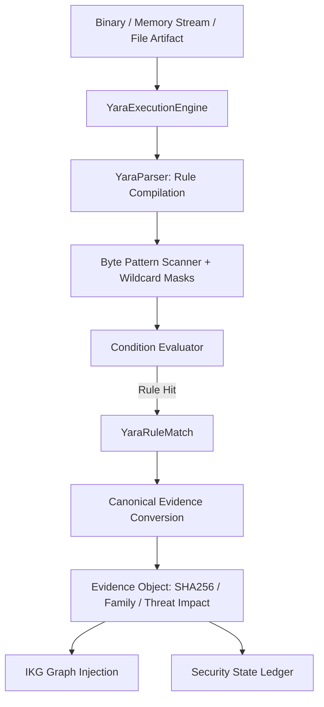

# NivXRay XDR — YARA Content & Execution Architecture

## 1. First-Class Native YARA Support

Unlike systems that treat YARA rules as external scripts or flatten them into simple regular expressions, NivXRay XDR implements a **native, first-class YARA engine (`backend/detection_content/yara_engine.py`)**.

The engine supports:
- **Exact Byte Sequences & Text Literals**: Full ASCII, wide (UTF-16LE), and case-insensitive matching.
- **Hex Sequences with Wildcard Masks**: Hex tokens such as `{ 4D 5A ?? 00 03 }` where `??` represents wildcard ignore masks without byte drift.
- **Header & Structural Conditions**: PE header offsets (`uint16(0) == 0x5A4D`), ELF magic (`uint32(0) == 0x464C457F`), and filesize filters.
- **Complex Boolean Logic**: Conditions such as `$mz at 0 and (2 of ($beacon_cfg, $pipe, $cs_ua))` or `all of them`.
- **Direct Evidence Projection**: Matches produce Canonical Evidence objects (`artifact_yara_detection`) feeding the Investigation Knowledge Graph (IKG) and Security State.



---

## 2. Canonical YARA Evidence Schema

When a YARA rule matches an artifact or memory payload, the native engine transforms the hit into a standardized **Canonical Evidence** object:

```json
{
  "evidence_type": "artifact_yara_detection",
  "artifact": {
    "filename": "sample_beacon.bin",
    "size": 24576,
    "sha256": "4b227777d4dd1fc61c6f884f48641d02b4d121d3fd328cb08b5531fcacdabf8a",
    "md5": "b10a8db164e0754105b7a99be72e3fe5"
  },
  "yara_match": {
    "rule_name": "CobaltStrike_Beacon_Stager",
    "threat_family": "CobaltStrike",
    "confidence": 0.95,
    "tags": ["APT", "C2"],
    "meta": {
      "author": "NivXRay Threat Research",
      "threat_family": "CobaltStrike",
      "confidence": "0.95",
      "mitre_attack": "T1071.001"
    },
    "matched_strings": [
      {
        "identifier": "$mz",
        "offset": 0,
        "length": 2,
        "matched_data": "MZ"
      },
      {
        "identifier": "$beacon_cfg",
        "offset": 8,
        "length": 29,
        "matched_data": "%02d/%02d/%02d %02d:%02d:%02d"
      },
      {
        "identifier": "$pipe",
        "offset": 37,
        "length": 14,
        "matched_data": "\\\\.\\pipe\\MSSE-"
      }
    ],
    "mitre_attack": ["T1071.001"]
  },
  "security_state_impact": {
    "proven_capability": "malware_artifact_delivery",
    "family": "CobaltStrike",
    "confidence_score": 0.95
  },
  "timestamp": "2026-09-04T16:07:53.112Z"
}
```

---

## 3. False-Positive Fixture Architecture

To guarantee zero regression across production deployments, every YARA rule in NivXRay must be paired with both **positive verification fixtures** and **negative benign fixtures**:

```python
# Example YARA Rule Fixture Definition
{
    "content_id": "DET-YARA-001",
    "name": "Cobalt Strike Beacon Stager",
    "yara_source": """rule CobaltStrike_Beacon_Stager { ... }""",
    # Positive fixture: contains MZ header, beacon timestamp format, and named pipe
    "positive_bytes": b"MZ\x90\x00\x03\x00\x00\x00%02d/%02d/%02d %02d:%02d:%02d\\\\.\\pipe\\MSSE-1234-server",
    # Negative fixture: benign PE header without C2 signatures
    "negative_bytes": b"MZ\x90\x00\x03\x00\x00\x00This program cannot be run in DOS mode.\r\r\n$",
}
```

### Invariant Checks
1. `rule.match(positive_bytes)` **MUST** return at least one match.
2. `rule.match(negative_bytes)` **MUST** return zero matches.
3. If either check fails, the rule is marked `REJECTED` and quarantined from active scanning.
